# Technical Specifications

## 1. INTRODUCTION

### EXECUTIVE SUMMARY

| Aspect | Description |
| --- | --- |
| Project Overview | Development of a Selenium automation framework using Page Object Model (POM) design pattern to automate testing of the Storydoc signup process |
| Business Problem | Manual testing of the signup flow is time-consuming, error-prone, and doesn't scale with frequent releases, creating potential for undetected defects in this critical user journey |
| Key Stakeholders | QA Engineers, Development Team, Product Managers, DevOps Team |
| Value Proposition | Reduced regression testing time, earlier defect detection, improved test coverage and consistency, CI/CD pipeline integration, decreased manual testing effort |

### SYSTEM OVERVIEW

#### Project Context

| Aspect | Description |
| --- | --- |
| Business Context | Storydoc is a presentation platform requiring reliable testing of user onboarding to ensure smooth user acquisition |
| Current Limitations | Reliance on manual testing creates inconsistency in test coverage and execution frequency |
| Enterprise Integration | The automation framework will integrate with existing CI/CD pipelines and complement manual testing efforts |

#### High-Level Description

| Component | Details |
| --- | --- |
| Primary Capabilities | Automated validation of signup flows with reusable components for future test expansion |
| Key Architectural Decisions | Implementation of Page Object Model for maintainability with separate locator files to improve maintainability |
| Major Components | Test cases, Page Objects, Locator Repository, Test Utilities, Configuration Management |
| Technical Approach | Selenium WebDriver implementation with structured organization following POM best practices |

#### Success Criteria

| Criteria Type | Metrics |
| --- | --- |
| Measurable Objectives | 100% automation of positive signup flow, \< 5% test flakiness, \< 5 minute execution time |
| Critical Success Factors | Reliable test execution, maintainable code structure, readable test reports |
| Key Performance Indicators | Reduction in manual testing time, increase in defect detection rate, decrease in regression testing cycle time |

### SCOPE

#### In-Scope

**Core Features and Functionalities:**

- Selenium WebDriver implementation with Page Object Model design pattern
- Separate locator file organization for improved maintainability
- Positive signup flow automation for https://editor-staging.storydoc.com/sign-up
- Test execution reporting and logging
- Cross-browser compatibility for major browsers

**Implementation Boundaries:**

- Testing limited to Storydoc staging environment
- Focus on desktop web browser automation
- English language interface testing only
- Standard form input validation

#### Out-of-Scope

- Negative test scenarios for the signup process
- Performance and load testing
- Mobile device testing
- API level testing
- Other Storydoc functionality beyond the signup process
- Production environment testing
- Accessibility testing
- Security testing
- Internationalization and localization testing

## 2. PRODUCT REQUIREMENTS

### FEATURE CATALOG

#### F-001: Page Object Model Implementation

| Metadata | Value |
| --- | --- |
| Feature Name | Page Object Model Implementation |
| Feature Category | Framework Architecture |
| Priority Level | Critical |
| Status | Proposed |

**Description:**

- **Overview**: Core architectural implementation of Page Object Model design pattern that separates test logic from page representation
- **Business Value**: Enables maintainable test framework that reduces long-term maintenance costs
- **User Benefits**: Simplified test creation, improved code readability, reduced duplication
- **Technical Context**: Fundamental pattern that allows testers to model each web page as a class with methods representing user actions

**Dependencies:**

- **Prerequisite Features**: None
- **System Dependencies**: Selenium WebDriver
- **External Dependencies**: Java/Python development environment
- **Integration Requirements**: Compatible with chosen test runner (TestNG/JUnit/pytest)

#### F-002: Locator Repository

| Metadata | Value |
| --- | --- |
| Feature Name | Locator Repository |
| Feature Category | Framework Component |
| Priority Level | High |
| Status | Proposed |

**Description:**

- **Overview**: Centralized storage of all web element locators in separate files from page objects
- **Business Value**: Isolates UI changes to single location, simplifying maintenance
- **User Benefits**: Faster updates when UI changes, improved locator organization
- **Technical Context**: Implements separation of concerns between element identification and page behavior

**Dependencies:**

- **Prerequisite Features**: F-001 (Page Object Model Implementation)
- **System Dependencies**: None
- **External Dependencies**: None
- **Integration Requirements**: Must be easily accessible by Page Object classes

#### F-003: Signup Process Automation

| Metadata | Value |
| --- | --- |
| Feature Name | Signup Process Automation |
| Feature Category | Test Implementation |
| Priority Level | Critical |
| Status | Proposed |

**Description:**

- **Overview**: Automated test scripts covering the positive signup flow at Storydoc staging
- **Business Value**: Ensures critical user acquisition path functions correctly
- **User Benefits**: Consistent validation of core user onboarding process
- **Technical Context**: Implementation of specific test cases using the framework components

**Dependencies:**

- **Prerequisite Features**: F-001, F-002
- **System Dependencies**: Internet access, Storydoc staging environment availability
- **External Dependencies**: Valid test data for account creation
- **Integration Requirements**: Handle form submissions, validations, and redirects

#### F-004: Test Configuration Management

| Metadata | Value |
| --- | --- |
| Feature Name | Test Configuration Management |
| Feature Category | Framework Component |
| Priority Level | Medium |
| Status | Proposed |

**Description:**

- **Overview**: Configuration mechanism for managing test environment settings and browser options
- **Business Value**: Enables flexible test execution across different environments
- **User Benefits**: Easy adjustment of test parameters without code changes
- **Technical Context**: Central configuration system that controls test execution environment

**Dependencies:**

- **Prerequisite Features**: F-001
- **System Dependencies**: None
- **External Dependencies**: Configuration parser library
- **Integration Requirements**: Must be accessible throughout the framework

#### F-005: Test Reporting

| Metadata | Value |
| --- | --- |
| Feature Name | Test Reporting |
| Feature Category | Framework Component |
| Priority Level | Medium |
| Status | Proposed |

**Description:**

- **Overview**: Generation of detailed test execution reports with pass/fail status
- **Business Value**: Provides visibility into test execution results
- **User Benefits**: Easy identification of test failures and their causes
- **Technical Context**: Integration with reporting libraries to produce structured reports

**Dependencies:**

- **Prerequisite Features**: F-001, F-003
- **System Dependencies**: None
- **External Dependencies**: Reporting library (e.g., ExtentReports, Allure)
- **Integration Requirements**: Capture test execution details and screenshots on failure

### FUNCTIONAL REQUIREMENTS TABLE

#### Page Object Model Implementation (F-001)

| Requirement ID | Description | Acceptance Criteria | Priority |
| --- | --- | --- | --- |
| F-001-RQ-001 | Create base Page Object class | Base class implemented with common methods for element interaction | Must-Have |
| F-001-RQ-002 | Implement page objects for signup flow | Page objects created for all pages in signup process | Must-Have |
| F-001-RQ-003 | Add navigation methods between pages | Methods that return appropriate page objects after navigation | Must-Have |
| F-001-RQ-004 | Implement wait utilities | Explicit wait utilities for element visibility and interactions | Must-Have |

| Technical Details | Specification |
| --- | --- |
| Input Parameters | WebDriver instance, timeout values |
| Output/Response | Page object methods return page objects or action results |
| Performance Criteria | Page object initialization \< 1 second |
| Data Requirements | None |

| Validation Rules | Requirements |
| --- | --- |
| Business Rules | Each page must have a dedicated page object class |
| Data Validation | N/A |
| Security Requirements | No credentials stored in page objects |
| Compliance Requirements | Follow project coding standards |

#### Locator Repository (F-002)

| Requirement ID | Description | Acceptance Criteria | Priority |
| --- | --- | --- | --- |
| F-002-RQ-001 | Create separate files for locators | All element locators stored in dedicated files | Must-Have |
| F-002-RQ-002 | Organize locators by page | Locators grouped by corresponding page/component | Must-Have |
| F-002-RQ-003 | Support multiple locator strategies | Repository supports ID, CSS, XPath, and other strategies | Must-Have |
| F-002-RQ-004 | Implement access mechanism from page objects | Simple mechanism to retrieve locators in page objects | Must-Have |

| Technical Details | Specification |
| --- | --- |
| Input Parameters | Page name, element name |
| Output/Response | Locator strategy and value |
| Performance Criteria | Locator retrieval \< 100ms |
| Data Requirements | N/A |

| Validation Rules | Requirements |
| --- | --- |
| Business Rules | Each UI element must have a unique identifier |
| Data Validation | Locator syntax validation |
| Security Requirements | N/A |
| Compliance Requirements | Follow naming conventions for locators |

#### Signup Process Automation (F-003)

| Requirement ID | Description | Acceptance Criteria | Priority |
| --- | --- | --- | --- |
| F-003-RQ-001 | Navigate to signup page | Successfully load the signup page URL | Must-Have |
| F-003-RQ-002 | Fill in all required signup fields | All required fields populated with valid test data | Must-Have |
| F-003-RQ-003 | Submit signup form | Form submission executed successfully | Must-Have |
| F-003-RQ-004 | Verify successful signup | Confirmation of successful account creation | Must-Have |
| F-003-RQ-005 | Handle verification steps if present | Complete any email verification steps | Should-Have |

| Technical Details | Specification |
| --- | --- |
| Input Parameters | Test data for signup form, browser type |
| Output/Response | User account created, confirmation message/page |
| Performance Criteria | Complete test execution \< 2 minutes |
| Data Requirements | Valid test email addresses, compliant password format |

| Validation Rules | Requirements |
| --- | --- |
| Business Rules | Test must use unique email addresses for each run |
| Data Validation | Email and password format validation |
| Security Requirements | Test data must not contain actual user information |
| Compliance Requirements | N/A |

#### Test Configuration Management (F-004)

| Requirement ID | Description | Acceptance Criteria | Priority |
| --- | --- | --- | --- |
| F-004-RQ-001 | Create configuration file structure | Configuration file with all necessary parameters | Must-Have |
| F-004-RQ-002 | Support multiple browser configurations | Ability to specify and switch between browsers | Must-Have |
| F-004-RQ-003 | Support environment-specific settings | Configuration options for different environments | Should-Have |
| F-004-RQ-004 | Implement command-line parameter override | Override configuration via command-line arguments | Could-Have |

| Technical Details | Specification |
| --- | --- |
| Input Parameters | Configuration file path, parameter keys |
| Output/Response | Configured framework settings |
| Performance Criteria | Configuration loading \< 500ms |
| Data Requirements | Valid configuration file format |

| Validation Rules | Requirements |
| --- | --- |
| Business Rules | Default values should be provided for all settings |
| Data Validation | Configuration file syntax validation |
| Security Requirements | Sensitive data should be externalized |
| Compliance Requirements | N/A |

#### Test Reporting (F-005)

| Requirement ID | Description | Acceptance Criteria | Priority |
| --- | --- | --- | --- |
| F-005-RQ-001 | Generate test execution reports | HTML report showing test results | Must-Have |
| F-005-RQ-002 | Capture screenshots on failure | Screenshots embedded in reports on test failure | Must-Have |
| F-005-RQ-003 | Log test steps and actions | Detailed logging of each test step | Should-Have |
| F-005-RQ-004 | Support report customization | Ability to customize report format | Could-Have |

| Technical Details | Specification |
| --- | --- |
| Input Parameters | Test execution results, failure information |
| Output/Response | HTML/XML reports, screenshot files |
| Performance Criteria | Report generation \< 30s |
| Data Requirements | Test execution data, storage for screenshots |

| Validation Rules | Requirements |
| --- | --- |
| Business Rules | Reports must clearly indicate pass/fail status |
| Data Validation | N/A |
| Security Requirements | Reports should not contain sensitive data |
| Compliance Requirements | N/A |

### FEATURE RELATIONSHIPS

| Feature | Depends On | Used By | Shared Components |
| --- | --- | --- | --- |
| F-001: Page Object Model Implementation | None | F-002, F-003, F-005 | WebDriver wrapper, Wait utilities |
| F-002: Locator Repository | F-001 | F-003 | Element identification strategies |
| F-003: Signup Process Automation | F-001, F-002, F-004 | F-005 | Test data, Assertions |
| F-004: Test Configuration Management | None | F-001, F-003 | Configuration parser |
| F-005: Test Reporting | F-003 | None | Logging utilities |

**Integration Points:**

- Page Object Model (F-001) provides the foundation for all test implementation
- Locator Repository (F-002) is used by all Page Objects to identify elements
- Test Configuration (F-004) controls the environment for test execution
- Test Reporting (F-005) captures results from test execution

**Shared Components:**

- WebDriver initialization and management
- Wait utilities for synchronization
- Assertion utilities for verifications
- Logging framework for execution tracking

### IMPLEMENTATION CONSIDERATIONS

#### Page Object Model Implementation (F-001)

- **Technical Constraints:**

  - Must be compatible with latest Selenium WebDriver
  - Should support Chrome and Firefox at minimum

- **Performance Requirements:**

  - Quick page object initialization
  - Efficient element location and interaction

- **Scalability Considerations:**

  - Design should support expansion to additional test scenarios
  - Structure should accommodate growing number of page objects

- **Security Implications:**

  - No sensitive data should be hardcoded in page objects

- **Maintenance Requirements:**

  - Clear documentation of page object methods
  - Consistent naming conventions

#### Locator Repository (F-002)

- **Technical Constraints:**

  - Must support all required Selenium locator strategies
  - Should be easily extensible for new pages

- **Performance Requirements:**

  - Fast retrieval of locators

- **Scalability Considerations:**

  - Structure should support hundreds of locators
  - Organization should remain clear as locator count grows

- **Security Implications:**

  - No sensitive selectors that expose security vulnerabilities

- **Maintenance Requirements:**

  - Regular review and update of locators when UI changes
  - Clear naming convention for all locators

#### Signup Process Automation (F-003)

- **Technical Constraints:**

  - Must work with supported browsers
  - Should handle dynamic elements in form

- **Performance Requirements:**

  - Complete signup flow under 2 minutes
  - Handle typical page load times

- **Scalability Considerations:**

  - Ability to parameterize for data-driven testing

- **Security Implications:**

  - Secure handling of test credentials
  - No exposure of test data in reports

- **Maintenance Requirements:**

  - Regular verification against latest application version
  - Maintenance of test data sets

#### Test Configuration Management (F-004)

- **Technical Constraints:**

  - Must support configuration via files
  - Should support different formats (properties, JSON)

- **Performance Requirements:**

  - Quick configuration loading

- **Scalability Considerations:**

  - Support for multiple environment configurations

- **Security Implications:**

  - Secure storage of sensitive configuration

- **Maintenance Requirements:**

  - Documentation of all configuration options
  - Version control of configuration files

#### Test Reporting (F-005)

- **Technical Constraints:**

  - Compatible with chosen test runner
  - Should support HTML report format

- **Performance Requirements:**

  - Efficient report generation

- **Scalability Considerations:**

  - Report structure should handle large test suites

- **Security Implications:**

  - Reports should not contain sensitive information

- **Maintenance Requirements:**

  - Regular cleanup of old reports
  - Documentation of report interpretation

## 3. TECHNOLOGY STACK

### PROGRAMMING LANGUAGES

| Platform/Component | Language | Version | Justification |
| --- | --- | --- | --- |
| Automation Framework | Java | 11 | Industry standard for enterprise Selenium frameworks with strong typing, exceptional threading support, and comprehensive ecosystem for testing |
| Utility Scripts | Shell/Batch | - | OS-specific scripts for test execution and environment setup |

**Selection Criteria:**

- Java provides robust compatibility with Selenium WebDriver and extensive test framework support
- Static typing reduces runtime errors and improves maintainability
- Large community support and extensive documentation
- Enterprise-grade performance for stable test execution

**Dependencies:**

- Java Development Kit (JDK) 11 or newer
- Maven/Gradle for dependency management

### FRAMEWORKS & LIBRARIES

| Category | Component | Version | Purpose |
| --- | --- | --- | --- |
| **Core Test Automation** | Selenium WebDriver | 4.8.x | Browser automation core library |
|  | TestNG | 7.7.x | Test orchestration, parallel execution, data-driven testing |
|  | WebDriverManager | 5.3.x | Automated driver binary management |
| **Utilities** | Commons-io | 2.11.x | File operations for screenshots and reporting |
|  | Log4j | 2.19.x | Comprehensive logging capabilities |
| **Reporting** | ExtentReports | 5.0.x | Rich HTML test execution reports with screenshots |
| **Data Management** | Apache POI | 5.2.x | Test data management through Excel (if needed) |
| **Configuration** | Owner | 1.0.12 | Type-safe configuration management |

**Compatibility Requirements:**

- All libraries must be compatible with Java 11+
- Selenium 4.8+ required for modern browser support
- TestNG preferred over JUnit for enhanced test control

**Justification:**

- Selenium WebDriver is the industry standard for browser automation
- TestNG provides superior test organization and configuration vs JUnit
- ExtentReports offers rich visual reporting with minimal configuration
- WebDriverManager eliminates manual driver binary management
- Owner library provides type-safe configuration with minimal code

### DATABASES & STORAGE

| Type | Technology | Purpose |
| --- | --- | --- |
| File Storage | Local File System | Test reports, screenshots, execution logs |
| Version Control | Git | Code repository and version management |

**Data Persistence Strategy:**

- Test results and logs archived by date and build number
- Screenshots captured on test failures
- No database required for this automation scope

### THIRD-PARTY SERVICES

| Category | Service | Purpose |
| --- | --- | --- |
| **Test Environments** | BrowserStack/Sauce Labs (optional) | Cross-browser testing on multiple platforms |
| **Monitoring** | Jenkins/GitHub Actions | Test execution and reporting |

**Integration Requirements:**

- Test framework must generate reports compatible with CI/CD pipeline
- If using cloud testing platforms, WebDriver configuration must support remote execution

### DEVELOPMENT & DEPLOYMENT

| Category | Tool | Version | Purpose |
| --- | --- | --- | --- |
| **IDE** | IntelliJ IDEA | Latest | Primary development environment |
|  | Eclipse | Latest | Alternative development environment |
| **Build System** | Maven | 3.8.x | Dependency management and build automation |
| **Version Control** | Git | Latest | Source code management |
| **CI/CD** | Jenkins | Latest | Continuous integration and scheduled test execution |
|  | GitHub Actions | - | Alternative CI/CD system |

**Development Requirements:**

- Consistent code formatting using standard Java conventions
- JDK 11+ installation on development machines
- IDE plugins for TestNG and Maven

**Execution Requirements:**

- Headless browser capability for CI/CD execution
- Cross-platform compatibility for test execution

### SYSTEM ARCHITECTURE DIAGRAM

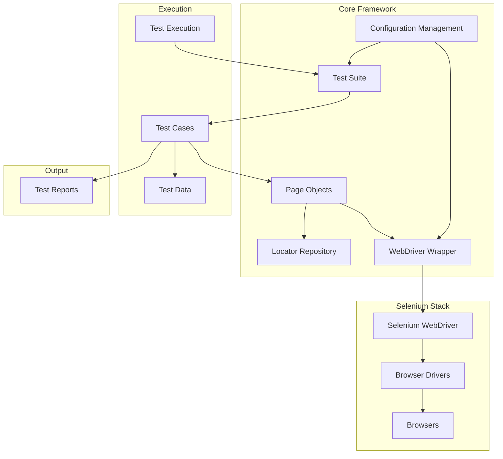
```mermaid
graph TD
    A[Test Execution] --> B[Test Suite]
    B --> C[Test Cases]
    C --> D[Page Objects]
    D --> E[Locator Repository]
    D --> F[WebDriver Wrapper]
    F --> G[Selenium WebDriver]
    G --> H[Browser Drivers]
    H --> I[Browsers]
    
    J[Configuration Management] --> B
    J --> F
    
    C --> K[Test Data]
    C --> L[Test Reports]
    
    subgraph "Core Framework"
        B
        F
        D
        E
        J
    end
    
    subgraph "Execution"
        A
        C
        K
    end
    
    subgraph "Output"
        L
    end
    
    subgraph "Selenium Stack"
        G
        H
        I
    end
```

### TEST EXECUTION FLOW

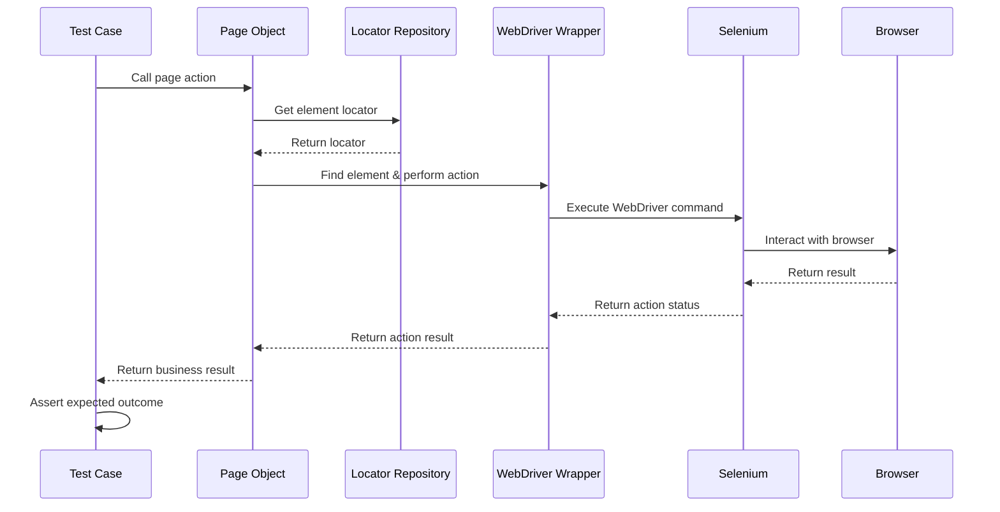
```mermaid
sequenceDiagram
    participant TC as Test Case
    participant PO as Page Object
    participant LR as Locator Repository
    participant WD as WebDriver Wrapper
    participant SE as Selenium
    participant BR as Browser

    TC->>PO: Call page action
    PO->>LR: Get element locator
    LR-->>PO: Return locator
    PO->>WD: Find element & perform action
    WD->>SE: Execute WebDriver command
    SE->>BR: Interact with browser
    BR-->>SE: Return result
    SE-->>WD: Return action status
    WD-->>PO: Return action result
    PO-->>TC: Return business result
    TC->>TC: Assert expected outcome
```

## 4. PROCESS FLOWCHART

### SYSTEM WORKFLOWS

#### Core Business Processes

**End-to-end User Journeys:**

- Test Initialization → Page Navigation → Data Input → Form Submission → Verification → Reporting → Cleanup
- Signup Process Flow: User enters email & password → Submits form → Receives confirmation → Account created
- Test framework initialization to report generation lifecycle

**System Interactions:**

- Page Objects interact with Locator Repository to retrieve element identifiers
- WebDriver interacts with browser to execute commands
- Configuration Manager controls test environment parameters
- Reporter captures execution results and evidence

**Decision Points:**

- Element existence verification before interaction
- Dynamic waits based on page responsiveness
- Execution path selection based on UI state
- Test continuation decisions after critical validations
- Error recovery strategy selection

**Error Handling Paths:**

- Element not found recovery
- Timeout management with configurable retry attempts
- Screenshot capture on failure points
- Detailed exception logging
- Graceful test termination with proper resource cleanup

#### Integration Workflows

**Data Flow Between Systems:**

- Test data → Test Cases → Page Objects → WebDriver → Browser
- Browser responses → WebDriver → Page Objects → Verification Points → Test Reports
- Configuration parameters flow to all framework components
- Execution events flow to logging and reporting systems

**API Interactions:**

- Selenium WebDriver API for browser automation
- TestNG API for test orchestration and assertions
- WebDriverManager API for driver binary management
- ExtentReports API for result documentation

**Event Processing Flows:**

- Test listener events (start, pass, fail, skip)
- WebDriver event listener flow (command execution, errors)
- Element interaction events (click, type, validation)
- Reporting events (test step logging, screenshot capture)

**Batch Processing Sequences:**

- Test suite execution sequence management
- Parallel test execution control
- Test case dependency resolution
- Pre/post-condition handling sequence
- Resource initialization and cleanup batching

### FLOWCHART REQUIREMENTS

#### Test Execution Workflow

**Start and End Points:**

- Start: Test initialization and environment setup
- End: Resource cleanup and report finalization

**Process Steps:**

1. Initialize test framework components
2. Load test configuration
3. Initialize WebDriver with appropriate browser settings
4. Navigate to signup page
5. Execute test steps via Page Objects
6. Verify expected outcomes
7. Capture test results
8. Generate reports
9. Clean up resources

**Decision Diamonds:**

- Is configuration valid?
- Is WebDriver initialized successfully?
- Is application URL accessible?
- Are page elements present and interactable?
- Does form submission succeed?
- Is success confirmation displayed?

**System Boundaries:**

- Test Framework (internal)
- Browser Interface (Selenium WebDriver boundary)
- Application Under Test (external)
- Operating System (environment)

**User Touchpoints:**

- Email input field interaction
- Password input field interaction
- Form submission button click
- Confirmation message validation

**Error States and Recovery Paths:**

- Connection failures: Retry with backoff
- Element location failures: Alternative locator strategies
- Validation errors: Screenshot and detailed logging
- Unexpected popups: Dismissal handlers
- Session timeouts: Session recreation

**Timing and SLA Considerations:**

- Page load timeout: 30 seconds max
- Element wait timeout: 10 seconds default
- Complete test execution: \< 2 minutes
- Test initialization: \< 5 seconds
- Report generation: \< 30 seconds

#### Validation Rules

**Business Rules at Each Step:**

- Email must be unique for each test run
- Password must meet complexity requirements
- All required fields must be completed
- Form submission must result in successful account creation
- Confirmation message must contain expected text

**Data Validation Requirements:**

- Email format validation
- Password length and complexity validation
- Field input constraints (min/max lengths)
- Error message validation if inputs are invalid
- Confirmation page validation

**Authorization Checkpoints:**

- Access to signup page verification
- Successful account creation confirmation
- Proper redirection after signup

**Regulatory Compliance Checks:**

- Test data privacy compliance
- Password security requirements
- Terms and conditions acceptance

### TECHNICAL IMPLEMENTATION

#### State Management

**State Transitions:**

- Page Object state transitions (page to page)
- Test case state progression
- Element states (visible, enabled, selected)
- Test execution states (running, passed, failed, skipped)

**Data Persistence Points:**

- Test configuration persistence in properties files
- Test result storage in report files
- Screenshot capture on failure
- Execution logs in log files
- Test data management in data providers

**Caching Requirements:**

- WebDriver instance caching
- Page Object caching for performance
- Element reference caching considerations
- Test data caching for reuse

**Transaction Boundaries:**

- Test method boundaries (setUp/tearDown)
- Page navigation boundaries
- Form submission transaction
- Reporting transaction

#### Error Handling

**Retry Mechanisms:**

- Element interaction retries with exponential backoff
- Page load retries
- Form submission retries
- Test execution retries for flaky tests

**Fallback Processes:**

- Alternative locator strategies when primary fails
- Browser fallback options if preferred browser fails
- Screenshot capture as visual verification fallback
- Graceful degradation paths for non-critical features

**Error Notification Flows:**

- Console logging of errors
- Log file detailed error capture
- Screenshot attached to reports
- Exception details in test reports
- CI/CD pipeline notification

**Recovery Procedures:**

- WebDriver session recovery after failure
- Browser restart after crash
- Clean state restoration between tests
- Resource cleanup to prevent memory leaks
- Test environment reset between test runs

### REQUIRED DIAGRAMS

#### High-level System Workflow

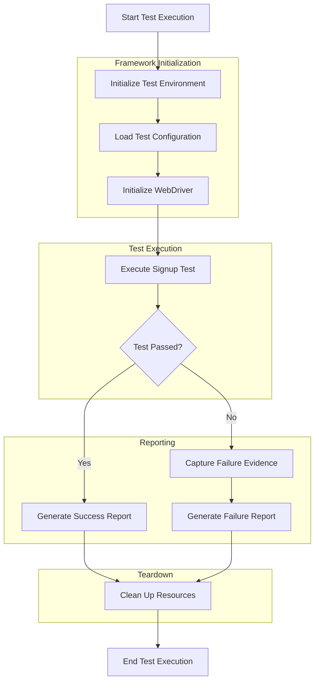
```mermaid
flowchart TD
    A[Start Test Execution] --> B[Initialize Test Environment]
    B --> C[Load Test Configuration]
    C --> D[Initialize WebDriver]
    D --> E[Execute Signup Test]
    
    E --> F{Test Passed?}
    F -- Yes --> G[Generate Success Report]
    F -- No --> H[Capture Failure Evidence]
    H --> I[Generate Failure Report]
    
    G --> J[Clean Up Resources]
    I --> J
    J --> K[End Test Execution]
    
    subgraph "Framework Initialization"
        B
        C
        D
    end
    
    subgraph "Test Execution"
        E
        F
    end
    
    subgraph "Reporting"
        G
        H
        I
    end
    
    subgraph "Teardown"
        J
    end
```

#### Signup Process Test Flow

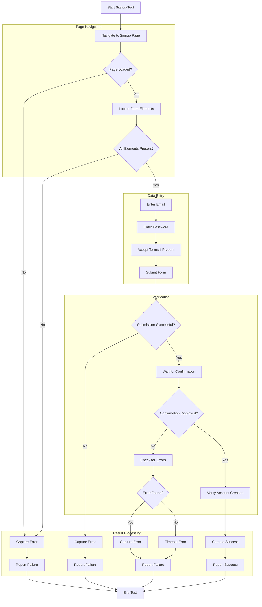
```mermaid
flowchart TD
    A[Start Signup Test] --> B[Navigate to Signup Page]
    B --> C{Page Loaded?}
    C -- No --> D[Capture Error]
    D --> E[Report Failure]
    E --> Z[End Test]
    
    C -- Yes --> F[Locate Form Elements]
    F --> G{All Elements Present?}
    G -- No --> D
    
    G -- Yes --> H[Enter Email]
    H --> I[Enter Password]
    I --> J[Accept Terms if Present]
    J --> K[Submit Form]
    
    K --> L{Submission Successful?}
    L -- No --> M[Capture Error]
    M --> N[Report Failure]
    N --> Z
    
    L -- Yes --> O[Wait for Confirmation]
    O --> P{Confirmation Displayed?}
    P -- No --> Q[Check for Errors]
    Q --> R{Error Found?}
    R -- Yes --> S[Capture Error]
    S --> T[Report Failure]
    T --> Z
    
    R -- No --> U[Timeout Error]
    U --> T
    
    P -- Yes --> V[Verify Account Creation]
    V --> W[Capture Success]
    W --> X[Report Success]
    X --> Z
    
    subgraph "Page Navigation"
        B
        C
        F
        G
    end
    
    subgraph "Data Entry"
        H
        I
        J
        K
    end
    
    subgraph "Verification"
        L
        O
        P
        Q
        R
        V
    end
    
    subgraph "Result Processing"
        D
        E
        M
        N
        S
        T
        U
        W
        X
    end
```

#### Framework Component Interaction

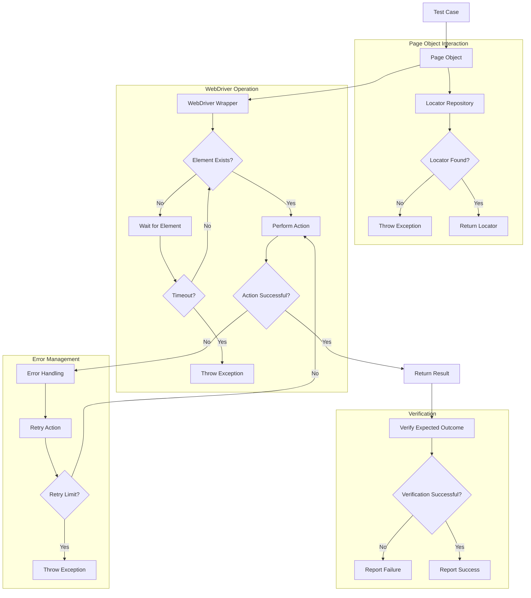
```mermaid
flowchart TD
    A[Test Case] --> B[Page Object]
    B --> C[Locator Repository]
    C --> D{Locator Found?}
    D -- No --> E[Throw Exception]
    D -- Yes --> F[Return Locator]
    
    B --> G[WebDriver Wrapper]
    G --> H{Element Exists?}
    H -- No --> I[Wait for Element]
    I --> J{Timeout?}
    J -- Yes --> K[Throw Exception]
    J -- No --> H
    
    H -- Yes --> L[Perform Action]
    L --> M{Action Successful?}
    M -- No --> N[Error Handling]
    N --> O[Retry Action]
    O --> P{Retry Limit?}
    P -- Yes --> Q[Throw Exception]
    P -- No --> L
    
    M -- Yes --> R[Return Result]
    R --> S[Verify Expected Outcome]
    S --> T{Verification Successful?}
    T -- No --> U[Report Failure]
    T -- Yes --> V[Report Success]
    
    subgraph "Page Object Interaction"
        B
        C
        D
        E
        F
    end
    
    subgraph "WebDriver Operation"
        G
        H
        I
        J
        K
        L
        M
    end
    
    subgraph "Error Management"
        N
        O
        P
        Q
    end
    
    subgraph "Verification"
        S
        T
        U
        V
    end
```

#### Error Handling Flowchart

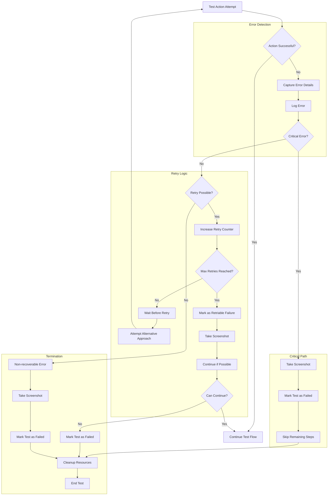
```mermaid
flowchart TD
    A[Test Action Attempt] --> B{Action Successful?}
    B -- Yes --> C[Continue Test Flow]
    
    B -- No --> D[Capture Error Details]
    D --> E[Log Error]
    E --> F{Critical Error?}
    
    F -- Yes --> G[Take Screenshot]
    G --> H[Mark Test as Failed]
    H --> I[Skip Remaining Steps]
    I --> J[Cleanup Resources]
    J --> K[End Test]
    
    F -- No --> L{Retry Possible?}
    L -- Yes --> M[Increase Retry Counter]
    M --> N{Max Retries Reached?}
    N -- No --> O[Wait Before Retry]
    O --> P[Attempt Alternative Approach]
    P --> A
    
    N -- Yes --> Q[Mark as Retriable Failure]
    Q --> R[Take Screenshot]
    R --> S[Continue if Possible]
    S --> T{Can Continue?}
    T -- Yes --> C
    T -- No --> U[Mark Test as Failed]
    U --> J
    
    L -- No --> V[Non-recoverable Error]
    V --> W[Take Screenshot]
    W --> X[Mark Test as Failed]
    X --> J
    
    subgraph "Error Detection"
        B
        D
        E
        F
    end
    
    subgraph "Critical Path"
        G
        H
        I
    end
    
    subgraph "Retry Logic"
        L
        M
        N
        O
        P
        Q
        R
        S
        T
    end
    
    subgraph "Termination"
        J
        K
        U
        V
        W
        X
    end
```

#### Integration Sequence Diagram

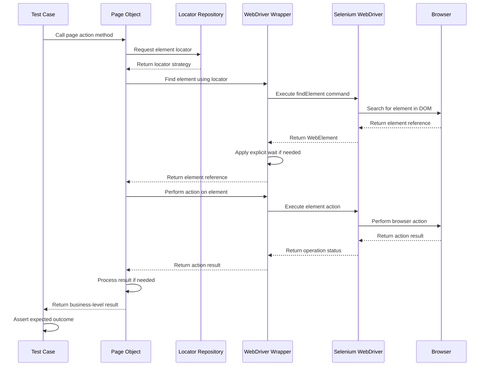
```mermaid
sequenceDiagram
    participant TC as Test Case
    participant PO as Page Object
    participant LR as Locator Repository
    participant WD as WebDriver Wrapper
    participant SE as Selenium WebDriver
    participant BR as Browser
    
    TC->>PO: Call page action method
    PO->>LR: Request element locator
    LR-->>PO: Return locator strategy
    
    PO->>WD: Find element using locator
    WD->>SE: Execute findElement command
    SE->>BR: Search for element in DOM
    BR-->>SE: Return element reference
    SE-->>WD: Return WebElement
    
    WD->>WD: Apply explicit wait if needed
    WD-->>PO: Return element reference
    
    PO->>WD: Perform action on element
    WD->>SE: Execute element action
    SE->>BR: Perform browser action
    BR-->>SE: Return action result
    SE-->>WD: Return operation status
    WD-->>PO: Return action result
    
    PO->>PO: Process result if needed
    PO-->>TC: Return business-level result
    
    TC->>TC: Assert expected outcome
```

#### State Transition Diagram

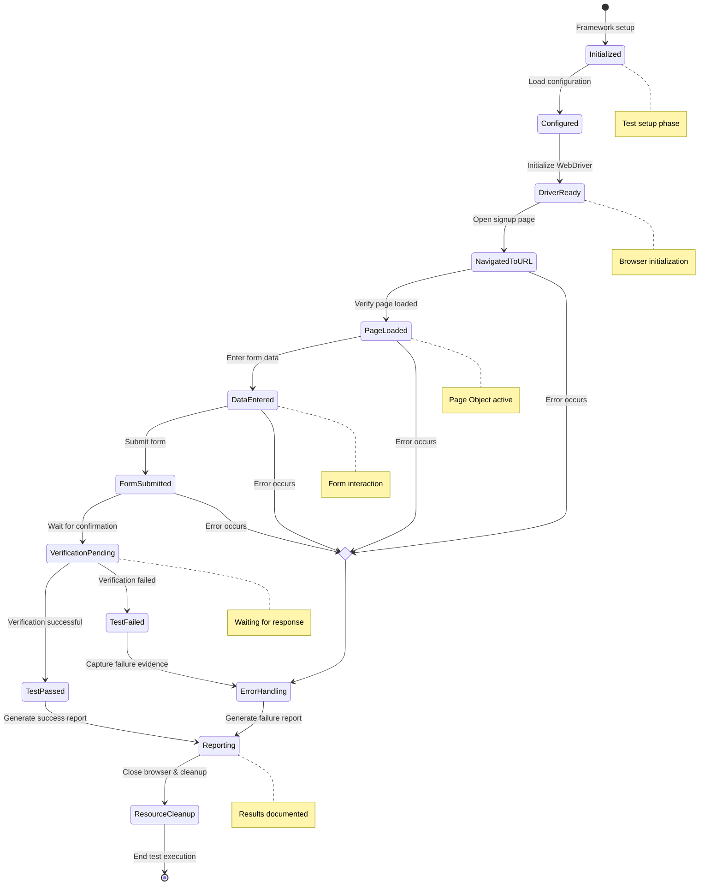
```mermaid
stateDiagram-v2
    [*] --> Initialized: Framework setup
    Initialized --> Configured: Load configuration
    Configured --> DriverReady: Initialize WebDriver
    DriverReady --> NavigatedToURL: Open signup page
    
    NavigatedToURL --> PageLoaded: Verify page loaded
    PageLoaded --> DataEntered: Enter form data
    DataEntered --> FormSubmitted: Submit form
    
    FormSubmitted --> VerificationPending: Wait for confirmation
    VerificationPending --> TestPassed: Verification successful
    VerificationPending --> TestFailed: Verification failed
    
    TestPassed --> Reporting: Generate success report
    TestFailed --> ErrorHandling: Capture failure evidence
    ErrorHandling --> Reporting: Generate failure report
    
    Reporting --> ResourceCleanup: Close browser & cleanup
    ResourceCleanup --> [*]: End test execution
    
    state if_error <<choice>>
    NavigatedToURL --> if_error: Error occurs
    PageLoaded --> if_error: Error occurs
    DataEntered --> if_error: Error occurs
    FormSubmitted --> if_error: Error occurs
    
    if_error --> ErrorHandling
    
    note right of Initialized: Test setup phase
    note right of DriverReady: Browser initialization 
    note right of PageLoaded: Page Object active
    note right of DataEntered: Form interaction
    note right of VerificationPending: Waiting for response
    note right of Reporting: Results documented
```

## 5. SYSTEM ARCHITECTURE

### HIGH-LEVEL ARCHITECTURE

#### System Overview

The Selenium automation framework follows a layered architecture based on the Page Object Model (POM) design pattern, providing clear separation of concerns between test logic and page representation. This architectural approach was selected for its maintainability benefits and industry acceptance as a best practice for UI automation.

Key architectural principles include:

- **Separation of Concerns**: Test logic is separated from page representation and element locators
- **Encapsulation**: Page objects encapsulate the page structure and behavior
- **Abstraction**: WebDriver interactions are abstracted through page objects
- **Reusability**: Common functionality is implemented in base classes and utilities
- **Maintainability**: Locators are centralized in separate files for easy updates

System boundaries are clearly defined with the framework interacting with the browser through Selenium WebDriver and the Storydoc application via the browser. The framework does not directly interact with backend systems but only through the UI as an end user would.

#### Core Components Table

| Component Name | Primary Responsibility | Key Dependencies | Critical Considerations |
| --- | --- | --- | --- |
| Test Cases | Define test scenarios and assertions for signup flow | Page Objects, Test Data | Must be readable and maintainable |
| Page Objects | Represent pages and their behaviors | Locator Repository, WebDriver Wrapper | Should reflect actual pages in application |
| Locator Repository | Store element identifiers separate from page logic | None | Must be organized by page for maintainability |
| WebDriver Wrapper | Abstract Selenium WebDriver interactions | Selenium WebDriver | Should handle synchronization and common issues |
| Test Utilities | Provide common helper functions | None | Must be generic and reusable |
| Configuration Manager | Handle test environment settings | None | Should support multiple environments |
| Reporting System | Generate test execution reports | Test Cases, Test Utilities | Must provide clear pass/fail status |

#### Data Flow Description

The primary data flow begins with the Configuration Manager loading environment settings that control WebDriver initialization. Test data flows from data sources (constants or external files) into Test Cases, which use Page Objects to interact with the application.

Page Objects request element locators from the Locator Repository to find UI elements. The Page Objects then use the WebDriver Wrapper to interact with these elements through Selenium WebDriver, which communicates with the browser. Browser responses flow back through WebDriver to the Page Objects, where application state is evaluated and returned to Test Cases for assertions.

Test execution results flow to the Reporting System, which generates execution reports and captures screenshots for failed tests. Logs are generated throughout the execution flow and persisted for troubleshooting.

The framework utilizes a synchronous communication pattern, with most operations blocking until browser interactions complete. Explicit waits are implemented at critical points to handle dynamic elements and asynchronous UI updates.

#### External Integration Points

| System Name | Integration Type | Data Exchange Pattern | Protocol/Format | SLA Requirements |
| --- | --- | --- | --- | --- |
| Web Browsers | Direct integration | Command-response | WebDriver protocol | Response \< 30s |
| Storydoc Application | UI interaction | User action simulation | HTTP/HTML | Page load \< 30s |
| CI/CD Pipeline | Execution trigger | Command-line invocation | Shell/Batch commands | Build time \< 15min |
| File System | Data persistence | File I/O | Local file access | Write time \< 5s |

### COMPONENT DETAILS

#### Test Cases Component

**Purpose and Responsibilities:**

- Define test scenarios for the signup process
- Execute test steps through page objects
- Verify expected outcomes through assertions
- Handle test data and test control flow

**Technologies and Frameworks:**

- Java as primary language
- TestNG for test orchestration and assertions
- Maven/Gradle for project management

**Key Interfaces:**

- TestNG annotations (@Test, @BeforeMethod, etc.)
- Page object method calls
- Assertion utility methods

**Data Persistence:**

- Test results captured in TestNG reports
- No direct data persistence requirements

**Scaling Considerations:**

- Designed for parallel execution capability
- Test organization to support increasing test coverage

#### Page Objects Component

**Purpose and Responsibilities:**

- Represent web pages in the application
- Encapsulate element interactions
- Provide high-level methods representing user actions
- Handle page transitions

**Technologies and Frameworks:**

- Java classes representing each page
- Inheritance from BasePage for common functionality

**Key Interfaces:**

- Page action methods (enterEmail, clickSignUp, etc.)
- Page transition methods returning new page objects
- Element interaction methods

**Data Persistence:**

- Stateless operation with no persistence requirements
- May temporarily store page state during test execution

**Scaling Considerations:**

- Modular design allowing addition of new page objects
- Common functionality in base classes to reduce duplication

#### Locator Repository Component

**Purpose and Responsibilities:**

- Store element locators separate from page objects
- Provide centralized location for updating selectors
- Organize locators by page/component

**Technologies and Frameworks:**

- Java classes or property files
- Enum or constant classes for typed locators

**Key Interfaces:**

- Getter methods for locator retrieval
- Organization by page name

**Data Persistence:**

- Static definition in source code
- No runtime persistence requirements

**Scaling Considerations:**

- Hierarchical organization for growing number of locators
- Naming conventions for clarity and consistency

#### WebDriver Wrapper Component

**Purpose and Responsibilities:**

- Abstract direct Selenium WebDriver calls
- Handle common synchronization issues
- Provide enhanced element interaction methods
- Manage WebDriver lifecycle

**Technologies and Frameworks:**

- Selenium WebDriver
- Custom wrapper implementation

**Key Interfaces:**

- Element action methods (click, type, select, etc.)
- Navigation methods
- Wait utilities
- Browser management methods

**Data Persistence:**

- WebDriver session state management
- No permanent data persistence

**Scaling Considerations:**

- Thread-safety for parallel execution
- Browser compatibility across major browsers

#### Configuration Manager Component

**Purpose and Responsibilities:**

- Load and manage test configuration
- Provide environment-specific settings
- Control browser and test execution parameters

**Technologies and Frameworks:**

- Property files or YAML
- Configuration parsing utilities

**Key Interfaces:**

- Configuration retrieval methods
- Environment detection methods

**Data Persistence:**

- Configuration stored in external files
- In-memory during test execution

**Scaling Considerations:**

- Support for multiple environments and configurations
- Extensibility for new configuration parameters

#### Reporting System Component

**Purpose and Responsibilities:**

- Generate detailed test execution reports
- Capture screenshots on test failures
- Log test steps and results

**Technologies and Frameworks:**

- ExtentReports or Allure
- Log4j/SLF4J for logging

**Key Interfaces:**

- Report generation methods
- Test status tracking methods
- Screenshot capture utilities

**Data Persistence:**

- Reports stored as HTML files
- Screenshots saved as image files
- Logs saved as text files

**Scaling Considerations:**

- Handling large numbers of test results
- Performance impact during extensive reporting

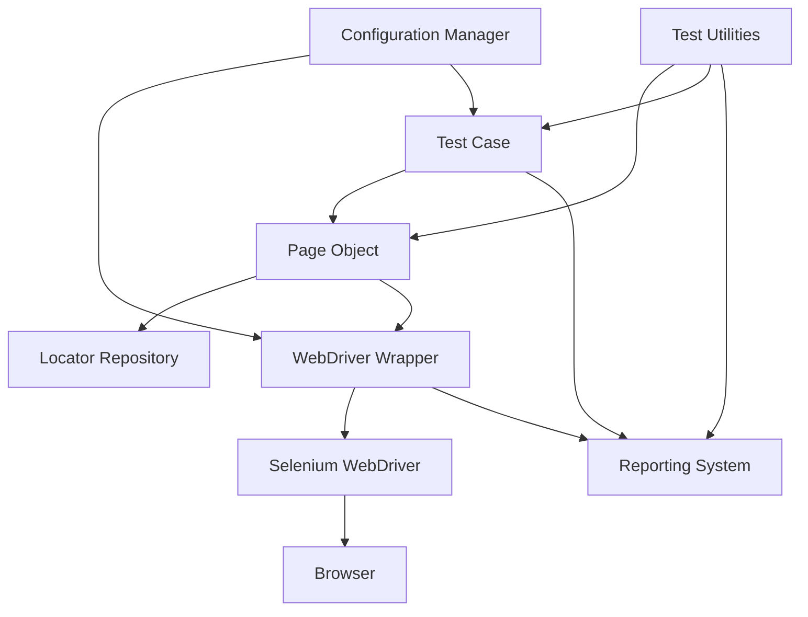
```mermaid
graph TD
    A[Test Case] --> B[Page Object]
    B --> C[Locator Repository]
    B --> D[WebDriver Wrapper]
    D --> E[Selenium WebDriver]
    E --> F[Browser]
    G[Configuration Manager] --> D
    G --> A
    A --> H[Reporting System]
    D --> H
    I[Test Utilities] --> B
    I --> A
    I --> H
```

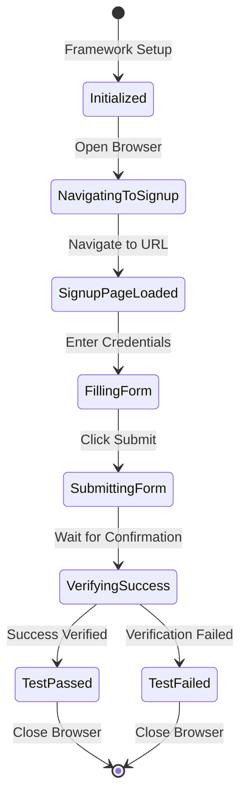
```mermaid
stateDiagram-v2
    [*] --> Initialized: Framework Setup
    Initialized --> NavigatingToSignup: Open Browser
    NavigatingToSignup --> SignupPageLoaded: Navigate to URL
    SignupPageLoaded --> FillingForm: Enter Credentials
    FillingForm --> SubmittingForm: Click Submit
    SubmittingForm --> VerifyingSuccess: Wait for Confirmation
    VerifyingSuccess --> TestPassed: Success Verified
    VerifyingSuccess --> TestFailed: Verification Failed
    TestPassed --> [*]: Close Browser
    TestFailed --> [*]: Close Browser
```

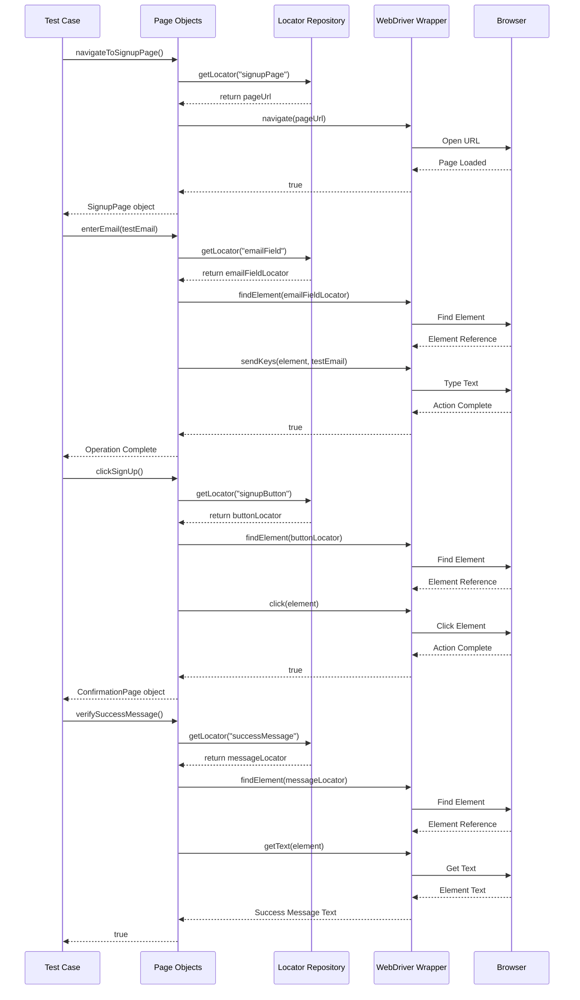
```mermaid
sequenceDiagram
    participant TC as Test Case
    participant PO as Page Objects
    participant LR as Locator Repository
    participant WD as WebDriver Wrapper
    participant BR as Browser
    
    TC->>PO: navigateToSignupPage()
    PO->>LR: getLocator("signupPage")
    LR-->>PO: return pageUrl
    PO->>WD: navigate(pageUrl)
    WD->>BR: Open URL
    BR-->>WD: Page Loaded
    WD-->>PO: true
    PO-->>TC: SignupPage object
    
    TC->>PO: enterEmail(testEmail)
    PO->>LR: getLocator("emailField")
    LR-->>PO: return emailFieldLocator
    PO->>WD: findElement(emailFieldLocator)
    WD->>BR: Find Element
    BR-->>WD: Element Reference
    PO->>WD: sendKeys(element, testEmail)
    WD->>BR: Type Text
    BR-->>WD: Action Complete
    WD-->>PO: true
    PO-->>TC: Operation Complete
    
    TC->>PO: clickSignUp()
    PO->>LR: getLocator("signupButton")
    LR-->>PO: return buttonLocator
    PO->>WD: findElement(buttonLocator)
    WD->>BR: Find Element
    BR-->>WD: Element Reference
    PO->>WD: click(element)
    WD->>BR: Click Element
    BR-->>WD: Action Complete
    WD-->>PO: true
    PO-->>TC: ConfirmationPage object
    
    TC->>PO: verifySuccessMessage()
    PO->>LR: getLocator("successMessage")
    LR-->>PO: return messageLocator
    PO->>WD: findElement(messageLocator)
    WD->>BR: Find Element
    BR-->>WD: Element Reference
    PO->>WD: getText(element)
    WD->>BR: Get Text
    BR-->>WD: Element Text
    WD-->>PO: Success Message Text
    PO-->>TC: true
```

### TECHNICAL DECISIONS

#### Architecture Style Decisions

| Decision | Chosen Approach | Alternatives Considered | Rationale |
| --- | --- | --- | --- |
| Design Pattern | Page Object Model | Record & Playback, Script-based | Provides better maintainability, reusability, and readability |
| Layer Separation | Strict separation of test logic, page actions, and locators | Combined approach | Enhances maintainability when UI changes occur |
| Browser Abstraction | WebDriver Wrapper | Direct WebDriver usage | Adds stability with built-in waits and error handling |
| Test Structure | Scenario-based | Feature-based, Data-driven | Aligns with business use cases and improves readability |

The Page Object Model architecture was selected as the primary pattern due to its proven effectiveness in creating maintainable test automation frameworks. POM provides clear separation of concerns, with test logic, page representation, and element location kept distinct. This separation makes the framework more resistant to UI changes and easier to maintain over time.

The decision to maintain locators in separate files further enhances maintainability by centralizing all element identification in one location. When the UI changes, only the locator files need updates rather than multiple page objects.

#### Communication Pattern Choices

| Pattern | Implementation | Use Case | Benefit |
| --- | --- | --- | --- |
| Command-Response | Page method calls returning results | User actions with verification | Clear action outcomes |
| Builder Pattern | Page method chaining | Sequential form filling | Improved readability |
| Factory Method | Page object instantiation | Page transitions | Encapsulation of page creation |
| Observer Pattern | Event listeners | WebDriver operations monitoring | Enhanced logging and reporting |

The primary communication pattern is a command-response model where test cases call page object methods that return either operation results or new page objects. This creates a fluent interface that mimics user interactions with the application and improves test script readability.

Synchronous communication is used throughout the framework to ensure that operations complete before proceeding to the next step, which is critical for reliable web UI testing.

#### Data Storage Solution Rationale

| Data Type | Storage Mechanism | Justification | Limitations |
| --- | --- | --- | --- |
| Test Data | Constants/CSV files | Simple, version-controlled, low overhead | Limited dynamic data generation |
| Configuration | Properties files | Standard approach, easy to modify | No complex structure support |
| Test Results | HTML reports | Rich visual representation, shareable | Requires file system access |
| Locators | Java classes/property files | Type safety, version control | Limited runtime modification |

For this framework, lightweight storage solutions were selected to minimize dependencies and complexity. Test data is primarily stored as constants or in simple CSV files, making it easy to version control and modify.

Configuration data is stored in standard properties files, following Java conventions and allowing easy changes between environments.

#### Caching Strategy Justification

| Cache Type | Implementation | Purpose | Refresh Strategy |
| --- | --- | --- | --- |
| WebDriver Instance | ThreadLocal variable | Reuse driver across test methods | New instance per test class |
| Page Objects | Factory methods | Avoid repetitive initialization | New instance on page navigation |
| Element References | Limited caching | Performance optimization | Refresh on page reloads |
| Configuration | Singleton pattern | Single load of settings | Static for test execution |

The caching strategy focuses on balancing performance and reliability. WebDriver instances are cached per thread to support parallel execution while avoiding resource contention. Page objects are typically not cached between tests to ensure a clean state, but may be reused within a test method.

Element references are generally not cached for extended periods to avoid stale element exceptions, with the WebDriver wrapper handling element re-location as needed.

#### Security Mechanism Selection

| Security Concern | Approach | Implementation | Rationale |
| --- | --- | --- | --- |
| Test Data Privacy | Externalization | Configuration file parameters | Prevents sensitive data in code |
| Credentials | Environment variables | Retrieved at runtime | Avoids hardcoded credentials |
| Browser Security | Configured profiles | Custom browser options | Controls cookie/cache handling |
| Test Isolation | Clean session | New browser session per test class | Prevents cross-test contamination |

Security considerations for the test framework focus on protecting test data and credentials while ensuring that tests don't interfere with each other. Sensitive information like passwords is externalized in configuration files or environment variables rather than hardcoded in the test code.

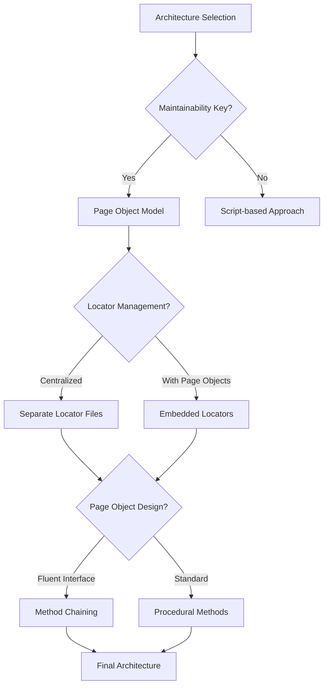
```mermaid
graph TD
    A[Architecture Selection] --> B{Maintainability Key?}
    B -- Yes --> C[Page Object Model]
    B -- No --> D[Script-based Approach]
    
    C --> E{Locator Management?}
    E -- Centralized --> F[Separate Locator Files]
    E -- With Page Objects --> G[Embedded Locators]
    
    F --> H{Page Object Design?}
    G --> H
    
    H -- Fluent Interface --> I[Method Chaining]
    H -- Standard --> J[Procedural Methods]
    
    I --> K[Final Architecture]
    J --> K
```

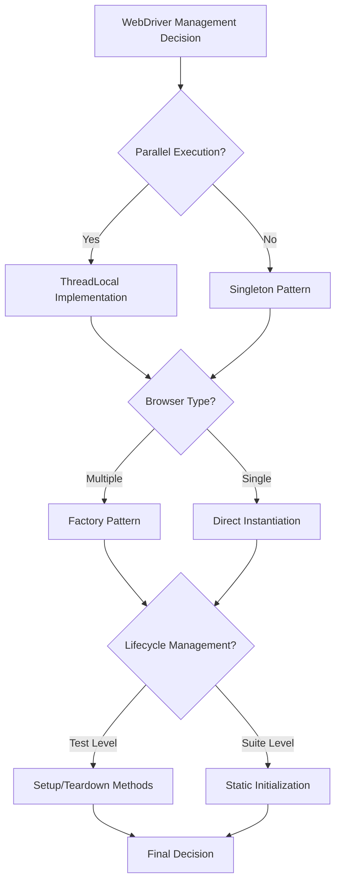
```mermaid
graph TD
    A[WebDriver Management Decision] --> B{Parallel Execution?}
    B -- Yes --> C[ThreadLocal Implementation]
    B -- No --> D[Singleton Pattern]
    
    C --> E{Browser Type?}
    D --> E
    
    E -- Multiple --> F[Factory Pattern]
    E -- Single --> G[Direct Instantiation]
    
    F --> H{Lifecycle Management?}
    G --> H
    
    H -- Test Level --> I[Setup/Teardown Methods]
    H -- Suite Level --> J[Static Initialization]
    
    I --> K[Final Decision]
    J --> K
```

### CROSS-CUTTING CONCERNS

#### Monitoring and Observability Approach

The monitoring strategy for the automation framework focuses on test execution visibility and issue identification:

- **Execution Monitoring**: Real-time console output shows test progress and status
- **Result Dashboards**: HTML reports provide visual representation of test execution results
- **Test Metrics Collection**: Success rates, execution times, and failure patterns are tracked
- **Log Aggregation**: Centralized logging consolidates information from all test components
- **Execution History**: Test run history is preserved for trend analysis

This approach enables quick identification of problems in both the application under test and the test framework itself, supporting continuous improvement of test reliability.

#### Logging and Tracing Strategy

| Log Level | Usage | Information Included | Retention |
| --- | --- | --- | --- |
| DEBUG | Detailed troubleshooting | Method parameters, element states | 7 days |
| INFO | Normal operations | Test steps, page transitions | 30 days |
| WARN | Potential issues | Slow responses, retries | 30 days |
| ERROR | Test failures | Exception details, screenshots | 90 days |

The logging implementation uses Log4j with a hierarchical approach:

- **Framework-level logging**: Internal operations and technical details
- **Test-level logging**: Business-oriented actions and validations
- **Integration-level logging**: Interactions with external systems

Each test creates a unique trace identifier to correlate all logged events across components, facilitating troubleshooting of complex issues.

#### Error Handling Patterns

| Error Type | Handling Approach | Recovery Mechanism | Impact Management |
| --- | --- | --- | --- |
| Element Not Found | Explicit waits with timeout | Retry with alternative locator | Fail current test, continue suite |
| Stale Element | Automatic re-location | Re-fetch element before action | Transparent retry |
| Timeout | Configurable wait periods | Extend wait or fail gracefully | Log detailed timing information |
| Assertion Failure | Clear error reporting | None - test fails | Screenshot capture, detailed logging |

The framework implements a multi-layered error handling approach:

1. **Prevention**: Robust waits and synchronization to avoid timing issues
2. **Detection**: Early identification of potential problems
3. **Recovery**: Automatic retry for transient issues
4. **Reporting**: Detailed failure information with visual evidence
5. **Isolation**: Failures contained to affected tests

This comprehensive approach minimizes flaky tests while providing detailed information when failures occur.

#### Authentication and Authorization Framework

For the Storydoc signup automation, authentication handling is minimal since the test creates new accounts. However, the framework includes:

- **Test Data Management**: Generation of unique email addresses for each test run
- **Password Management**: Secure storage of test passwords in configuration
- **Session Management**: Browser session handling between tests
- **Cleanup Procedures**: Post-test account cleanup where possible

This approach ensures that tests can run repeatedly without interference from previous executions.

#### Performance Requirements and SLAs

| Metric | Target | Measurement Method | Action if Violated |
| --- | --- | --- | --- |
| Test Execution Time | \< 5 minutes for full suite | Timer in test framework | Optimize slow tests, increase timeouts |
| Individual Test Time | \< 60 seconds per test | Per-test timing | Refactor or split test |
| Framework Initialization | \< 5 seconds | Startup timing | Optimize initialization sequence |
| Resource Usage | \< 1GB memory per browser instance | JVM monitoring | Review for memory leaks, optimize resource usage |

The performance requirements focus on maintaining efficient test execution while ensuring reliability. Explicit timeouts are configured for all wait operations to prevent indefinite hangs.

#### Disaster Recovery Procedures

| Failure Scenario | Detection Method | Recovery Procedure | Prevention Strategy |
| --- | --- | --- | --- |
| Browser Crash | Exception monitoring | Restart browser, continue from last checkpoint | Regular driver updates, session limits |
| Application Unavailable | Connection timeout | Retry with backoff, mark as environment issue | Pre-test health checks |
| Test Data Corruption | Data validation | Use backup data set, generate new data | Data integrity checks |
| Framework Exception | Error monitoring | Graceful termination, preserve logs | Robust exception handling |

The framework implements graceful degradation strategies to handle unexpected failures, prioritizing the preservation of execution information for troubleshooting.

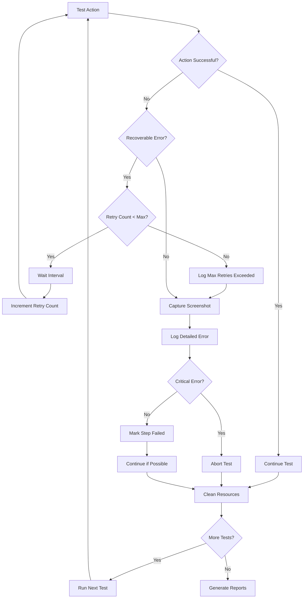
```mermaid
graph TD
    A[Test Action] --> B{Action Successful?}
    B -->|Yes| C[Continue Test]
    C --> O[Clean Resources]
    B -->|No| D{Recoverable Error?}
    D -->|Yes| E{Retry Count < Max?}
    E -->|Yes| F[Wait Interval]
    F --> G[Increment Retry Count]
    G --> A
    E -->|No| H[Log Max Retries Exceeded]
    H --> I[Capture Screenshot]
    D -->|No| I
    I --> J[Log Detailed Error]
    J --> K{Critical Error?}
    K -->|Yes| L[Abort Test]
    K -->|No| M[Mark Step Failed]
    M --> N[Continue if Possible]
    L --> O
    N --> O
    O --> P{More Tests?}
    P -->|Yes| Q[Run Next Test]
    Q --> A
    P -->|No| R[Generate Reports]
```

## 6. SYSTEM COMPONENTS DESIGN

### CORE FRAMEWORK COMPONENTS

#### Base Page Object

| Component | Description |
| --- | --- |
| **Responsibility** | Provides common functionality for all page objects |
| **Key Methods** | `waitForElementVisible()`, `click()`, `type()`, `getText()`, `isElementPresent()` |
| **Implementation Details** | Abstract class with protected WebDriver instance, implements common waits and element interactions |

```java
public abstract class BasePage {
    protected WebDriver driver;
    protected WebDriverWait wait;
    protected JavascriptExecutor js;
    
    public BasePage(WebDriver driver) {
        this.driver = driver;
        this.wait = new WebDriverWait(driver, Duration.ofSeconds(10));
        this.js = (JavascriptExecutor) driver;
    }
    
    protected WebElement waitForElementVisible(By locator) {
        return wait.until(ExpectedConditions.visibilityOfElementLocated(locator));
    }
    
    protected void click(By locator) {
        waitForElementVisible(locator).click();
    }
    
    protected void type(By locator, String text) {
        WebElement element = waitForElementVisible(locator);
        element.clear();
        element.sendKeys(text);
    }
    
    protected String getText(By locator) {
        return waitForElementVisible(locator).getText();
    }
    
    protected boolean isElementPresent(By locator) {
        try {
            driver.findElement(locator);
            return true;
        } catch (NoSuchElementException e) {
            return false;
        }
    }
}
```

#### WebDriver Manager

| Component | Description |
| --- | --- |
| **Responsibility** | Manages WebDriver lifecycle and browser configuration |
| **Key Methods** | `getDriver()`, `initDriver()`, `quitDriver()`, `configureDriver()` |
| **Implementation Details** | Singleton pattern or ThreadLocal implementation for parallel execution |

```java
public class WebDriverManager {
    private static ThreadLocal<WebDriver> driverThreadLocal = new ThreadLocal<>();
    
    public static WebDriver getDriver() {
        if (driverThreadLocal.get() == null) {
            initDriver();
        }
        return driverThreadLocal.get();
    }
    
    public static void initDriver() {
        WebDriver driver;
        String browser = ConfigurationManager.getInstance().getBrowser().toLowerCase();
        
        switch (browser) {
            case "chrome":
                WebDriverManager.chromedriver().setup();
                driver = new ChromeDriver(getChromeOptions());
                break;
            case "firefox":
                WebDriverManager.firefoxdriver().setup();
                driver = new FirefoxDriver(getFirefoxOptions());
                break;
            default:
                WebDriverManager.chromedriver().setup();
                driver = new ChromeDriver(getChromeOptions());
        }
        
        driver.manage().window().maximize();
        driver.manage().timeouts().pageLoadTimeout(Duration.ofSeconds(30));
        driver.manage().timeouts().implicitlyWait(Duration.ofSeconds(0)); // Using explicit waits
        
        driverThreadLocal.set(driver);
    }
    
    public static void quitDriver() {
        if (driverThreadLocal.get() != null) {
            driverThreadLocal.get().quit();
            driverThreadLocal.remove();
        }
    }
    
    private static ChromeOptions getChromeOptions() {
        ChromeOptions options = new ChromeOptions();
        // Add options as needed
        return options;
    }
    
    private static FirefoxOptions getFirefoxOptions() {
        FirefoxOptions options = new FirefoxOptions();
        // Add options as needed
        return options;
    }
}
```

#### Configuration Manager

| Component | Description |
| --- | --- |
| **Responsibility** | Loads and manages test configuration |
| **Key Methods** | `getInstance()`, `getProperty()`, `getBrowser()`, `getBaseUrl()` |
| **Implementation Details** | Singleton pattern, loads properties from configuration file |

```java
public class ConfigurationManager {
    private static ConfigurationManager instance;
    private Properties properties;
    
    private ConfigurationManager() {
        properties = new Properties();
        try (InputStream input = getClass().getClassLoader().getResourceAsStream("config.properties")) {
            properties.load(input);
        } catch (IOException e) {
            e.printStackTrace();
        }
    }
    
    public static synchronized ConfigurationManager getInstance() {
        if (instance == null) {
            instance = new ConfigurationManager();
        }
        return instance;
    }
    
    public String getProperty(String key) {
        return properties.getProperty(key);
    }
    
    public String getBrowser() {
        return getProperty("browser");
    }
    
    public String getBaseUrl() {
        return getProperty("base.url");
    }
    
    public int getTimeout() {
        return Integer.parseInt(getProperty("timeout.seconds"));
    }
}
```

#### Test Base

| Component | Description |
| --- | --- |
| **Responsibility** | Provides common setup and teardown for all tests |
| **Key Methods** | `setUp()`, `tearDown()`, `getScreenshot()` |
| **Implementation Details** | Base class for all tests with test lifecycle methods |

```java
public class TestBase {
    protected WebDriver driver;
    protected ExtentReports extent;
    protected ExtentTest test;
    
    @BeforeTest
    public void setUpReport() {
        extent = new ExtentReports();
        ExtentSparkReporter spark = new ExtentSparkReporter("test-output/report.html");
        extent.attachReporter(spark);
    }
    
    @BeforeMethod
    public void setUp(Method method) {
        driver = WebDriverManager.getDriver();
        test = extent.createTest(method.getName());
    }
    
    @AfterMethod
    public void tearDown(ITestResult result) {
        if (result.getStatus() == ITestResult.FAILURE) {
            test.fail(result.getThrowable());
            test.addScreenCaptureFromPath(getScreenshot(result.getName()));
        }
        WebDriverManager.quitDriver();
    }
    
    @AfterTest
    public void tearDownReport() {
        extent.flush();
    }
    
    private String getScreenshot(String testName) {
        TakesScreenshot ts = (TakesScreenshot) driver;
        File source = ts.getScreenshotAs(OutputType.FILE);
        String destination = "test-output/screenshots/" + testName + "_" + System.currentTimeMillis() + ".png";
        try {
            FileUtils.copyFile(source, new File(destination));
        } catch (IOException e) {
            e.printStackTrace();
        }
        return destination;
    }
}
```

### PAGE OBJECTS STRUCTURE

#### Page Object Hierarchy

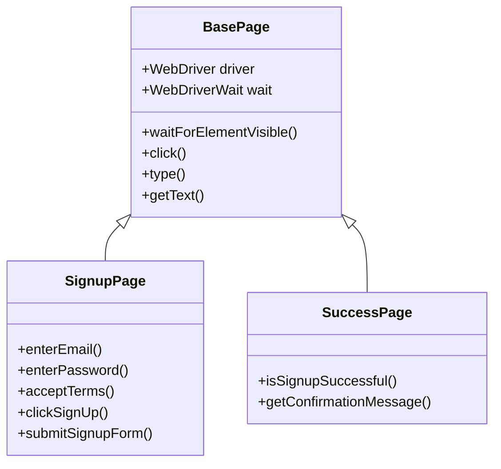
```mermaid
classDiagram
    BasePage <|-- SignupPage
    BasePage <|-- SuccessPage
    BasePage : +WebDriver driver
    BasePage : +WebDriverWait wait
    BasePage : +waitForElementVisible()
    BasePage : +click()
    BasePage : +type()
    BasePage : +getText()
    SignupPage : +enterEmail()
    SignupPage : +enterPassword()
    SignupPage : +acceptTerms()
    SignupPage : +clickSignUp()
    SignupPage : +submitSignupForm()
    SuccessPage : +isSignupSuccessful()
    SuccessPage : +getConfirmationMessage()
```

#### SignupPage Implementation

```java
public class SignupPage extends BasePage {
    
    public SignupPage(WebDriver driver) {
        super(driver);
    }
    
    public SignupPage navigateToSignupPage() {
        driver.get(ConfigurationManager.getInstance().getProperty("signup.url"));
        return this;
    }
    
    public SignupPage enterEmail(String email) {
        type(SignupPageLocators.EMAIL_FIELD, email);
        return this;
    }
    
    public SignupPage enterPassword(String password) {
        type(SignupPageLocators.PASSWORD_FIELD, password);
        return this;
    }
    
    public SignupPage acceptTerms() {
        click(SignupPageLocators.TERMS_CHECKBOX);
        return this;
    }
    
    public SuccessPage clickSignUp() {
        click(SignupPageLocators.SIGNUP_BUTTON);
        return new SuccessPage(driver);
    }
    
    public SuccessPage submitSignupForm(String email, String password) {
        return enterEmail(email)
               .enterPassword(password)
               .acceptTerms()
               .clickSignUp();
    }
    
    public boolean isSignupPageLoaded() {
        return isElementPresent(SignupPageLocators.SIGNUP_FORM);
    }
}
```

#### SuccessPage Implementation

```java
public class SuccessPage extends BasePage {
    
    public SuccessPage(WebDriver driver) {
        super(driver);
    }
    
    public boolean isSignupSuccessful() {
        return isElementPresent(SuccessPageLocators.SUCCESS_MESSAGE);
    }
    
    public String getConfirmationMessage() {
        return getText(SuccessPageLocators.SUCCESS_MESSAGE);
    }
}
```

### LOCATOR REPOSITORY DESIGN

#### Locator File Organization

```
src/main/java/locators/
  ├── SignupPageLocators.java
  ├── SuccessPageLocators.java
  └── CommonLocators.java
```

#### SignupPageLocators Implementation

```java
public class SignupPageLocators {
    // Form Elements
    public static final By SIGNUP_FORM = By.cssSelector("form[data-testid='signup-form']");
    public static final By EMAIL_FIELD = By.cssSelector("input[data-testid='email-input']");
    public static final By PASSWORD_FIELD = By.cssSelector("input[data-testid='password-input']");
    public static final By TERMS_CHECKBOX = By.cssSelector("input[data-testid='terms-checkbox']");
    public static final By SIGNUP_BUTTON = By.cssSelector("button[data-testid='signup-button']");
    
    // Error Messages
    public static final By EMAIL_ERROR = By.cssSelector("[data-testid='email-error']");
    public static final By PASSWORD_ERROR = By.cssSelector("[data-testid='password-error']");
}
```

#### SuccessPageLocators Implementation

```java
public class SuccessPageLocators {
    public static final By SUCCESS_MESSAGE = By.cssSelector("[data-testid='signup-success-message']");
    public static final By WELCOME_HEADER = By.cssSelector("h1[data-testid='welcome-header']");
    public static final By CONTINUE_BUTTON = By.cssSelector("button[data-testid='continue-button']");
}
```

### UTILITY CLASSES

#### Wait Utilities

```java
public class WaitUtils {
    
    public static WebElement waitForElementVisible(WebDriver driver, By locator, long timeoutInSeconds) {
        WebDriverWait wait = new WebDriverWait(driver, Duration.ofSeconds(timeoutInSeconds));
        return wait.until(ExpectedConditions.visibilityOfElementLocated(locator));
    }
    
    public static WebElement waitForElementClickable(WebDriver driver, By locator, long timeoutInSeconds) {
        WebDriverWait wait = new WebDriverWait(driver, Duration.ofSeconds(timeoutInSeconds));
        return wait.until(ExpectedConditions.elementToBeClickable(locator));
    }
    
    public static boolean waitForElementInvisible(WebDriver driver, By locator, long timeoutInSeconds) {
        WebDriverWait wait = new WebDriverWait(driver, Duration.ofSeconds(timeoutInSeconds));
        return wait.until(ExpectedConditions.invisibilityOfElementLocated(locator));
    }
    
    public static void waitForPageLoad(WebDriver driver, long timeoutInSeconds) {
        WebDriverWait wait = new WebDriverWait(driver, Duration.ofSeconds(timeoutInSeconds));
        wait.until(driver1 -> ((JavascriptExecutor) driver1)
            .executeScript("return document.readyState").equals("complete"));
    }
}
```

#### Random Data Generator

```java
public class RandomDataGenerator {
    
    public static String generateRandomEmail() {
        return "test" + System.currentTimeMillis() + "@example.com";
    }
    
    public static String generateRandomPassword() {
        // Generate a password that meets requirements (e.g., 8+ chars, special chars, etc.)
        return "Test@" + System.currentTimeMillis();
    }
}
```

### TEST IMPLEMENTATION

#### Signup Test Implementation

```java
public class SignupTest extends TestBase {
    
    private SignupPage signupPage;
    
    @BeforeMethod
    public void setupTest() {
        signupPage = new SignupPage(driver);
        signupPage.navigateToSignupPage();
    }
    
    @Test
    public void testPositiveSignupFlow() {
        // Generate test data
        String email = RandomDataGenerator.generateRandomEmail();
        String password = RandomDataGenerator.generateRandomPassword();
        
        // Execute signup process
        SuccessPage successPage = signupPage
            .enterEmail(email)
            .enterPassword(password)
            .acceptTerms()
            .clickSignUp();
        
        // Verify successful signup
        Assert.assertTrue(successPage.isSignupSuccessful(), 
            "Signup was not successful");
        
        // Optional: verify content of success message
        String confirmationMessage = successPage.getConfirmationMessage();
        Assert.assertTrue(confirmationMessage.contains("successfully"), 
            "Success message not displayed correctly");
    }
}
```

### CONFIGURATION MANAGEMENT

#### Configuration File Structure

```properties
# config.properties
# Browser Configuration
browser=chrome
headless=false

# URLs
base.url=https://editor-staging.storydoc.com
signup.url=https://editor-staging.storydoc.com/sign-up

# Timeouts
timeout.seconds=10
page.load.timeout=30

# Reporting
screenshots.dir=test-output/screenshots
reports.dir=test-output/reports
```

#### Configuration File Utility

```java
public interface ConfigProperties {
    @Key("browser")
    String browser();
    
    @Key("headless")
    boolean headless();
    
    @Key("base.url")
    String baseUrl();
    
    @Key("signup.url")
    String signupUrl();
    
    @Key("timeout.seconds")
    int timeoutSeconds();
    
    @Key("page.load.timeout")
    int pageLoadTimeout();
}
```

### COMPONENT INTERACTIONS

#### Test Execution Flow

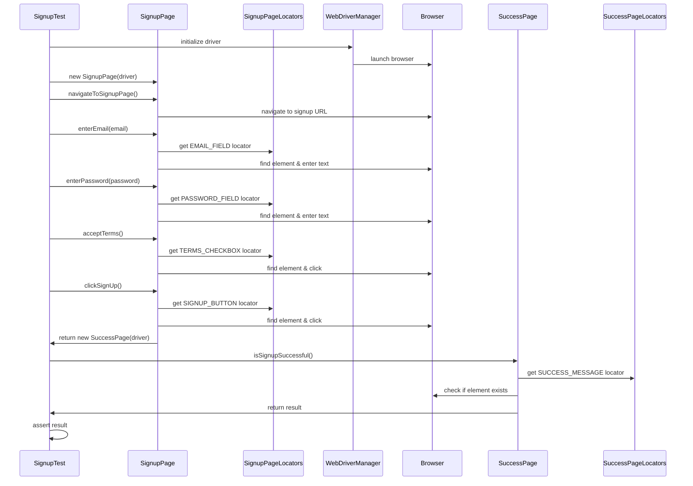
```mermaid
sequenceDiagram
    participant Test as SignupTest
    participant Page as SignupPage
    participant Locators as SignupPageLocators
    participant Driver as WebDriverManager
    participant Browser as Browser
    
    Test->>Driver: initialize driver
    Driver->>Browser: launch browser
    Test->>Page: new SignupPage(driver)
    Test->>Page: navigateToSignupPage()
    Page->>Browser: navigate to signup URL
    
    Test->>Page: enterEmail(email)
    Page->>Locators: get EMAIL_FIELD locator
    Page->>Browser: find element & enter text
    
    Test->>Page: enterPassword(password)
    Page->>Locators: get PASSWORD_FIELD locator
    Page->>Browser: find element & enter text
    
    Test->>Page: acceptTerms()
    Page->>Locators: get TERMS_CHECKBOX locator
    Page->>Browser: find element & click
    
    Test->>Page: clickSignUp()
    Page->>Locators: get SIGNUP_BUTTON locator
    Page->>Browser: find element & click
    Page->>Test: return new SuccessPage(driver)
    
    Test->>SuccessPage: isSignupSuccessful()
    SuccessPage->>SuccessPageLocators: get SUCCESS_MESSAGE locator
    SuccessPage->>Browser: check if element exists
    SuccessPage->>Test: return result
    
    Test->>Test: assert result
```

### DATA MANAGEMENT

#### Test Data Strategy

| Type | Source | Management Approach |
| --- | --- | --- |
| Email Addresses | Generated at runtime | Unique timestamp-based generation |
| Passwords | Generated at runtime | Meet complexity requirements |
| Expected Results | Constants | Defined in test classes or separate constants file |
| Configuration Data | Properties file | Externalized in config.properties |

#### Data Flow

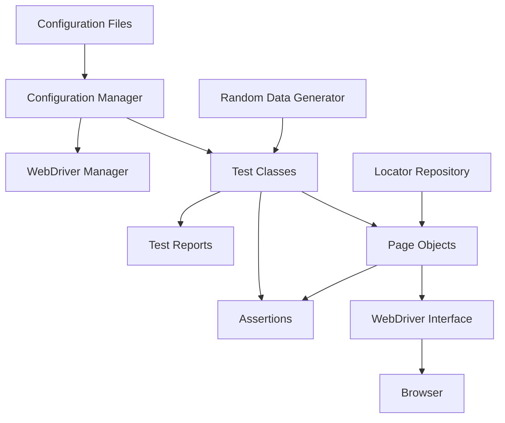
```mermaid
graph TD
    A[Configuration Files] --> B[Configuration Manager]
    B --> C[Test Classes]
    B --> D[WebDriver Manager]
    E[Random Data Generator] --> C
    C --> F[Page Objects]
    G[Locator Repository] --> F
    F --> H[WebDriver Interface]
    H --> I[Browser]
    C --> J[Assertions]
    F --> J
    C --> K[Test Reports]
```

### ERROR HANDLING

#### Exception Handling Strategy

| Exception Type | Handling Approach | Recovery Action |
| --- | --- | --- |
| NoSuchElementException | Try/catch in BasePage methods | Log error, capture screenshot, fail test |
| TimeoutException | Explicit handling in wait methods | Retry with increased timeout or alternative locator |
| WebDriverException | Global exception handler | Restart WebDriver session if possible |
| AssertionError | TestNG listener | Capture detailed test state information |

#### Error Recovery Process

```java
public void safeClick(By locator) {
    try {
        click(locator);
    } catch (TimeoutException | NoSuchElementException e) {
        logger.error("Failed to click element: " + locator);
        // Try alternative approach
        try {
            WebElement element = driver.findElement(locator);
            ((JavascriptExecutor) driver).executeScript("arguments[0].click();", element);
        } catch (Exception ex) {
            logger.error("Failed to click element using JS: " + locator);
            throw e; // Rethrow original exception if recovery fails
        }
    }
}
```

### REPORTING COMPONENTS

#### Report Structure

| Component | Implementation | Purpose |
| --- | --- | --- |
| HTML Report | ExtentReports | Detailed test execution results with screenshots |
| Logs | Log4j | Detailed execution logs for troubleshooting |
| JUnit XML | TestNG | CI/CD integration and historical tracking |
| Screenshots | Commons-IO | Visual evidence of failures |

#### Reporting Flow

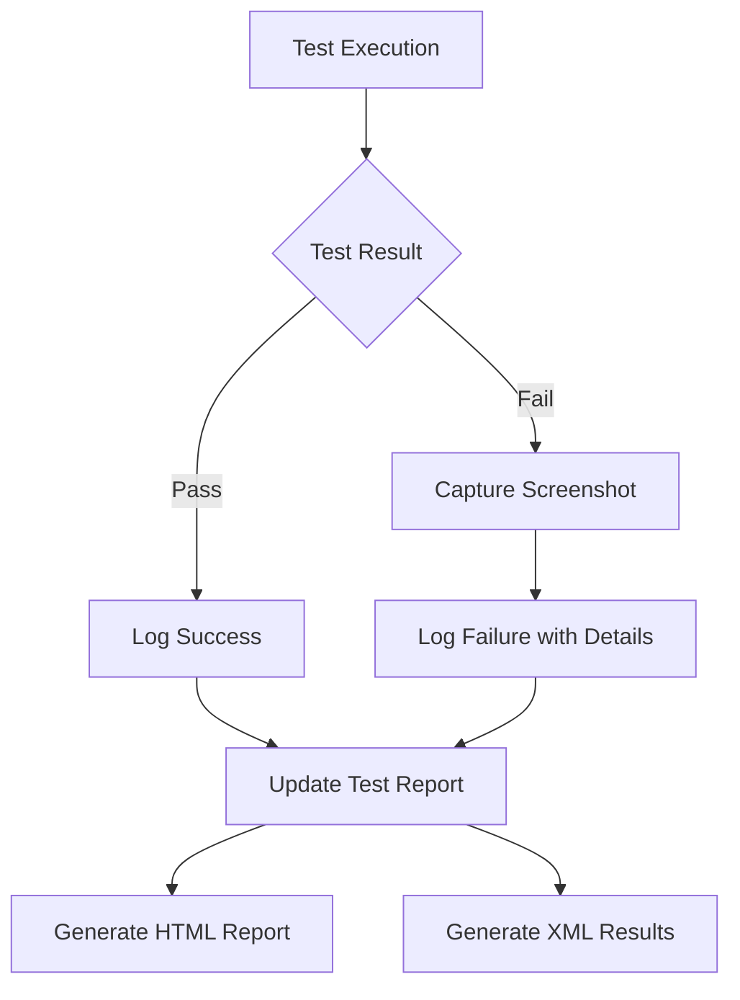
```mermaid
graph TD
    A[Test Execution] --> B{Test Result}
    B -->|Pass| C[Log Success]
    B -->|Fail| D[Capture Screenshot]
    D --> E[Log Failure with Details]
    C --> F[Update Test Report]
    E --> F
    F --> G[Generate HTML Report]
    F --> H[Generate XML Results]
```

### FRAMEWORK EXTENSIBILITY

#### Extension Points

| Extension Point | Purpose | Implementation Mechanism |
| --- | --- | --- |
| New Page Objects | Support additional pages | Create new page classes extending BasePage |
| Additional Browsers | Support more browsers | Add browser options to WebDriverManager |
| Custom Reporting | Enhanced reporting | Implement custom TestNG listeners |
| New Test Scenarios | Additional test coverage | Create new test classes extending TestBase |
| Custom Waits | Specialized synchronization | Add methods to WaitUtils |

#### Adding a New Page Object Example

```java
// 1. Create locators file
public class NewPageLocators {
    public static final By HEADER = By.cssSelector("h1.header");
    public static final By SUBMIT_BUTTON = By.id("submit");
}

// 2. Create page object class
public class NewPage extends BasePage {
    public NewPage(WebDriver driver) {
        super(driver);
    }
    
    public boolean isPageLoaded() {
        return isElementPresent(NewPageLocators.HEADER);
    }
    
    public void submitForm() {
        click(NewPageLocators.SUBMIT_BUTTON);
    }
}

// 3. Update existing page object to handle navigation
public SuccessPage clickContinue() {
    click(SuccessPageLocators.CONTINUE_BUTTON);
    return new NewPage(driver);
}
```

## 6.1 CORE SERVICES ARCHITECTURE

Core Services Architecture in the traditional microservices sense is not applicable for this system. This Selenium automation framework is a client-side testing tool implementing the Page Object Model pattern rather than a distributed application requiring service orchestration. Instead, this section describes the framework's architectural components and patterns that enable effective test automation.

### FRAMEWORK COMPONENTS

| Component Type | Description | Responsibilities |
| --- | --- | --- |
| Test Runner | TestNG-based execution engine | Orchestrates test execution, handles test lifecycle, manages test dependencies |
| Page Objects | Page representation classes | Encapsulate page elements and behaviors, abstract UI interactions, provide business-level methods |
| Locator Repository | Element identifier storage | Centralize element locators, isolate UI changes, improve maintainability |
| WebDriver Manager | Browser management component | Initialize browser instances, manage driver lifecycle, configure browser capabilities |

#### Component Communication Patterns

| Pattern | Implementation | Purpose |
| --- | --- | --- |
| Factory Pattern | Page object instantiation | Create appropriate page objects when navigating between pages |
| Facade Pattern | Page object methods | Abstract complex UI interactions behind simple method calls |
| Singleton | WebDriver/Configuration instances | Ensure single point of access to critical resources |
| Command Pattern | Action methods in page objects | Encapsulate UI operations as executable commands |

#### Resource Management Approach

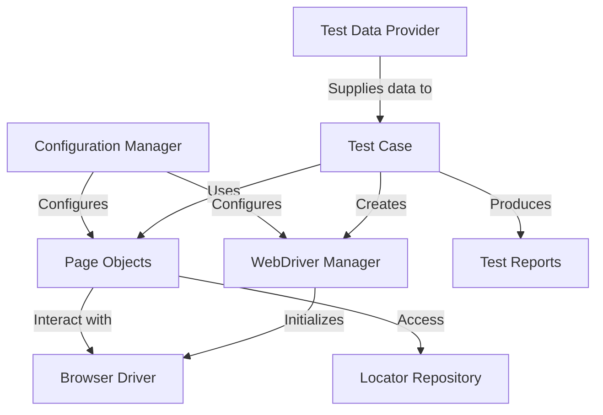
```mermaid
flowchart TD
    A[Test Case] -->|Creates| B[WebDriver Manager]
    B -->|Initializes| C[Browser Driver]
    A -->|Uses| D[Page Objects]
    D -->|Access| E[Locator Repository]
    D -->|Interact with| C
    F[Configuration Manager] -->|Configures| B
    F -->|Configures| D
    A -->|Produces| G[Test Reports]
    H[Test Data Provider] -->|Supplies data to| A
```

#### Synchronization Mechanisms

| Mechanism | Implementation | Purpose |
| --- | --- | --- |
| Explicit Waits | WebDriverWait implementations | Synchronize test execution with application state |
| Fluent Wait | Custom wait conditions | Handle dynamic elements and variable load times |
| Page Load Verification | isPageLoaded() methods | Confirm successful page transitions before proceeding |
| Retry Mechanisms | Custom retry logic | Recover from transient UI issues or timing problems |

### SCALABILITY DESIGN

#### Test Execution Scaling Approach

| Scaling Method | Implementation | Benefits |
| --- | --- | --- |
| Parallel Execution | TestNG parallel attributes | Reduce total execution time, increase test coverage |
| Thread-Safe Components | ThreadLocal WebDriver instances | Support concurrent test execution without interference |
| Modular Page Objects | Hierarchical page object design | Enable test composition and reuse |
| Data-Driven Testing | TestNG data providers | Scale test scenarios without code duplication |

#### Resource Optimization Techniques

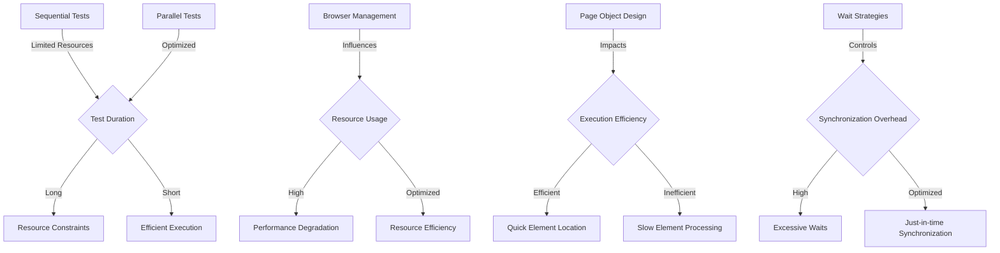
```mermaid
flowchart TD
    A[Sequential Tests] -->|Limited Resources| B{Test Duration}
    C[Parallel Tests] -->|Optimized| B
    B -->|Long| D[Resource Constraints]
    B -->|Short| E[Efficient Execution]
    
    F[Browser Management] -->|Influences| G{Resource Usage}
    G -->|High| H[Performance Degradation]
    G -->|Optimized| I[Resource Efficiency]
    
    J[Page Object Design] -->|Impacts| K{Execution Efficiency}
    K -->|Efficient| L[Quick Element Location]
    K -->|Inefficient| M[Slow Element Processing]
    
    N[Wait Strategies] -->|Controls| O{Synchronization Overhead}
    O -->|High| P[Excessive Waits]
    O -->|Optimized| Q[Just-in-time Synchronization]
```

#### Performance Considerations

| Consideration | Implementation Approach | Impact |
| --- | --- | --- |
| Browser Instances | Limited concurrent browsers | Control memory/CPU consumption |
| Element Location | Optimized locator strategies | Reduce DOM traversal time |
| Page Load Handling | Dynamic waits with timeouts | Prevent excessive wait times |
| Screenshots | Captured only on failures | Minimize disk I/O operations |
| Test Data | Generated or loaded efficiently | Reduce test preparation time |

### RESILIENCE PATTERNS

#### Test Reliability Mechanisms

| Mechanism | Implementation | Purpose |
| --- | --- | --- |
| Explicit Waits | Condition-based synchronization | Handle timing variations in application |
| Retry Logic | Attempt-retry-fallback pattern | Recover from transient failures |
| Screenshot Capture | Automatic capture on failure | Provide visual evidence for diagnosis |
| Clean Session | New browser instance per test class | Prevent state contamination between tests |
| Detailed Logging | Hierarchical logging structure | Enable effective troubleshooting |

#### Error Recovery Procedures

```mermaid
flowchart TD
    A[Test Action] --> B{Action Successful?}
    B -->|Yes| C[Continue Test]
    B -->|No| D{Recoverable Error?}
    D -->|Yes| E{Retry Limit Reached?}
    E -->|No| F[Wait and Retry]
    F --> A
    E -->|Yes| G[Log Maximum Retries]
    D -->|No| H[Critical Failure]
    G --> I[Take Screenshot]
    H --> I
    I --> J[Log Detailed Error]
    J --> K[Report Failure]
    K --> L[Continue Test Suite]
```

#### Test Data Management Approach

| Approach | Implementation | Resilience Benefit |
| --- | --- | --- |
| Dynamic Generation | Timestamp-based unique data | Prevent test interference |
| Environment Isolation | Staging environment testing | Avoid production impact |
| Data Independence | Self-contained test data | Eliminate external dependencies |
| Cleanup Procedures | Post-test state restoration | Ensure repeatable test conditions |

### FRAMEWORK SCALING CONSIDERATIONS

For larger test suites and growing application complexity, the framework can scale through:

| Scaling Need | Implementation Strategy | Benefits |
| --- | --- | --- |
| More Test Coverage | Page component isolation | Reuse page components across tests |
| Multiple Browsers | WebDriver factory pattern | Support cross-browser verification |
| Execution Speed | Test distribution | Run subsets on multiple machines |
| Results Analysis | Aggregated reporting | Consolidate results from distributed tests |

```mermaid
flowchart TD
    A[Test Suite Growth] --> B{Framework Scalability}
    B -->|Poor| C[Increased Maintenance]
    B -->|Good| D[Sustainable Testing]
    
    E[Page Object Design] -->|Influences| F{Component Reusability}
    F -->|High| G[Efficient Test Creation]
    F -->|Low| H[Duplicated Test Code]
    
    I[Locator Strategy] -->|Impacts| J{UI Change Resilience}
    J -->|Strong| K[Isolated Maintenance]
    J -->|Weak| L[Widespread Updates]
    
    M[Execution Architecture] -->|Determines| N{Parallel Capability}
    N -->|Enabled| O[Linear Execution Time]
    N -->|Disabled| P[Execution Time Growth]
```

This architectural approach focuses on creating a maintainable, resilient test automation framework that can effectively validate the Storydoc signup process while providing a foundation for future test expansion.

## 6.2 DATABASE DESIGN

Database Design is not applicable to this system. The Selenium automation framework using Page Object Model pattern does not require a traditional database for its core functionality for the following reasons:

### ALTERNATIVE DATA MANAGEMENT APPROACHES

| Data Type | Storage Mechanism | Purpose | Implementation |
| --- | --- | --- | --- |
| Test Data | Properties/CSV/JSON files | Store test inputs | File-based storage for email addresses, passwords, and expected results |
| Test Configuration | Properties files | Environment settings | Configuration for browser types, URLs, timeouts, and execution parameters |
| Test Results | HTML/XML reports | Execution outcomes | Generated files storing pass/fail results and execution details |
| Screenshots | Image files | Failure evidence | Captured on test failures and stored in filesystem |

### FILE-BASED STORAGE STRATEGY

```mermaid
graph TD
    A[Test Execution] --> B[Input Data]
    A --> C[Output Data]
    
    B --> D[Test Data Files]
    B --> E[Configuration Files]
    
    C --> F[Result Reports]
    C --> G[Screenshots]
    C --> H[Execution Logs]
    
    D --> I[CSV/JSON/Properties]
    E --> J[Properties Files]
    F --> K[HTML/XML Reports]
    G --> L[PNG Files]
    H --> M[Log Files]
```

### DATA FLOW ARCHITECTURE

```mermaid
flowchart TD
    A[Test Data Files] -->|Read| B[Data Providers]
    B -->|Supply| C[Test Cases]
    D[Configuration Files] -->|Configure| E[Framework Components]
    E -->|Support| C
    C -->|Generate| F[Test Results]
    F -->|Write| G[Report Files]
    C -->|Capture| H[Screenshots]
    C -->|Produce| I[Log Entries]
```

### PERSISTENCE CONSIDERATIONS

#### Data Retention Strategy

| Data Category | Retention Approach | Duration | Cleanup Mechanism |
| --- | --- | --- | --- |
| Test Results | Build server storage | 30-90 days | Automated purging of old reports |
| Screenshots | Selective retention | Keep only for failures | Delete successful test artifacts |
| Execution Logs | Rolling file appenders | 7-30 days | Log rotation and archiving |
| Test Data | Version controlled | Permanent (in source code) | N/A |

#### Temporary Data Management

The framework will generate temporary data during execution:

- Unique email addresses for signup tests
- Browser session data and cookies
- In-memory objects during test execution

These are automatically handled by:

- The browser being closed at the end of tests
- JVM garbage collection for in-memory objects
- File system cleanup for temporary downloads

### PERFORMANCE OPTIMIZATION

While traditional database optimization is not applicable, the framework implements these performance considerations:

| Optimization Area | Implementation | Benefit |
| --- | --- | --- |
| Resource Loading | Lazy initialization | Load test data only when needed |
| File I/O | Buffered operations | Efficient reading/writing of configuration and results |
| Memory Management | Object pooling | Reuse page objects and WebDriver instances where appropriate |
| Parallel Access | Thread-safe file operations | Support concurrent test execution |

For larger test suites or enterprise implementations, consideration could be given to integrating with test management systems or results databases, but this is beyond the scope of the current project requirements.

## 6.3 INTEGRATION ARCHITECTURE

For this Selenium automation framework, a traditional enterprise integration architecture with complex APIs and message processing is not required. The framework primarily interacts with the Storydoc application through the browser using Selenium WebDriver, which is a library dependency rather than an external integration. However, the framework does have specific integration points that should be documented.

### FRAMEWORK INTEGRATION POINTS

#### WebDriver Integration

| Integration Point | Type | Purpose | Implementation |
| --- | --- | --- | --- |
| Browser Drivers | Library | Browser automation | WebDriverManager for automated driver management |
| Browser Process | External | UI interaction | Selenium command execution through browser drivers |
| Application UI | External | Test target | HTTP/HTTPS connection to application URL |

```mermaid
sequenceDiagram
    participant Test as Test Framework
    participant WD as WebDriver
    participant Browser as Browser
    participant App as Storydoc UI
    
    Test->>WD: initialize(browserType)
    WD->>Browser: launch browser process
    Browser-->>WD: browser instance
    WD-->>Test: driver instance
    
    Test->>WD: navigate(URL)
    WD->>Browser: HTTP request
    Browser->>App: load page
    App-->>Browser: render page
    Browser-->>WD: page loaded
    WD-->>Test: navigation complete
    
    Test->>WD: findElement(locator)
    WD->>Browser: locate in DOM
    Browser-->>WD: element reference
    WD-->>Test: WebElement
    
    Test->>WD: element.sendKeys(text)
    WD->>Browser: input text
    Browser->>App: update form field
    App-->>Browser: field updated
    Browser-->>WD: action complete
    WD-->>Test: operation result
```

#### CI/CD Integration

| Integration Point | Type | Purpose | Implementation |
| --- | --- | --- | --- |
| Test Execution | Command-line | Automated test runs | Maven/Gradle commands with appropriate goals |
| Test Reporting | File-based | Result visualization | HTML/XML reports consumed by CI systems |
| Artifact Management | File-based | Report archiving | Report files stored as build artifacts |

```mermaid
graph TD
    A[CI/CD Pipeline] -->|Triggers| B[Test Execution]
    B -->|Maven/Gradle| C[Selenium Framework]
    C -->|Generates| D[Test Reports]
    D -->|Stored as| E[Build Artifacts]
    C -->|Updates| F[Test Status]
    F -->|Determines| G[Build Status]
    H[Source Code] -->|Changes Trigger| A
```

### TESTING TOOL INTEGRATION

#### Reporting Integration

| Tool | Integration Method | Data Format | Purpose |
| --- | --- | --- | --- |
| ExtentReports | Direct library | HTML/Screenshots | Rich test reporting with screenshots |
| TestNG Reports | Native output | XML/HTML | Standard test execution results |
| Log4j | Library | Log files | Detailed execution logging |

```mermaid
flowchart TD
    A[Test Execution] -->|Results| B{Report Type}
    B -->|TestNG| C[XML Reports]
    B -->|Extent| D[HTML Dashboard]
    B -->|Logging| E[Log Files]
    
    C -->|Consumed by| F[CI System]
    D -->|Viewed in| G[Web Browser]
    E -->|Analyzed for| H[Troubleshooting]
    
    I[Test Failures] -->|Triggers| J[Screenshot Capture]
    J -->|Embedded in| D
```

#### Data Management Integration

| Data Source | Integration Method | Purpose | Implementation |
| --- | --- | --- | --- |
| Test Data | File-based | Input parameters | Properties/CSV/JSON files |
| Configuration | File-based | Framework settings | Properties files |
| Object Repository | Code-based | Element locators | Java classes with locator constants |

```mermaid
graph TD
    A[Test Cases] -->|Read| B[Test Data Files]
    A -->|Use| C[Configuration Files]
    D[Page Objects] -->|Access| E[Locator Repository]
    F[Test Runner] -->|Configures| A
    F -->|Controls| G[Browser Configuration]
    H[Test Results] -->|Written to| I[Report Files]
```

### EXTERNAL DEPENDENCIES

| Dependency | Purpose | Integration Type | Versioning |
| --- | --- | --- | --- |
| Selenium WebDriver | Browser automation | Library | 4.8.x+ |
| WebDriverManager | Driver binary management | Library | 5.3.x+ |
| TestNG | Test orchestration | Library | 7.7.x+ |
| ExtentReports | Test reporting | Library | 5.0.x+ |
| Browser Drivers | Browser control | External executable | Latest stable |

#### Dependency Management

```mermaid
flowchart TD
    A[Maven/Gradle] -->|Manages| B[Framework Dependencies]
    B -->|Core| C[Selenium WebDriver]
    B -->|Testing| D[TestNG]
    B -->|Reporting| E[ExtentReports]
    B -->|Utilities| F[Apache Commons]
    
    G[WebDriverManager] -->|Downloads| H[Browser Drivers]
    H -->|Controls| I[Browsers]
    C -->|Uses| H
    
    J[Framework Code] -->|Built with| A
    J -->|Uses| B
```

### BROWSER COMMUNICATION ARCHITECTURE

The framework communicates with browsers using the WebDriver protocol, which is a RESTful API under the hood:

```mermaid
sequenceDiagram
    participant Test as Test Code
    participant PO as Page Object
    participant WD as WebDriver API
    participant Driver as Browser Driver
    participant Browser as Browser
    
    Test->>PO: performAction()
    PO->>WD: findElement(By.id("email"))
    WD->>Driver: HTTP POST /session/{id}/element
    Driver->>Browser: Locate element in DOM
    Browser-->>Driver: Element reference
    Driver-->>WD: Element ID
    
    PO->>WD: element.sendKeys("test@example.com")
    WD->>Driver: HTTP POST /session/{id}/element/{id}/value
    Driver->>Browser: Input text to element
    Browser-->>Driver: Success
    Driver-->>WD: Operation result
    WD-->>PO: Operation complete
    PO-->>Test: Action result
```

### SECURITY CONSIDERATIONS

| Security Aspect | Implementation | Purpose |
| --- | --- | --- |
| Test Data Protection | Externalized configuration | Avoid hardcoded credentials |
| Browser Security | Configured profiles | Control cookie storage and permissions |
| Environment Isolation | Testing on staging | Prevent production data exposure |

### FUTURE INTEGRATION POSSIBILITIES

While current integration needs are limited, the framework is designed to accommodate future extensions:

1. Integration with cloud testing platforms (BrowserStack, Sauce Labs)
2. Integration with test management systems
3. Integration with defect tracking systems (Jira)
4. API testing capabilities alongside UI testing

```mermaid
graph TD
    subgraph "Current Scope"
        A[Selenium Framework] -->|Interacts with| B[Storydoc UI]
        A -->|Produces| C[Test Reports]
        A -->|Runs in| D[CI/CD Pipeline]
    end
    
    subgraph "Future Extensions"
        A -.->|Could integrate with| E[Cloud Testing Platforms]
        A -.->|Could integrate with| F[Test Management System]
        A -.->|Could integrate with| G[Defect Tracking]
        A -.->|Could extend to| H[API Testing]
    end
```

This simplified integration architecture focuses on the practical integration points needed for a Selenium automation framework without introducing unnecessary complexity that would be more applicable to distributed enterprise systems.

## 6.4 SECURITY ARCHITECTURE

Detailed Security Architecture in the traditional enterprise sense is not applicable for this system. The Selenium automation framework is a testing tool rather than a customer-facing application that stores sensitive data or requires complex authentication mechanisms. However, several standard security practices should be implemented to protect test data, test environments, and maintain secure coding practices.

### TEST DATA SECURITY

| Security Concern | Implementation Approach | Purpose |
| --- | --- | --- |
| Test Credentials | Externalized configuration | Prevent hardcoded credentials in source code |
| Data Generation | Dynamic test data creation | Avoid using real user data in tests |
| Sensitive Data | Environment variables for secrets | Keep sensitive values out of configuration files |
| Data Cleanup | Post-test cleanup routines | Remove test accounts after execution when possible |

```mermaid
flowchart TD
    A[Test Data] -->|Stored as| B{Storage Method}
    B -->|Sensitive| C[Environment Variables]
    B -->|Non-sensitive| D[Configuration Files]
    B -->|Generated| E[Runtime Generation]
    
    F[Test Execution] -->|Uses| G[Test Data]
    G -->|Contains| H[Credentials]
    H -->|Protected via| I[Secure Storage]
    
    J[Test Completion] -->|Triggers| K[Data Cleanup]
    K -->|Removes| L[Test Accounts]
```

### CODE AND ENVIRONMENT SECURITY

| Security Practice | Implementation | Benefit |
| --- | --- | --- |
| Version Control Access | Restricted repository permissions | Prevent unauthorized code access |
| Secrets Management | No credentials in source code | Avoid credential exposure in repositories |
| Browser Security | Clean user profile per test | Prevent session data leakage between tests |
| Report Security | Restricted access to test results | Protect any sensitive information in reports |

#### Best Practices for Security in Test Automation

1. **Use dedicated test accounts** with minimal privileges
2. **Implement timeout-based browser session management** to prevent orphaned sessions
3. **Clear browser data** between test runs
4. **Use encrypted connections** (HTTPS) for accessing the application
5. **Implement secure coding practices** to prevent injection vulnerabilities
6. **Limit logging** of sensitive information
7. **Restrict CI/CD pipeline access** to authorized personnel

### SECURE EXECUTION FLOW

```mermaid
sequenceDiagram
    participant CI as CI/CD System
    participant TF as Test Framework
    participant CM as Configuration Manager
    participant BR as Browser
    participant APP as Application
    
    CI->>TF: Trigger Test Execution
    TF->>CM: Retrieve Configuration
    CM->>CM: Load Environment Variables
    CM->>TF: Return Secure Configuration
    
    TF->>BR: Initialize Browser Session
    BR->>BR: Configure Private Session
    TF->>BR: Navigate to Application
    BR->>APP: Connect via HTTPS
    
    TF->>BR: Execute Test Actions
    BR->>APP: Interact with Application
    
    TF->>TF: Generate Test Results
    TF->>TF: Mask Sensitive Data in Reports
    TF->>BR: Clear Session Data
    TF->>BR: Close Browser
    
    TF->>CI: Return Test Status
```

### ENVIRONMENT SECURITY ZONES

```mermaid
graph TD
    subgraph "Development Environment"
        A[Local Development] --> B[Source Code Repository]
        C[Local Test Execution] --> D[Local Test Reports]
    end
    
    subgraph "Execution Environment"
        E[CI/CD Pipeline] --> F[Automated Test Execution]
        F --> G[Test Reports Storage]
    end
    
    subgraph "Test Target Environment"
        H[Staging Environment] --> I[Storydoc Application]
    end
    
    B --> E
    F --> H
```

### SECURE CODING PRACTICES

| Practice Category | Specific Practices | Implementation |
| --- | --- | --- |
| Input Validation | Validate all inputs | Proper validation before using test data |
| Output Encoding | Escape special characters | Proper handling of strings in reports |
| Error Handling | Generic error messages | Avoid exposing implementation details |
| Logging | Limited sensitive data | Avoid logging credentials or personal data |

### SECURITY COMPLIANCE GUIDELINES

While formal compliance frameworks like PCI-DSS or HIPAA are not directly applicable to this testing framework, the following security principles should be observed:

| Principle | Implementation | Verification |
| --- | --- | --- |
| Least Privilege | Use minimal access rights | Review of permissions and configurations |
| Data Minimization | Collect only necessary data | Audit of test data usage |
| Secure Communication | Use HTTPS for application testing | Verify using encrypted connections |
| Secure Disposal | Clear test data after use | Implement cleanup procedures |

The framework should adhere to the organization's existing security policies, particularly regarding:

1. Source code security practices
2. Test data management
3. Access to test environments
4. Credential management
5. Reporting and information sharing

By following these standard security practices, the test automation framework can maintain an appropriate security posture without requiring a complex enterprise security architecture that would be better suited to production applications handling sensitive customer data.

## 6.5 MONITORING AND OBSERVABILITY

### MONITORING INFRASTRUCTURE

#### Metrics Collection

| Metric Category | Key Metrics | Collection Method | Purpose |
| --- | --- | --- | --- |
| Test Execution | Success rate, duration, flakiness | TestNG listeners | Track test reliability and performance |
| Browser Performance | Page load time, element response time | Custom timing methods | Identify performance bottlenecks |
| Resource Usage | Memory consumption, CPU utilization | JVM metrics | Prevent resource exhaustion |
| Error Frequency | Exception counts by type | Custom exception handler | Identify recurring issues |

The framework implements a lightweight metrics collection approach using TestNG listeners and custom utilities to gather execution data without impacting test performance:

```java
public class MetricsListener implements ITestListener {
    private static Map<String, TestMetrics> metricsMap = new ConcurrentHashMap<>();
    
    @Override
    public void onTestStart(ITestResult result) {
        String testName = result.getName();
        metricsMap.put(testName, new TestMetrics(testName, System.currentTimeMillis()));
    }
    
    @Override
    public void onTestSuccess(ITestResult result) {
        String testName = result.getName();
        TestMetrics metrics = metricsMap.get(testName);
        metrics.setEndTime(System.currentTimeMillis());
        metrics.setStatus("PASS");
        MetricsCollector.recordTestMetrics(metrics);
    }
    
    // Additional methods for failed tests, skipped tests, etc.
}
```

#### Log Aggregation

| Log Source | Information Captured | Aggregation Method | Retention |
| --- | --- | --- | --- |
| Framework Logs | Initialization, configuration | Log4j with file appenders | 30 days |
| Test Execution Logs | Test steps, actions, verifications | Custom logger in page objects | 30 days |
| Error Logs | Exceptions, failures, stack traces | Enhanced error logging | 90 days |
| Browser Console Logs | JavaScript errors, network issues | WebDriver logging capabilities | 7 days |

```mermaid
graph TD
    A[Test Execution] -->|Generates| B[Multiple Log Types]
    B -->|Framework| C[System Logs]
    B -->|Test Steps| D[Action Logs]
    B -->|Failures| E[Error Logs]
    B -->|Browser| F[Console Logs]
    
    C -->|Collected by| G[Log4j]
    D -->|Collected by| G
    E -->|Collected by| G
    F -->|Captured via| H[WebDriver]
    
    G -->|Stored in| I[Log Files]
    H -->|Stored in| I
    
    I -->|Consumed by| J[Log Analysis]
    J -->|Generates| K[Test Health Reports]
```

#### Alert Management

| Alert Type | Trigger Condition | Notification Channel | Severity |
| --- | --- | --- | --- |
| Test Failure | Any test fails in CI pipeline | Email, Slack | Medium |
| High Flakiness | Test flakiness exceeds threshold | Email, Slack | High |
| Execution Timeout | Test suite exceeds time limit | Email, Dashboard | Medium |
| Environment Issue | Browser initialization failures | Email, Slack | High |

The framework implements a notification system that integrates with CI/CD platforms to alert stakeholders about significant test failures or reliability issues:

```mermaid
flowchart TD
    A[Test Execution] --> B{Test Result}
    B -->|Success| C[Update Dashboard]
    B -->|Failure| D[Failure Analysis]
    D -->|Critical| E[High Priority Alert]
    D -->|Non-Critical| F[Standard Alert]
    
    E -->|Send to| G[Slack Channel]
    E -->|Send to| H[Email]
    F -->|Send to| H
    
    I[Test Metrics] -->|Above Threshold| J[Flakiness Alert]
    J -->|Send to| G
    
    K[Test Duration] -->|Exceeds Limit| L[Performance Alert]
    L -->|Send to| H
```

#### Dashboard Design

| Dashboard | Primary Audience | Key Visualizations | Update Frequency |
| --- | --- | --- | --- |
| Test Results | QA Team | Pass/fail trend, duration trend | After each run |
| Test Health | Dev Team | Flakiness metrics, error frequency | Daily |
| Environment Status | DevOps | Resource usage, browser compatibility | Real-time |
| Release Readiness | Management | Coverage metrics, regression results | Per release |

The framework generates HTML reports using ExtentReports that provide visual representation of test execution results:

```mermaid
graph TD
    subgraph "Test Results Dashboard"
        A[Test Suite Summary] --> B[Pass/Fail Counts]
        A --> C[Duration Graph]
        A --> D[Failure Categories]
        
        E[Test Details] --> F[Step-by-Step Results]
        E --> G[Screenshots]
        E --> H[Execution Logs]
        
        I[Trend Analysis] --> J[Historical Pass Rate]
        I --> K[Avg. Duration Trend]
    end
```

### OBSERVABILITY PATTERNS

#### Health Checks

| Check Type | Implementation | Frequency | Purpose |
| --- | --- | --- | --- |
| Framework Initialization | Validation in TestBase | Every test run | Confirm proper setup |
| Browser Availability | WebDriver initialization check | Before test execution | Ensure browser readiness |
| Environment Access | Application URL accessibility | Before test suite | Verify app availability |
| Resource Availability | Memory and thread monitoring | Continuous | Prevent resource exhaustion |

```java
public class HealthChecker {
    public static boolean isEnvironmentHealthy() {
        try {
            // Check if application URL is accessible
            URL url = new URL(ConfigurationManager.getInstance().getBaseUrl());
            HttpURLConnection connection = (HttpURLConnection) url.openConnection();
            connection.setRequestMethod("HEAD");
            int responseCode = connection.getResponseCode();
            return (200 <= responseCode && responseCode <= 399);
        } catch (Exception e) {
            LogManager.getLogger(HealthChecker.class).error("Environment health check failed", e);
            return false;
        }
    }
    
    // Additional health check methods
}
```

#### Performance Metrics

| Metric | Measurement | Threshold | Action on Breach |
| --- | --- | --- | --- |
| Test Execution Time | Per test duration | \< 60 seconds | Optimize or split test |
| Page Load Time | Navigation timing | \< 10 seconds | Adjust wait strategies |
| Element Location Time | Element find duration | \< 5 seconds | Optimize locators |
| Browser Startup Time | WebDriver initialization | \< 10 seconds | Optimize browser options |

```mermaid
flowchart TD
    A[Test Performance Monitor] -->|Tracks| B[Time Metrics]
    B -->|Per Test| C[Execution Duration]
    B -->|Per Page| D[Page Load Time]
    B -->|Per Action| E[Element Interaction Time]
    
    F[Threshold Analysis] -->|Compares to| G[Expected Baselines]
    F -->|Identifies| H[Performance Outliers]
    H -->|Triggers| I[Optimization Review]
```

#### Business Metrics

For a test automation framework, business metrics focus on the value delivered to the testing process:

| Metric | Calculation | Target | Business Impact |
| --- | --- | --- | --- |
| Defect Detection Rate | Defects found / Total tests | Increasing trend | Earlier issue detection |
| Regression Test Coverage | Automated tests / Total tests | \>90% of critical paths | Reduced manual effort |
| Test Reliability | (Total runs - Flaky runs) / Total runs | \>95% | Improved confidence |
| Time Savings | Manual test time - Automation time | \>70% reduction | Faster release cycles |

#### SLA Monitoring

| SLA Category | Metric | Target | Monitoring Method |
| --- | --- | --- | --- |
| Test Execution | Suite completion time | \<15 minutes | Execution timestamps |
| Test Reliability | Flakiness rate | \<5% | Success/failure tracking |
| Results Reporting | Report generation time | \<2 minutes | Timing measurements |
| Framework Stability | Framework exceptions | \<1% of failures | Exception type analysis |

The framework implements SLA tracking through a dedicated monitoring component that measures key performance indicators against defined targets:

```java
public class SLAMonitor {
    private static final double MAX_FLAKINESS_RATE = 0.05; // 5%
    private static final long MAX_EXECUTION_TIME = 900000; // 15 minutes
    
    public static SLAStatus checkTestExecutionSLA(TestExecutionStats stats) {
        boolean timeSLA = stats.getTotalExecutionTime() <= MAX_EXECUTION_TIME;
        boolean reliabilitySLA = stats.getFlakiness() <= MAX_FLAKINESS_RATE;
        
        if (timeSLA && reliabilitySLA) {
            return SLAStatus.COMPLIANT;
        } else {
            return SLAStatus.BREACH;
        }
    }
    
    // Additional SLA checking methods
}
```

#### Capacity Tracking

| Resource | Monitoring Approach | Threshold | Scaling Strategy |
| --- | --- | --- | --- |
| JVM Memory | Memory usage tracking | \<80% of allocated | Increase JVM heap if needed |
| Thread Pool | Active thread monitoring | \<90% of maximum | Adjust parallel execution |
| Browser Instances | Active sessions count | Based on system capacity | Limit concurrent browsers |
| Disk Space | Log and report size monitoring | \<80% of allocated | Implement log rotation |

### INCIDENT RESPONSE

#### Alert Routing

| Alert Type | Primary Recipient | Secondary Recipients | Delivery Channel |
| --- | --- | --- | --- |
| Test Failures | QA Engineer | Test Lead, Developer | Email, Slack |
| Framework Exceptions | Automation Engineer | QA Lead | Email, Slack |
| Environment Issues | DevOps | QA Team | Email, Slack, SMS |
| Performance Breaches | Performance Engineer | QA Lead | Email, Dashboard |

```mermaid
flowchart TD
    A[Test Result] -->|Analyzed by| B[Alert Classifier]
    
    B -->|Test Logic Failure| C[QA Engineer]
    B -->|Framework Issue| D[Automation Engineer]
    B -->|Environment Problem| E[DevOps Engineer]
    B -->|Performance Issue| F[Performance Engineer]
    
    C -->|Can't resolve| G[Test Lead]
    D -->|Can't resolve| H[QA Lead]
    E -->|Can't resolve| I[Infrastructure Team]
    F -->|Can't resolve| H
    
    G -->|Still unresolved| J[Development Team]
    H -->|Still unresolved| J
    I -->|Still unresolved| K[Cloud Provider Support]
```

#### Escalation Procedures

| Severity | Initial Response Time | Escalation Trigger | Escalation Path |
| --- | --- | --- | --- |
| Critical | 1 hour | No resolution in 2 hours | QA Lead → Dev Lead → Manager |
| High | 4 hours | No resolution in 1 day | QA Engineer → QA Lead → Dev Lead |
| Medium | 1 day | No resolution in 3 days | QA Engineer → QA Lead |
| Low | 3 days | No resolution in 1 week | Documentation for next sprint |

For test automation failures, the escalation process follows a tiered approach based on impact and resolution time:

1. **First Level**: Individual test failures handled by QA Engineers
2. **Second Level**: Pattern of failures or framework issues escalated to QA Lead
3. **Third Level**: Critical issues impacting release readiness escalated to management

#### Runbooks

| Scenario | Runbook | Owner | Recovery Time Objective |
| --- | --- | --- | --- |
| Failed Tests in CI | Failure Analysis Runbook | QA Engineer | 4 hours |
| Framework Exception | Exception Troubleshooting Guide | Automation Engineer | 8 hours |
| Browser Compatibility Issue | Cross-browser Debug Guide | QA Engineer | 1 day |
| Environment Unavailable | Environment Recovery Guide | DevOps | 2 hours |

Each runbook provides step-by-step procedures for diagnosing and resolving common issues:

```
# Example: Test Failure Analysis Runbook

1. Check test failure screenshot and logs
2. Determine failure category (element not found, assertion failure, timeout)
3. Verify if failure is reproducible locally
4. Check for recent application changes in affected area
5. Examine element locators for potential updates needed
6. Review timing/synchronization requirements
7. Fix issue or create detailed defect report
8. Verify fix in local environment before pushing to CI
```

#### Post-mortem Processes

| Activity | Timing | Participants | Outcomes |
| --- | --- | --- | --- |
| Failure Analysis | Within 24 hours of critical failure | QA Engineer, Automation Engineer | Root cause identification |
| Review Meeting | Weekly for recurring issues | QA Team, Dev Representatives | Action items, preventive measures |
| Framework Enhancement | Post-release | Automation Engineers | Framework improvements |
| Trend Analysis | Monthly | QA Lead, Test Architects | Strategic improvements |

The post-mortem process focuses on:

1. Identifying root causes for test failures
2. Distinguishing between application defects and test issues
3. Implementing framework improvements to prevent similar failures
4. Tracking recurring patterns for strategic improvements

#### Improvement Tracking

| Improvement Category | Tracking Method | Review Frequency | Success Criteria |
| --- | --- | --- | --- |
| Flaky Test Reduction | Flakiness trend | Bi-weekly | 20% reduction per month |
| Execution Speed | Duration trend | Monthly | 10% improvement per quarter |
| Failure Analysis Time | Time to diagnose | Monthly | 15% reduction per quarter |
| Framework Stability | Exception rate | Monthly | \<1% of test runs |

```mermaid
graph TD
    subgraph "Continuous Improvement Process"
        A[Test Failures] -->|Analyzed in| B[Post-mortem]
        B -->|Generates| C[Action Items]
        C -->|Tracked in| D[Improvement Backlog]
        D -->|Prioritized in| E[Sprint Planning]
        E -->|Implemented as| F[Framework Enhancements]
        F -->|Measured by| G[Improvement Metrics]
        G -->|Reviewed in| H[Monthly QA Review]
        H -->|Updates| B
    end
```

### MONITORING ARCHITECTURE

The overall monitoring architecture for the test automation framework focuses on collecting metrics at key points in the test execution lifecycle:

```mermaid
graph TD
    subgraph "Test Execution"
        A[Test Runner] -->|Executes| B[Test Classes]
        B -->|Use| C[Page Objects]
        C -->|Interact with| D[WebDriver]
        D -->|Controls| E[Browser]
        E -->|Accesses| F[Application]
    end
    
    subgraph "Monitoring Layer"
        G[TestNG Listeners] -->|Collect| H[Test Metrics]
        I[Custom Loggers] -->|Generate| J[Execution Logs]
        K[WebDriver EventListener] -->|Capture| L[Browser Interactions]
        M[Exception Handler] -->|Record| N[Error Metrics]
    end
    
    subgraph "Reporting & Analysis"
        O[HTML Reports] -->|Display| P[Test Results]
        Q[Metrics Dashboard] -->|Visualize| R[Health Metrics]
        S[Alert System] -->|Notify on| T[SLA Breaches]
        U[Log Analysis] -->|Identify| V[Patterns & Trends]
    end
    
    B -->|Instrumented by| G
    B -->|Log through| I
    D -->|Monitored by| K
    B -->|Errors handled by| M
    
    H -->|Feed into| O
    H -->|Feed into| Q
    J -->|Analyzed by| U
    L -->|Contribute to| R
    N -->|Trigger| S
    N -->|Included in| O
```

This architecture ensures comprehensive visibility into all aspects of test execution while maintaining separation of concerns between the test implementation and monitoring infrastructure.

By implementing these monitoring and observability practices, the Selenium automation framework provides:

1. Clear visibility into test execution health and reliability
2. Early detection of potential issues in both tests and application
3. Structured approach to resolving test failures
4. Data-driven framework improvement over time
5. Confidence in the automated testing process for all stakeholders

The monitoring approach is designed to be lightweight and focused on the specific needs of a test automation framework rather than implementing complex monitoring solutions better suited to production services.

## 6.6 TESTING STRATEGY

### TESTING APPROACH

#### Unit Testing

| Aspect | Approach | Tools | Implementation |
| --- | --- | --- | --- |
| Framework Components | Unit testing of framework utility classes and helpers | JUnit 5, Mockito | Test each component in isolation with mocked dependencies |
| Page Objects | Validation of page object structure and methods | JUnit 5, Mockito | Test page object methods with mocked WebDriver |
| Base Classes | Testing common functionality in base classes | JUnit 5 | Ensure base classes function as expected independently |

**Test Organization Structure:**

```
src/test/java/
  ├── unit/
  │   ├── pageobjects/
  │   │   ├── SignupPageTest.java
  │   │   └── SuccessPageTest.java
  │   ├── utils/
  │   │   ├── WaitUtilsTest.java
  │   │   └── RandomDataGeneratorTest.java
  │   └── core/
  │       ├── WebDriverManagerTest.java
  │       └── ConfigurationManagerTest.java
```

**Mocking Strategy:**

- Use Mockito to mock WebDriver interface
- Create stub responses for element interactions
- Mock configuration to test different environments
- Use PowerMockito for static method mocking if necessary

**Code Coverage Requirements:**

- Minimum 80% code coverage for utility classes
- Minimum 70% code coverage for core framework components
- Focus on critical path coverage rather than absolute percentage

**Test Naming Conventions:**

```java
@Test
void shouldReturnSuccessPage_whenSubmittingValidCredentials() {
    // Test implementation
}

@Test
void shouldThrowException_whenElementNotFound() {
    // Test implementation
}
```

**Test Data Management:**

- Constants for standard test inputs
- Factory methods for common test objects
- Parameterized tests for multiple scenarios

```java
@ParameterizedTest
@ValueSource(strings = {"test@example.com", "user.name@domain.co"})
void shouldAcceptValidEmailFormats(String email) {
    // Test implementation
}
```

#### Integration Testing

| Aspect | Approach | Tools | Implementation |
| --- | --- | --- | --- |
| Framework Integration | Testing interaction between framework components | TestNG | Validate component communication with actual (non-mocked) instances |
| Page Object Chain | Testing page navigation flow | Selenium, TestNG | Verify correct page transitions and state management |
| Configuration Integration | Validate configuration loading and application | TestNG | Test different configuration scenarios |

**Service Integration Test Approach:**

- Integration tests focus on framework component interaction
- Verify WebDriver Manager correctly initializes browser sessions
- Ensure Page Objects correctly interact with WebDriver
- Validate locator repository integration with Page Objects

**API Testing Strategy:**

- Limited API testing scope as framework focuses on UI
- Consider adding API verification for application state if needed
- Use REST Assured for any backend verification requirements

**Test Environment Management:**

- Dedicated test properties file for integration tests
- Browser configuration specifically for integration testing
- Running against isolated test environment

```java
public class PageObjectIntegrationTest {
    private WebDriver driver;
    private SignupPage signupPage;
    
    @BeforeMethod
    public void setUp() {
        driver = WebDriverManager.getDriver();
        signupPage = new SignupPage(driver);
    }
    
    @Test
    public void shouldNavigateBetweenPages() {
        signupPage.navigateToSignupPage();
        SuccessPage successPage = signupPage.submitSignupForm("test@example.com", "Test@1234");
        Assert.assertTrue(successPage.isSignupSuccessful());
    }
    
    @AfterMethod
    public void tearDown() {
        WebDriverManager.quitDriver();
    }
}
```

#### End-to-End Testing

| Aspect | Approach | Tools | Implementation |
| --- | --- | --- | --- |
| Functional Testing | Complete signup flow validation | Selenium WebDriver, TestNG | Execute full signup scenarios against actual environment |
| Cross-Browser Testing | Validate across supported browsers | Selenium, WebDriverManager | Run tests on Chrome, Firefox, and Edge |
| Error Handling | Verify proper handling of errors | TestNG | Test framework's error recovery capabilities |

**E2E Test Scenarios:**

1. **Positive Signup Flow:**

   - Navigate to signup page
   - Enter valid email and password
   - Accept terms
   - Submit form
   - Verify successful signup

2. **Timeout Handling:**

   - Simulate slow page loading
   - Verify timeout management
   - Ensure proper test failure messaging

3. **Browser Session Management:**

   - Verify browser initialization
   - Confirm proper cleanup after tests
   - Test parallel execution isolation

**UI Automation Approach:**

- Page Object Model implementation
- Separate locator files for improved maintainability
- Explicit waits for reliable element interaction
- Screenshot capture on failures
- Detailed test reporting

**Test Data Setup/Teardown:**

- Generate unique test data for each test run
- Email format: `test_{timestamp}@example.com`
- Passwords meeting application requirements
- No persistent test data between runs

**Performance Testing Requirements:**

- Measure and log page load times
- Track element interaction times
- Establish baseline performance metrics
- Flag significant performance degradations

**Cross-Browser Testing Strategy:**

- Primary development on Chrome
- Regression testing on Firefox and Edge
- Headless execution for CI/CD pipeline
- Browser configuration via framework settings

```mermaid
flowchart TD
    A[Start Test] --> B[Initialize WebDriver]
    B --> C[Navigate to Signup Page]
    C --> D{Page Loaded?}
    D -->|Yes| E[Enter Email]
    D -->|No| F[Report Failure]
    E --> G[Enter Password]
    G --> H[Accept Terms]
    H --> I[Click Signup]
    I --> J{Success?}
    J -->|Yes| K[Verify Confirmation]
    J -->|No| L[Capture Error]
    K --> M[Test Passed]
    L --> N[Test Failed]
    M --> O[Cleanup]
    N --> O
    O --> P[End Test]
```

### TEST AUTOMATION

| Aspect | Implementation | Tools | Metrics |
| --- | --- | --- | --- |
| CI/CD Integration | Jenkins pipeline execution | Jenkins, Maven | Execution time \< 15 minutes |
| Reporting | HTML and XML reports | ExtentReports, TestNG | 100% of test results captured |
| Failure Analysis | Screenshot and log analysis | Custom utilities | Root cause identification for 95% of failures |

**Automated Test Triggers:**

- Pull request to main branch
- Nightly regression run
- Manual trigger for on-demand testing
- Scheduled runs (3x daily) against staging environment

**CI/CD Pipeline Configuration:**

```yaml
pipeline {
    agent any
    
    stages {
        stage('Checkout') {
            steps {
                checkout scm
            }
        }
        stage('Build') {
            steps {
                sh 'mvn clean compile'
            }
        }
        stage('Test') {
            steps {
                sh 'mvn test -Dsuite=signup'
            }
        }
        stage('Report') {
            steps {
                publishHTML(target: [
                    reportName: 'Test Report',
                    reportDir: 'target/extent-reports',
                    reportFiles: 'index.html',
                    keepAll: true
                ])
            }
        }
    }
    post {
        always {
            cleanWs()
        }
        failure {
            emailext (
                subject: "Failed Pipeline: ${currentBuild.fullDisplayName}",
                body: "Test execution failed. See ${env.BUILD_URL} for details.",
                recipientProviders: [[$class: 'DevelopersRecipientProvider']]
            )
        }
    }
}
```

**Parallel Test Execution:**

- TestNG parallel execution at class level
- ThreadLocal WebDriver instances for thread safety
- Configurable thread count based on environment
- Resource monitoring to prevent overload

```xml
<!DOCTYPE suite SYSTEM "https://testng.org/testng-1.0.dtd">
<suite name="Parallel Test Suite" parallel="classes" thread-count="3">
    <test name="Signup Tests">
        <classes>
            <class name="e2e.SignupTest"/>
            <class name="e2e.ErrorHandlingTest"/>
            <class name="e2e.PerformanceTest"/>
        </classes>
    </test>
</suite>
```

**Test Reporting Requirements:**

- Detailed step-by-step execution logs
- Screenshots on failure
- Execution time for each test
- Test status with failure reason
- Environment information and browser details
- Historical trend reporting

**Failed Test Handling:**

- Automatic retry of failed tests (max 1 retry)
- Detailed failure analysis with screenshots
- Classification of failures (application vs. framework)
- Failure notification via email/Slack
- Jira ticket creation for persistent failures

**Flaky Test Management:**

- Tracking of intermittently failing tests
- Quarantine mechanism for highly flaky tests
- Root cause analysis process
- Stabilization priority based on criticality
- Weekly review of flaky test metrics

```java
@Test(retryAnalyzer = RetryAnalyzer.class)
public void signupTest() {
    // Test implementation with retry capability
}

public class RetryAnalyzer implements IRetryAnalyzer {
    private int count = 0;
    private static final int MAX_RETRY = 1;
    
    @Override
    public boolean retry(ITestResult result) {
        if (count < MAX_RETRY) {
            count++;
            return true;
        }
        return false;
    }
}
```

### QUALITY METRICS

| Metric | Target | Measurement Method | Action on Miss |
| --- | --- | --- | --- |
| Test Pass Rate | \>95% | Test result ratio | Immediate investigation |
| Flaky Test Rate | \<5% | Inconsistent results tracking | Refactor or quarantine |
| Test Coverage | 100% of signup flow | Feature coverage matrix | Add missing scenarios |
| Execution Time | \<15 minutes | Pipeline duration | Optimize or parallelize |

**Code Coverage Targets:**

- Framework utility classes: \>80% coverage
- Page objects: \>70% coverage
- Test helper methods: \>90% coverage
- Core framework components: \>75% coverage

**Test Success Rate Requirements:**

- E2E tests: \>95% success rate on stable builds
- Framework unit tests: 100% success rate
- Acceptable flakiness: \<5% of test runs

**Performance Test Thresholds:**

- Page load: \<5 seconds
- Form submission: \<3 seconds
- Complete signup flow: \<15 seconds
- Test initialization: \<10 seconds

**Quality Gates:**

- All unit tests must pass
- E2E test success rate \>95%
- No high-priority automation bugs
- Performance thresholds met
- No security vulnerabilities in framework

**Documentation Requirements:**

- Detailed framework architecture documentation
- Page object usage examples
- Locator strategy documentation
- Test case descriptions with expected results
- Setup guide for new environments
- Troubleshooting guide for common issues

```mermaid
graph TD
    subgraph "Test Environment Architecture"
        A[Developer Machine] -->|Local Execution| B[Local Chrome/Firefox]
        C[CI/CD Pipeline] -->|Automated Execution| D[Containerized Browsers]
        D -->|Access| E[Staging Environment]
        B -->|Access| E
    end
    
    subgraph "Test Reporting Flow"
        F[Test Execution] -->|Generates| G[Raw Results]
        G -->|Processed by| H[TestNG Reporter]
        G -->|Enhanced by| I[ExtentReports]
        H -->|Produces| J[XML Reports]
        I -->|Produces| K[HTML Dashboard]
        J -->|Consumed by| L[CI/CD System]
        K -->|Reviewed by| M[QA Team]
    end
```

### TEST DATA FLOW

```mermaid
flowchart TD
    A[Test Data Sources] --> B{Data Type}
    B -->|Fixed Data| C[Test Constants]
    B -->|Generated Data| D[Data Generators]
    B -->|Environment Config| E[Properties Files]
    
    C --> F[Test Cases]
    D --> F
    E --> G[Framework Configuration]
    G --> H[WebDriver Setup]
    
    F --> I[Page Objects]
    I --> J[Form Submission]
    J --> K[Application Under Test]
    
    K --> L[Response Data]
    L --> M[Test Verification]
    M --> N[Test Results]
    
    O[Error Conditions] -.-> P[Screenshots]
    O -.-> Q[Error Logs]
    
    P --> R[Test Reports]
    Q --> R
    N --> R
```

### TEST ENVIRONMENT REQUIREMENTS

| Environment | Purpose | Configuration | Management |
| --- | --- | --- | --- |
| Development | Local test creation | Local browsers, IDE | Developer-managed |
| CI/CD | Automated verification | Headless browsers | Pipeline-managed |
| Staging | Regression testing | Production-like | DevOps-managed |

**Browser Requirements:**

- Chrome (latest 2 versions)
- Firefox (latest 2 versions)
- Edge (latest version)
- Headless mode for CI/CD execution

**Hardware Requirements:**

- CI/CD: 4 CPU cores, 8GB RAM, 20GB storage
- Development: 4 CPU cores, 16GB RAM, SSD storage
- Network: Stable internet connection to staging environment

**Software Dependencies:**

- Java 11 or higher
- Maven 3.8+
- Selenium WebDriver 4.8+
- TestNG 7.7+
- ExtentReports 5.0+
- WebDriverManager 5.3+
- Log4j 2.19+

**Example Test Pattern:**

```java
/**
 * Tests the positive signup flow with valid credentials.
 * Expected: User should successfully create an account
 */
@Test(groups = {"signup", "smoke", "regression"})
public void testSuccessfulSignup() {
    // Arrange
    String email = randomDataGenerator.generateEmail();
    String password = randomDataGenerator.generatePassword();
    
    // Act
    signupPage.navigateToSignupPage();
    SuccessPage successPage = signupPage
        .enterEmail(email)
        .enterPassword(password)
        .acceptTerms()
        .clickSignUp();
    
    // Assert
    Assert.assertTrue(successPage.isSignupSuccessful(), 
        "Signup process failed to complete successfully");
    Assert.assertTrue(successPage.getConfirmationMessage().contains("successfully"), 
        "Success message not displayed or incorrect");
    
    // Log
    logger.info("Successfully verified signup process with email: " + email);
}
```

### SECURITY TESTING CONSIDERATIONS

While comprehensive security testing is out of scope, the framework should implement these security practices:

| Security Aspect | Implementation | Verification |
| --- | --- | --- |
| Credentials Management | Use environment variables or secure storage | No hardcoded passwords |
| Test Data Privacy | Generate synthetic data | No real user information |
| Secure Communication | HTTPS for all connections | Verify all URLs use HTTPS |
| Session Isolation | New browser session per test | Verify no session leakage |

The framework will focus on functional testing of the signup process, with security testing handled by separate specialized tools and processes.

## 7. USER INTERFACE DESIGN

### 7.1 OVERVIEW

While the Selenium automation framework itself doesn't have a traditional graphical user interface (it's a code-based testing tool), there are two primary visual interfaces associated with this project:

1. The target application's signup page that will be tested
2. The test execution report interface that displays test results

This section provides wireframe representations of these interfaces to help visualize the elements that will be interacted with and the reporting output.

### 7.2 KEY INTERFACE COMPONENTS

#### 7.2.1 SYMBOL LEGEND

```
+-------+  Box/Container boundaries
|       |  
+-------+

[Button]  Button element
[...]     Text input field
[ ]       Checkbox (unchecked)
[x]       Checkbox (checked)
[v]       Dropdown menu
[!]       Alert/Warning message
[i]       Information icon
[@]       User/Profile icon
[<] [>]   Navigation elements
```

### 7.3 TARGET APPLICATION INTERFACE

#### 7.3.1 SIGNUP PAGE WIREFRAME

```
+-----------------------------------------------+
|             Storydoc Signup Page              |
+-----------------------------------------------+
|                                               |
|  +-------------------------------------+      |
|  |        Create your account          |      |
|  +-------------------------------------+      |
|                                               |
|  +-------------------------------------+      |
|  | Email                               |      |
|  | [..............................]    |      |
|  +-------------------------------------+      |
|                                               |
|  +-------------------------------------+      |
|  | Password                            |      |
|  | [..............................]    |      |
|  +-------------------------------------+      |
|                                               |
|  +-------------------------------------+      |
|  | [ ] I accept Terms and Conditions   |      |
|  +-------------------------------------+      |
|                                               |
|  +-------------------------------------+      |
|  | [      Sign Up      ]               |      |
|  +-------------------------------------+      |
|                                               |
|  Already have an account? [Sign In]           |
|                                               |
+-----------------------------------------------+
```

#### 7.3.2 SIGNUP PAGE ELEMENT DETAILS

| Element ID | Element Type | Locator Type | Purpose |
| --- | --- | --- | --- |
| Email Field | Text input | CSS: `input[data-testid='email-input']` | Enter email address |
| Password Field | Password input | CSS: `input[data-testid='password-input']` | Enter password |
| Terms Checkbox | Checkbox | CSS: `input[data-testid='terms-checkbox']` | Accept terms and conditions |
| Signup Button | Button | CSS: `button[data-testid='signup-button']` | Submit registration form |

#### 7.3.3 CONFIRMATION PAGE WIREFRAME

```
+-----------------------------------------------+
|           Storydoc Success Page               |
+-----------------------------------------------+
|                                               |
|  +-------------------------------------+      |
|  |         [i] Success!                |      |
|  |                                     |      |
|  |  Your account has been created      |      |
|  |  successfully.                      |      |
|  |                                     |      |
|  |  [    Continue to Dashboard    ]    |      |
|  |                                     |      |
|  +-------------------------------------+      |
|                                               |
+-----------------------------------------------+
```

#### 7.3.4 CONFIRMATION PAGE ELEMENT DETAILS

| Element ID | Element Type | Locator Type | Purpose |
| --- | --- | --- | --- |
| Success Message | Text | CSS: `[data-testid='signup-success-message']` | Confirms successful signup |
| Continue Button | Button | CSS: `button[data-testid='continue-button']` | Navigates to dashboard |

### 7.4 TEST REPORTING INTERFACE

#### 7.4.1 TEST EXECUTION DASHBOARD WIREFRAME

```
+---------------------------------------------------------------+
|                    Test Execution Report                       |
+---------------------------------------------------------------+
|                                                               |
|  +-----------------------------------------------------------+|
|  | Test Suite: Storydoc Signup                  [v] [^] [*]  ||
|  +-----------------------------------------------------------+|
|  | Status: PASSED   Duration: 00:01:23   Tests: 5 | 5/0/0    ||
|  +-----------------------------------------------------------+|
|  |                                                           ||
|  | +------+----------+--------+----------+----------------+ ||
|  | | ID   | Test     | Status | Duration | Details        | ||
|  | +------+----------+--------+----------+----------------+ ||
|  | | TC01 | SignupTest| PASSED | 00:00:25 | [>] [i]       | ||
|  | +------+----------+--------+----------+----------------+ ||
|  | | TC02 | EmailVali-| PASSED | 00:00:18 | [>] [i]       | ||
|  | |      | dationTest|        |          |                | ||
|  | +------+----------+--------+----------+----------------+ ||
|  | | TC03 | Password- | PASSED | 00:00:15 | [>] [i]       | ||
|  | |      | Validati- |        |          |                | ||
|  | |      | onTest    |        |          |                | ||
|  | +------+----------+--------+----------+----------------+ ||
|  | | TC04 | TermsTest | PASSED | 00:00:10 | [>] [i]       | ||
|  | +------+----------+--------+----------+----------------+ ||
|  | | TC05 | Confirma- | PASSED | 00:00:15 | [>] [i]       | ||
|  | |      | tionTest  |        |          |                | ||
|  | +------+----------+--------+----------+----------------+ ||
|  |                                                           ||
|  +-----------------------------------------------------------+|
|                                                               |
|  [       Export Results       ]  [       Run Again        ]   |
|                                                               |
+---------------------------------------------------------------+
```

#### 7.4.2 TEST CASE DETAILS WIREFRAME

```
+---------------------------------------------------------------+
|             Test Case Details: TC01 SignupTest                 |
+---------------------------------------------------------------+
|  [<] Back to Test Suite                                        |
|                                                               |
|  +-----------------------------------------------------------+|
|  | Status: PASSED   Duration: 00:00:25   Browser: Chrome     ||
|  +-----------------------------------------------------------+|
|  |                                                           ||
|  | +--------+-----------------------------+----------------+ ||
|  | | Step   | Description                 | Status         | ||
|  | +--------+-----------------------------+----------------+ ||
|  | | Step 1 | Navigate to signup page     | PASSED (0.5s)  | ||
|  | +--------+-----------------------------+----------------+ ||
|  | | Step 2 | Enter email                 | PASSED (0.3s)  | ||
|  | +--------+-----------------------------+----------------+ ||
|  | | Step 3 | Enter password              | PASSED (0.3s)  | ||
|  | +--------+-----------------------------+----------------+ ||
|  | | Step 4 | Check terms checkbox        | PASSED (0.2s)  | ||
|  | +--------+-----------------------------+----------------+ ||
|  | | Step 5 | Click signup button         | PASSED (0.4s)  | ||
|  | +--------+-----------------------------+----------------+ ||
|  | | Step 6 | Verify success message      | PASSED (0.5s)  | ||
|  | +--------+-----------------------------+----------------+ ||
|  |                                                           ||
|  | [i] Test Data:                                            ||
|  | Email: test_12345678@example.com                          ||
|  | Password: Test@1234                                       ||
|  |                                                           ||
|  | [!] No screenshots (test passed)                          ||
|  |                                                           ||
|  +-----------------------------------------------------------+|
|                                                               |
|  [    View Logs    ]  [    Run Single Test    ]               |
|                                                               |
+---------------------------------------------------------------+
```

#### 7.4.3 FAILED TEST CASE EXAMPLE

```
+---------------------------------------------------------------+
|             Test Case Details: TC02 EmailValidationTest        |
+---------------------------------------------------------------+
|  [<] Back to Test Suite                                        |
|                                                               |
|  +-----------------------------------------------------------+|
|  | Status: FAILED   Duration: 00:00:18   Browser: Chrome     ||
|  +-----------------------------------------------------------+|
|  |                                                           ||
|  | +--------+-----------------------------+----------------+ ||
|  | | Step   | Description                 | Status         | ||
|  | +--------+-----------------------------+----------------+ ||
|  | | Step 1 | Navigate to signup page     | PASSED (0.5s)  | ||
|  | +--------+-----------------------------+----------------+ ||
|  | | Step 2 | Enter invalid email         | PASSED (0.3s)  | ||
|  | +--------+-----------------------------+----------------+ ||
|  | | Step 3 | Enter password              | PASSED (0.3s)  | ||
|  | +--------+-----------------------------+----------------+ ||
|  | | Step 4 | Check terms checkbox        | PASSED (0.2s)  | ||
|  | +--------+-----------------------------+----------------+ ||
|  | | Step 5 | Click signup button         | PASSED (0.4s)  | ||
|  | +--------+-----------------------------+----------------+ ||
|  | | Step 6 | Verify error message        | FAILED (3.0s)  | ||
|  | +--------+-----------------------------+----------------+ ||
|  |                                                           ||
|  | [i] Test Data:                                            ||
|  | Email: invalid-email                                      ||
|  | Password: Test@1234                                       ||
|  |                                                           ||
|  | [!] Error:                                                ||
|  | Expected element 'email-error' to be visible              ||
|  | Element not found within timeout period                   ||
|  |                                                           ||
|  | +---------------------------------------------------+     ||
|  | |                                                   |     ||
|  | |               [Screenshot at failure]             |     ||
|  | |                                                   |     ||
|  | +---------------------------------------------------+     ||
|  |                                                           ||
|  +-----------------------------------------------------------+|
|                                                               |
|  [    View Logs    ]  [    View Stack Trace    ]              |
|                                                               |
+---------------------------------------------------------------+
```

### 7.5 USER INTERACTION FLOWS

#### 7.5.1 TEST EXECUTION FLOW

```
+----------------+     +------------------+     +----------------+
| Configure Test |---->| Execute Test     |---->| View Test      |
| Parameters     |     | (CLI or IDE)     |     | Results        |
+----------------+     +------------------+     +----------------+
                                                      |
                                                      v
                       +------------------+     +----------------+
                       | Analyze Failures |<----| Export Reports |
                       | (if any)         |     | (if needed)    |
                       +------------------+     +----------------+
```

#### 7.5.2 FRAMEWORK CONFIGURATION FLOW

```
+----------------+     +------------------+     +----------------+
| Edit config.   |---->| Set browser type |---->| Define test    |
| properties     |     | and options      |     | environment    |
+----------------+     +------------------+     +----------------+
        |                                              |
        v                                              v
+----------------+     +------------------+     +----------------+
| Configure      |---->| Set timeouts and |---->| Enable/disable |
| report options |     | wait strategies  |     | features       |
+----------------+     +------------------+     +----------------+
```

### 7.6 INTERFACE SPECIFICATIONS

#### 7.6.1 TEST REPORT REQUIREMENTS

1. **Usability Requirements:**

   - Reports must be viewable in any modern web browser
   - Navigation between test suites and test cases must be intuitive
   - Failed tests should be visually distinct (red color coding)
   - Test step details should be collapsible for better readability

2. **Visual Requirements:**

   - Consistent color scheme throughout reports
   - Responsive design that works on different screen sizes
   - Screenshots should be embedded directly in reports
   - Charts and graphs for test execution statistics when available

3. **Technical Requirements:**

   - HTML reports must be self-contained (CSS/JS embedded)
   - Reports should be generated in both HTML and XML formats
   - Sorting and filtering capabilities for test results
   - Export functionality to PDF or CSV

#### 7.6.2 RESPONSIVENESS REQUIREMENTS

Reports should render properly on:

- Desktop browsers (1920x1080 and higher)
- Laptop screens (1366x768 and higher)
- Tablet devices (portrait and landscape)

### 7.7 UI IMPLEMENTATION NOTES

The implementation will use ExtentReports library to generate the test execution reports with the following configuration:

```java
public void initializeReporting() {
    ExtentSparkReporter htmlReporter = new ExtentSparkReporter("test-output/report.html");
    htmlReporter.config().setTheme(Theme.STANDARD);
    htmlReporter.config().setDocumentTitle("Storydoc Signup Test Report");
    htmlReporter.config().setReportName("Selenium Test Automation Results");
    htmlReporter.config().setTimeStampFormat("EEEE, MMMM dd, yyyy, hh:mm a '('zzz')'");
    
    extent = new ExtentReports();
    extent.attachReporter(htmlReporter);
    extent.setSystemInfo("OS", System.getProperty("os.name"));
    extent.setSystemInfo("Browser", ConfigurationManager.getInstance().getBrowser());
    extent.setSystemInfo("Environment", "Staging");
    extent.setSystemInfo("Tester", "QA Team");
}
```

The test report UI will be automatically generated based on the test execution results, with no additional custom UI development required beyond the configuration of the reporting library.

# 8. INFRASTRUCTURE

### DEPLOYMENT ENVIRONMENT

#### Target Environment Assessment

| Aspect | Details |
| --- | --- |
| Type | Standalone test framework not requiring traditional deployment infrastructure |
| Execution Environments | Developer workstations, CI/CD servers, Dedicated test servers (optional) |
| Geographic Distribution | None - tests execute from single location accessing target environment |
| Resource Requirements | CPU: 4+ cores, Memory: 8GB+ (16GB recommended), Storage: \~1GB for framework and reports |

The Selenium automation framework is primarily a collection of test code rather than a deployed service, so infrastructure requirements focus on where tests will be executed and what resources they need to run effectively. Unlike production applications, this framework doesn't require complex infrastructure architecture.

#### Environment Management

| Management Aspect | Implementation Approach |
| --- | --- |
| Source Control | Git repository for test code and configuration |
| Dependency Management | Maven/Gradle for Java dependencies |
| Configuration Strategy | Environment-specific properties files (dev.properties, staging.properties) |
| Test Data Management | Generated test data with minimal persistence requirements |

The framework uses a simple configuration approach:

- Properties files define environment-specific settings
- Command-line parameters allow configuration overrides
- Externalized credentials for security
- Local vs. CI execution modes

```mermaid
graph TD
    subgraph "Configuration Management"
        A[Base Configuration] --> B[Environment-Specific Overrides]
        B --> C[Command-Line Overrides]
        C --> D[Final Runtime Configuration]
        E[Credentials] -->|Environment Variables| D
    end
```

### TEST EXECUTION INFRASTRUCTURE

#### Local Development Environment

| Component | Requirements | Purpose |
| --- | --- | --- |
| JDK | Version 11 or higher | Framework compilation and execution |
| IDE | IntelliJ IDEA, Eclipse, or VS Code | Development environment |
| Browsers | Chrome, Firefox, Edge | Target browsers for testing |
| Maven/Gradle | Latest stable version | Build and dependency management |

Local development workflow:

- Code and test creation in IDE
- Local execution for immediate feedback
- Debugging with IDE tools
- Commit to repository when tests pass locally

#### CI/CD Infrastructure

| Component | Implementation | Purpose |
| --- | --- | --- |
| Build Server | Jenkins, GitHub Actions, or GitLab CI | Automated test execution |
| Build Agents | Linux/Windows with JDK 11+ | Test execution environment |
| Browser Support | Chrome (headless), Firefox (headless) | CI testing targets |
| Reporting Storage | Server filesystem or cloud storage | Test report archiving |

```mermaid
flowchart TD
    A[Developer Commits Code] --> B[CI/CD System Triggered]
    B --> C[Build Framework]
    C --> D[Execute Tests]
    D --> E{Tests Pass?}
    E -->|Yes| F[Generate & Store Reports]
    E -->|No| G[Notify Team]
    G --> H[Issue Investigation]
    F --> I[Update Dashboards]
```

### BROWSER INFRASTRUCTURE

#### WebDriver Management

| Approach | Implementation | Benefits | Considerations |
| --- | --- | --- | --- |
| WebDriverManager Library | Automatic driver downloads | No manual driver maintenance | Internet access required during first run |
| Containerized Browsers | Docker containers for browsers | Consistent environments | Additional container setup required |
| Cloud Browser Services | BrowserStack/Sauce Labs (optional) | Wide browser coverage | Additional cost, network dependency |

The framework will primarily use WebDriverManager for simplified browser driver management, automatically downloading and configuring the appropriate driver versions for Chrome, Firefox, and Edge.

#### Browser Testing Options

```mermaid
graph TD
    subgraph "Test Framework"
        A[Test Suite]
    end
    
    subgraph "Execution Options"
        B[Local Execution]
        C[CI/CD Execution]
        D[Cloud Service Execution]
    end
    
    subgraph "Browser Options"
        E[Chrome]
        F[Firefox]
        G[Edge]
        H[Headless Browsers]
    end
    
    A --> B & C & D
    B & C --> E & F & G & H
    D --> I[Cloud Browser Farm]
```

### CI/CD PIPELINE

#### Build Pipeline

| Stage | Activities | Tools | Output |
| --- | --- | --- | --- |
| Checkout | Code retrieval from repository | Git | Source code |
| Compile | Framework compilation | Maven/Gradle | Compiled classes |
| Unit Test | Framework component testing | JUnit/TestNG | Test results |
| Integration Test | Framework component integration | JUnit/TestNG | Test results |
| Package | Framework packaging | Maven/Gradle | JAR file |

#### Test Execution Pipeline

| Stage | Activities | Tools | Output |
| --- | --- | --- | --- |
| Environment Setup | Configure test environment | Properties files | Configured environment |
| Browser Setup | Initialize WebDriver | WebDriverManager | Browser session |
| Test Execution | Execute test cases | TestNG | Raw test results |
| Report Generation | Create test reports | ExtentReports | HTML/XML reports |
| Notification | Alert team of results | Email/Slack | Notifications |

```mermaid
sequenceDiagram
    participant Git as Source Control
    participant CI as CI/CD System
    participant Build as Build Process
    participant Test as Test Execution
    participant Report as Reporting
    participant Team as Development Team
    
    Git->>CI: Trigger pipeline
    CI->>Build: Checkout & build
    Build->>Test: Execute tests
    Test->>Test: Run signup tests
    Test->>Report: Generate reports
    Report->>CI: Store artifacts
    CI->>Team: Send notifications
```

### JENKINS PIPELINE CONFIGURATION

```groovy
pipeline {
    agent any
    
    tools {
        maven 'Maven 3.8.6'
        jdk 'JDK 11'
    }
    
    stages {
        stage('Checkout') {
            steps {
                checkout scm
            }
        }
        
        stage('Build') {
            steps {
                sh 'mvn clean compile'
            }
        }
        
        stage('Unit Tests') {
            steps {
                sh 'mvn test -Dgroups="unit"'
            }
        }
        
        stage('Selenium Tests') {
            steps {
                sh 'mvn test -Dgroups="selenium" -Denv=staging -Dbrowser=chrome'
            }
            post {
                always {
                    junit '**/target/surefire-reports/*.xml'
                    publishHTML(target: [
                        allowMissing: false,
                        alwaysLinkToLastBuild: true,
                        keepAll: true,
                        reportDir: 'target/extent-reports',
                        reportFiles: 'index.html',
                        reportName: 'Test Execution Report'
                    ])
                }
            }
        }
    }
    
    post {
        failure {
            emailext (
                subject: "Failed Pipeline: ${currentBuild.fullDisplayName}",
                body: "Tests failed. Check the results at: ${env.BUILD_URL}",
                recipientProviders: [[$class: 'DevelopersRecipientProvider']]
            )
        }
    }
}
```

### GITHUB ACTIONS WORKFLOW

```yaml
name: Selenium Tests

on:
  push:
    branches: [ main, develop ]
  pull_request:
    branches: [ main ]
  schedule:
    - cron: '0 0 * * *'  # Daily midnight run

jobs:
  test:
    runs-on: ubuntu-latest
    
    steps:
    - uses: actions/checkout@v3
    
    - name: Set up JDK 11
      uses: actions/setup-java@v3
      with:
        java-version: '11'
        distribution: 'temurin'
        cache: maven
    
    - name: Build with Maven
      run: mvn -B clean compile
    
    - name: Run Selenium Tests
      run: mvn -B test -Dgroups="selenium" -Denv=staging -Dbrowser=chrome
    
    - name: Publish Test Report
      uses: actions/upload-artifact@v3
      if: always()
      with:
        name: test-reports
        path: target/extent-reports/
    
    - name: Publish Test Results
      uses: EnricoMi/publish-unit-test-result-action@v2
      if: always()
      with:
        files: "**/target/surefire-reports/*.xml"
```

### RESOURCE SIZING GUIDELINES

| Execution Scenario | CPU Recommendation | Memory Recommendation | Disk Space | Network |
| --- | --- | --- | --- | --- |
| Local Development | 4+ cores | 16GB+ RAM | 10GB free space | 10+ Mbps |
| CI/CD Server | 4+ cores | 8GB+ per agent | 20GB free space | 50+ Mbps |
| Parallel Execution | 2 cores per thread | 4GB per browser instance | 1GB per test run for reports | 10+ Mbps per thread |

These recommendations ensure:

- Smooth browser rendering performance
- Adequate memory for multiple browser instances
- Sufficient storage for test reports and screenshots
- Network bandwidth for application access and driver downloads

### INFRASTRUCTURE MONITORING

While traditional infrastructure monitoring is minimal for a test framework, several key metrics should be tracked:

| Metric Category | Key Metrics | Monitoring Approach |
| --- | --- | --- |
| Test Execution | Success rate, duration, flakiness | TestNG reporting, CI/CD dashboards |
| Resource Usage | Memory consumption, CPU utilization | JVM monitoring, system tools |
| Browser Performance | Page load time, execution speed | Custom timing logs |
| CI/CD Performance | Pipeline duration, queue time | CI/CD platform metrics |

```mermaid
graph TD
    A[Test Execution] -->|Produces| B[Execution Metrics]
    A -->|Generates| C[Resource Usage Data]
    A -->|Creates| D[Test Reports]
    
    B & C & D -->|Collected by| E[Monitoring System]
    E -->|Displayed on| F[Dashboard]
    E -->|Triggers| G[Alerts on Threshold Violation]
    
    F --> H[Performance Analysis]
    H --> I[Framework Optimization]
    I --> A
```

### TEST EXECUTION ARCHITECTURE

```mermaid
flowchart TD
    subgraph "Development Environment"
        A[Test Framework Code] --> B[Local Test Execution]
        B --> C[Local Browser]
        C --> D[Storydoc Staging Environment]
    end
    
    subgraph "CI/CD Environment"
        E[CI/CD Pipeline] --> F[Test Framework Execution]
        F --> G[Headless Browser]
        G --> D
    end
    
    subgraph "Optional Cloud Testing"
        H[CI/CD Pipeline] --> I[Remote Test Execution]
        I --> J[Cloud Browser Services]
        J --> D
    end
    
    K[Test Reports] --> L[QA Dashboard]
```

### COST CONSIDERATIONS

| Resource | Cost Factor | Optimization Strategy |
| --- | --- | --- |
| Developer Machines | One-time cost | Reuse existing developer hardware |
| CI/CD Pipeline | Minutes/hours used | Optimize test execution time, use caching |
| Cloud Browser Services | Per-minute usage | Use selectively for compatibility testing only |
| Test Maintenance | Developer time | Invest in framework maintainability |

### MAINTENANCE PROCEDURES

| Maintenance Task | Frequency | Responsibility | Process |
| --- | --- | --- | --- |
| Driver Updates | Monthly | QA Automation | Update WebDriverManager or driver binaries |
| Framework Library Updates | Quarterly | QA Automation | Update dependencies in pom.xml/build.gradle |
| Test Case Review | Sprint-based | QA Team | Review and update tests based on UI changes |
| Report Cleanup | Monthly | CI/CD Admin | Archive or delete old test reports |

This infrastructure approach strikes a balance between simplicity and effectiveness, focusing on the specific needs of a Selenium automation framework without introducing unnecessary complexity or cost.

## APPENDICES

### ADDITIONAL TECHNICAL INFORMATION

#### Selenium Architecture

| Component | Description |
| --- | --- |
| Selenium Client Library | Java bindings that provide the API for test scripts to interact with WebDriver |
| JSON Wire Protocol | Communication protocol between test scripts and browser drivers (legacy, replaced by W3C WebDriver in Selenium 4) |
| Browser Drivers | Browser-specific executables that interpret WebDriver commands (chromedriver, geckodriver, etc.) |
| Browsers | Actual web browsers that execute the commands and interact with web applications |

```mermaid
graph TD
    A[Test Script] -->|Java Client API| B[Selenium WebDriver]
    B -->|W3C Protocol| C[Browser Driver]
    C -->|Native Commands| D[Browser]
    D -->|HTTP/HTTPS| E[Web Application]
```

#### Locator Strategy Best Practices

| Strategy | Best Use Case | Reliability |
| --- | --- | --- |
| ID | First choice when available | High - least likely to change |
| CSS Selector | Complex structures without unique IDs | Medium-High - more resilient than XPath |
| XPath | Dynamic elements, complex relationships | Medium - can break with UI changes |
| Data Attributes | Modern applications with test attributes | High - when designed for testing |

#### Wait Strategy Implementations

| Wait Type | Implementation | Use Case |
| --- | --- | --- |
| Explicit Wait | WebDriverWait with ExpectedConditions | Recommended for most scenarios |
| Fluent Wait | FluentWait with custom polling | Complex scenarios with variable load times |
| Custom Wait | User-defined conditions | Application-specific synchronization |

```java
// Example of custom wait implementation
public WebElement waitForElementWithCustomCondition(WebDriver driver, By locator) {
    WebDriverWait wait = new WebDriverWait(driver, Duration.ofSeconds(10));
    return wait.until(driver -> {
        WebElement element = driver.findElement(locator);
        if (element.isDisplayed() && element.isEnabled()) {
            // Additional custom condition checks
            return element;
        }
        return null;
    });
}
```

### GLOSSARY

| Term | Definition |
| --- | --- |
| Page Object Model | Design pattern that creates an object repository for web UI elements where each page in the application has a corresponding class |
| Locator Repository | Pattern where element selectors are separated from page objects and stored in dedicated classes or files |
| WebDriver | API that controls browser behavior and interacts with web elements |
| Element | HTML component on a web page that can be interacted with via WebDriver |
| Fluent Interface | API design that allows method chaining for more readable code (e.g., `page.enterEmail().enterPassword().clickSubmit()`) |
| Test Fixture | Fixed state used as a baseline for running tests to ensure consistent test environments |
| Assertion | Verification point that validates if the actual result matches the expected result |
| WebElement | Interface representing an HTML element in Selenium WebDriver's object model |
| Headless Browser | Browser without a graphical user interface, used for automated testing in environments without displays |
| Synchronization | Techniques to handle timing issues between test execution and application state changes |
| Test Data Generator | Utility that creates unique test data for test execution to avoid data conflicts |
| Factory Method | Design pattern used to instantiate page objects when navigating between pages |
| Thread Safety | Characteristic of code that functions correctly during simultaneous execution by multiple threads |
| Page Load Strategy | Configuration determining when Selenium considers a page "loaded" (normal, eager, or none) |
| Test Listener | Interface implementation that allows code execution during test lifecycle events |
| Screenshots | Captured images of the browser state during test execution, especially on failures |
| Element Stale Exception | Exception thrown when referencing a WebElement no longer attached to the DOM |
| Flaky Test | Test that produces inconsistent results (pass/fail) across multiple runs without code changes |

### ACRONYMS

| Acronym | Definition |
| --- | --- |
| POM | Page Object Model |
| UI | User Interface |
| API | Application Programming Interface |
| DOM | Document Object Model |
| CSS | Cascading Style Sheets |
| XML | eXtensible Markup Language |
| HTML | HyperText Markup Language |
| AJAX | Asynchronous JavaScript And XML |
| JSON | JavaScript Object Notation |
| HTTP | HyperText Transfer Protocol |
| HTTPS | HyperText Transfer Protocol Secure |
| CI/CD | Continuous Integration/Continuous Deployment |
| IDE | Integrated Development Environment |
| JDK | Java Development Kit |
| JVM | Java Virtual Machine |
| SLA | Service Level Agreement |
| QA | Quality Assurance |
| XPath | XML Path Language |
| URL | Uniform Resource Locator |
| SDLC | Software Development Life Cycle |
| E2E | End-to-End |
| SUT | System Under Test |
| JDBC | Java Database Connectivity |
| REST | Representational State Transfer |
| DRY | Don't Repeat Yourself |
| NPE | NullPointerException |
| OOP | Object-Oriented Programming |
| POJO | Plain Old Java Object |
| SOLID | Single Responsibility, Open-Closed, Liskov Substitution, Interface Segregation, Dependency Inversion |
| TDD | Test-Driven Development |
| BDD | Behavior-Driven Development |