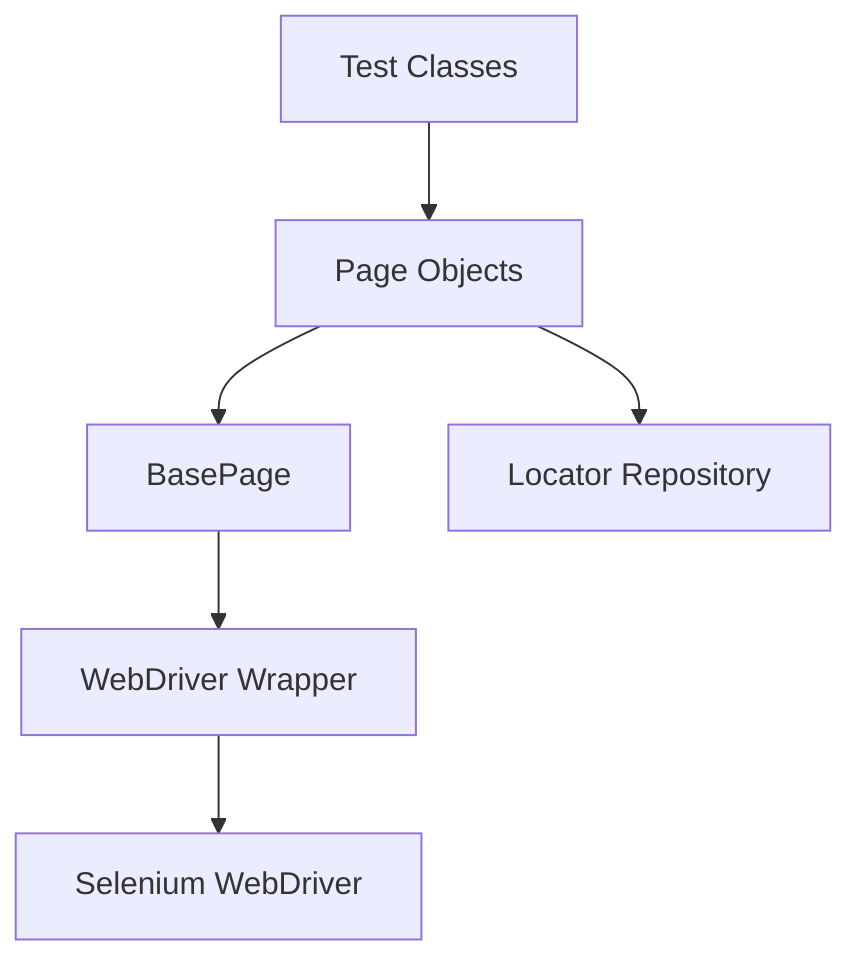
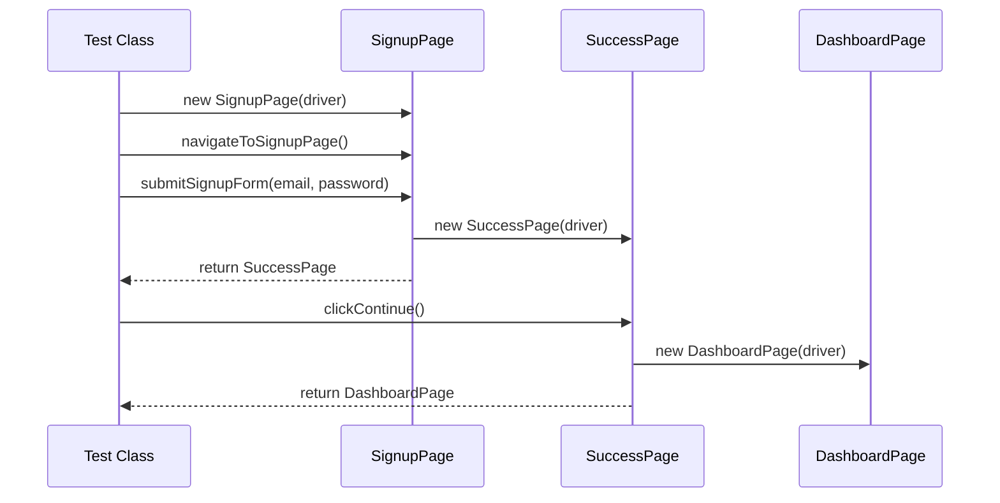

# Page Object Model Implementation: Storydoc Selenium Framework

## Introduction

The Page Object Model (POM) is a design pattern widely used in test automation that creates an abstraction layer to separate test logic from UI representation. In the Storydoc Selenium automation framework, POM serves as the foundational architecture to enable maintainable, scalable, and readable test automation.

The key purpose of implementing POM in our framework is to:

1. **Improve Maintainability**: When the UI changes, only the page object needs to be updated, not the tests.
2. **Enhance Readability**: Tests written using page objects are more concise and business-focused.
3. **Reduce Duplication**: Common UI interactions are implemented once in page objects and reused across tests.
4. **Support Test Stability**: Page objects encapsulate synchronization and error handling strategies.

By treating each page of the Storydoc application as a separate class, we create a clean separation between test logic and the technical implementation details of UI interaction.

## Page Object Model Principles

### Key Principles

The Page Object Model as implemented in our framework adheres to several core principles:

1. **Encapsulation of Page Structure**: Each page in the application is represented by a corresponding class that encapsulates the page's structure, elements, and behaviors.

2. **Abstraction of WebDriver Interactions**: Page objects abstract the low-level WebDriver API calls, providing higher-level methods that represent business actions a user would take on the page.

3. **Separation of Concerns**: 
   - **Page Objects**: Represent the UI structure and provide methods for interaction
   - **Locator Repository**: Stores element locators separate from page implementation
   - **Test Classes**: Focus on business flows and assertions rather than element details

4. **Interface Preservation**: Page objects provide a stable interface to the tests, shielding them from changes in the underlying UI implementation.

5. **Self-Contained Verification**: Page objects include methods to verify the state of the page, allowing for fluent assertions.

### Benefits in Context

For the Storydoc signup automation, these principles translate to several practical benefits:

- When the signup form changes, only the SignupPage class needs modification, not the tests.
- Tests read like user stories (e.g., `signupPage.enterEmail().enterPassword().clickSignUp()`) rather than technical WebDriver commands.
- Common error handling for element interactions is implemented once in the BasePage class.
- New tests can reuse existing page objects, accelerating test development.

## Framework Implementation

### Architectural Overview

The POM implementation in our framework follows a hierarchical structure:

```
BasePage (abstract)
  ├── SignupPage
  ├── SuccessPage
  └── [Other page classes]
```

This structure is complemented by a parallel hierarchy of locator classes:

```
SignupPageLocators
SuccessPageLocators
[Other locator classes]
```

### Key Components

1. **BasePage**: Abstract class providing common functionality for all page objects
2. **Page Objects**: Individual page classes extending BasePage
3. **Locator Repository**: Classes containing element locators
4. **WebDriver Wrapper**: Abstraction around direct WebDriver interaction
5. **Test Base**: Foundation for test classes that use page objects

### Component Relationships



### Page Initialization Pattern

Our framework follows a "chain navigational" pattern, where page objects return other page objects after navigation actions:

```java
// Example of chained navigation
SignupPage signupPage = new SignupPage(driver);
SuccessPage successPage = signupPage.submitSignupForm(email, password);
```

This pattern ensures that the test always has a reference to the currently active page.

## BasePage Class

The BasePage class is the foundation of our Page Object Model implementation. All page objects extend this class to inherit common functionality.

### Properties

```java
public abstract class BasePage {
    protected WebDriver driver;
    protected WebDriverWait wait;
    protected JavascriptExecutor js;
    protected Logger logger;
    
    // Constructor and methods...
}
```

### Constructor

```java
public BasePage(WebDriver driver) {
    this.driver = driver;
    this.wait = new WebDriverWait(driver, Duration.ofSeconds(10));
    this.js = (JavascriptExecutor) driver;
    this.logger = LogManager.getLogger(this.getClass());
}
```

### Common Methods

BasePage provides several categories of methods:

#### Element Interaction Methods

```java
protected WebElement waitForElementVisible(By locator) {
    return wait.until(ExpectedConditions.visibilityOfElementLocated(locator));
}

protected void click(By locator) {
    logger.debug("Clicking element: {}", locator);
    waitForElementVisible(locator).click();
}

protected void type(By locator, String text) {
    logger.debug("Typing '{}' into element: {}", text, locator);
    WebElement element = waitForElementVisible(locator);
    element.clear();
    element.sendKeys(text);
}

protected String getText(By locator) {
    String text = waitForElementVisible(locator).getText();
    logger.debug("Got text '{}' from element: {}", text, locator);
    return text;
}
```

#### Verification Methods

```java
protected boolean isElementPresent(By locator) {
    try {
        driver.findElement(locator);
        return true;
    } catch (NoSuchElementException e) {
        return false;
    }
}

protected boolean isElementVisible(By locator) {
    try {
        return waitForElementVisible(locator).isDisplayed();
    } catch (TimeoutException e) {
        return false;
    }
}
```

#### Wait Utilities

```java
protected void waitForPageLoad() {
    wait.until(driver -> ((JavascriptExecutor) driver)
        .executeScript("return document.readyState").equals("complete"));
}

protected boolean waitForElementInvisible(By locator) {
    try {
        return new WebDriverWait(driver, Duration.ofSeconds(5))
            .until(ExpectedConditions.invisibilityOfElementLocated(locator));
    } catch (TimeoutException e) {
        return false;
    }
}
```

#### Error Handling

```java
protected void safeClick(By locator) {
    try {
        click(locator);
    } catch (ElementClickInterceptedException e) {
        logger.warn("Element click intercepted, trying JavaScript click: {}", locator);
        WebElement element = driver.findElement(locator);
        js.executeScript("arguments[0].click();", element);
    }
}
```

## Page Objects Structure

### General Structure

Each page object follows a consistent structure:

```java
public class SomePage extends BasePage {
    // Class variables if needed
    
    // Constructor
    public SomePage(WebDriver driver) {
        super(driver);
        // Page-specific initialization if needed
    }
    
    // Page verification methods
    public boolean isPageLoaded() {
        // Implementation
    }
    
    // Element interaction methods
    public SomePage doSomething() {
        // Implementation
        return this;
    }
    
    // Page transition methods
    public OtherPage navigateToOtherPage() {
        // Implementation
        return new OtherPage(driver);
    }
}
```

### Method Categories

Page objects contain several categories of methods:

1. **Page Verification Methods**: Confirm that the page is loaded correctly
2. **Element Interaction Methods**: Perform actions on page elements
3. **Data Entry Methods**: Enter data into forms
4. **Navigation Methods**: Navigate to other pages
5. **State Retrieval Methods**: Get information from the page

### Fluent Interface

Many methods return the page object instance (`this`) to enable method chaining:

```java
signupPage.enterEmail(email)
          .enterPassword(password)
          .acceptTerms()
          .clickSignUp();
```

This creates a fluent interface that reads more like natural language.

## Locator Repository

### Purpose

The Locator Repository pattern separates element locators from page object implementation. This separation:

1. Centralizes locator management
2. Makes UI changes easier to handle
3. Improves code readability
4. Facilitates locator reuse

### Implementation

Locators are organized in separate files by page:

```java
public class SignupPageLocators {
    // Form Elements
    public static final By SIGNUP_FORM = By.cssSelector("form[data-testid='signup-form']");
    public static final By EMAIL_FIELD = By.cssSelector("input[data-testid='email-input']");
    public static final By PASSWORD_FIELD = By.cssSelector("input[data-testid='password-input']");
    public static final By TERMS_CHECKBOX = By.cssSelector("input[data-testid='terms-checkbox']");
    public static final By SIGNUP_BUTTON = By.cssSelector("button[data-testid='signup-button']");
    
    // Error Messages
    public static final By EMAIL_ERROR = By.cssSelector("[data-testid='email-error']");
    public static final By PASSWORD_ERROR = By.cssSelector("[data-testid='password-error']");
}
```

### Locator Strategies

We prioritize locator strategies in this order:

1. **Data Attributes**: Custom attributes like `data-testid` (preferred)
2. **ID**: Unique identifiers
3. **CSS Selectors**: For more complex selections
4. **XPath**: Used only when necessary for dynamic elements

### Locator Naming Convention

Locator constants follow these naming conventions:

- ALL_CAPS_WITH_UNDERSCORES
- Descriptive names indicating the element's purpose
- Suffix indicating element type for clarity (e.g., `_BUTTON`, `_FIELD`)

## SignupPage Example

Here's a complete example of the SignupPage implementation:

```java
public class SignupPage extends BasePage {
    
    public SignupPage(WebDriver driver) {
        super(driver);
    }
    
    /**
     * Navigates to the signup page.
     * 
     * @return the SignupPage instance
     */
    public SignupPage navigateToSignupPage() {
        driver.get(ConfigurationManager.getInstance().getProperty("signup.url"));
        waitForPageLoad();
        return this;
    }
    
    /**
     * Verifies that the signup page is loaded correctly.
     * 
     * @return true if the page is loaded, false otherwise
     */
    public boolean isSignupPageLoaded() {
        return isElementPresent(SignupPageLocators.SIGNUP_FORM);
    }
    
    /**
     * Enters the email address into the email field.
     * 
     * @param email the email address to enter
     * @return the SignupPage instance for method chaining
     */
    public SignupPage enterEmail(String email) {
        type(SignupPageLocators.EMAIL_FIELD, email);
        return this;
    }
    
    /**
     * Enters the password into the password field.
     * 
     * @param password the password to enter
     * @return the SignupPage instance for method chaining
     */
    public SignupPage enterPassword(String password) {
        type(SignupPageLocators.PASSWORD_FIELD, password);
        return this;
    }
    
    /**
     * Checks the terms and conditions checkbox.
     * 
     * @return the SignupPage instance for method chaining
     */
    public SignupPage acceptTerms() {
        click(SignupPageLocators.TERMS_CHECKBOX);
        return this;
    }
    
    /**
     * Clicks the signup button and expects navigation to the success page.
     * 
     * @return the newly created SuccessPage instance
     */
    public SuccessPage clickSignUp() {
        click(SignupPageLocators.SIGNUP_BUTTON);
        return new SuccessPage(driver);
    }
    
    /**
     * Completes the entire signup form and submits it.
     * 
     * @param email the email address to use
     * @param password the password to use
     * @return the SuccessPage that appears after successful signup
     */
    public SuccessPage submitSignupForm(String email, String password) {
        return enterEmail(email)
               .enterPassword(password)
               .acceptTerms()
               .clickSignUp();
    }
    
    /**
     * Checks if an email error message is displayed.
     * 
     * @return true if an error message is displayed, false otherwise
     */
    public boolean isEmailErrorDisplayed() {
        return isElementVisible(SignupPageLocators.EMAIL_ERROR);
    }
    
    /**
     * Gets the text of the email error message.
     * 
     * @return the error message text
     */
    public String getEmailErrorText() {
        return getText(SignupPageLocators.EMAIL_ERROR);
    }
    
    /**
     * Checks if a password error message is displayed.
     * 
     * @return true if an error message is displayed, false otherwise
     */
    public boolean isPasswordErrorDisplayed() {
        return isElementVisible(SignupPageLocators.PASSWORD_ERROR);
    }
    
    /**
     * Gets the text of the password error message.
     * 
     * @return the error message text
     */
    public String getPasswordErrorText() {
        return getText(SignupPageLocators.PASSWORD_ERROR);
    }
}
```

## SuccessPage Example

Here's a complete example of the SuccessPage implementation:

```java
public class SuccessPage extends BasePage {
    
    public SuccessPage(WebDriver driver) {
        super(driver);
    }
    
    /**
     * Verifies that the success page is loaded correctly.
     * 
     * @return true if the page is loaded, false otherwise
     */
    public boolean isPageLoaded() {
        return isElementVisible(SuccessPageLocators.SUCCESS_MESSAGE);
    }
    
    /**
     * Checks if the signup was successful by verifying the success message is displayed.
     * 
     * @return true if signup was successful, false otherwise
     */
    public boolean isSignupSuccessful() {
        return isElementVisible(SuccessPageLocators.SUCCESS_MESSAGE);
    }
    
    /**
     * Gets the confirmation message text.
     * 
     * @return the text of the confirmation message
     */
    public String getConfirmationMessage() {
        return getText(SuccessPageLocators.SUCCESS_MESSAGE);
    }
    
    /**
     * Clicks the continue button to proceed to the dashboard.
     * 
     * @return the DashboardPage instance
     */
    public DashboardPage clickContinue() {
        click(SuccessPageLocators.CONTINUE_BUTTON);
        return new DashboardPage(driver);
    }
    
    /**
     * Gets the welcome header text.
     * 
     * @return the welcome header text
     */
    public String getWelcomeHeaderText() {
        return getText(SuccessPageLocators.WELCOME_HEADER);
    }
}
```

## Page Transitions

### Navigation Pattern

Page transitions follow a factory pattern where clicking a link or button that navigates to a new page returns an instance of the relevant page object:

```java
// Method in SignupPage that transitions to SuccessPage
public SuccessPage clickSignUp() {
    click(SignupPageLocators.SIGNUP_BUTTON);
    return new SuccessPage(driver);
}
```

### WebDriver Handling

The same WebDriver instance is passed from one page object to another during transitions, ensuring:

1. Browser session continuity
2. No need to re-initialize the browser
3. Proper state management across pages

### Verification on Transition

Best practice is to verify that the new page has loaded correctly after navigation:

```java
public SuccessPage clickSignUp() {
    click(SignupPageLocators.SIGNUP_BUTTON);
    SuccessPage successPage = new SuccessPage(driver);
    // Verify new page has loaded correctly
    if (!successPage.isPageLoaded()) {
        throw new IllegalStateException("Success page did not load after clicking signup");
    }
    return successPage;
}
```

### Page Transition Diagram



## Using Page Objects in Tests

### Test Structure with Page Objects

Tests using page objects follow a clear structure:

```java
public class SignupTest extends TestBase {
    
    private SignupPage signupPage;
    
    @BeforeMethod
    public void setupTest() {
        signupPage = new SignupPage(driver);
        signupPage.navigateToSignupPage();
    }
    
    @Test
    public void testPositiveSignupFlow() {
        // Generate test data
        String email = RandomDataGenerator.generateRandomEmail();
        String password = RandomDataGenerator.generateRandomPassword();
        
        // Execute signup process
        SuccessPage successPage = signupPage
            .enterEmail(email)
            .enterPassword(password)
            .acceptTerms()
            .clickSignUp();
        
        // Verify successful signup
        Assert.assertTrue(successPage.isSignupSuccessful(), 
            "Signup was not successful");
        
        // Verify confirmation message
        String confirmationMessage = successPage.getConfirmationMessage();
        Assert.assertTrue(confirmationMessage.contains("successfully"), 
            "Success message not displayed correctly");
    }
}
```

### Best Practices for Tests

1. **Focus on Business Flows**: Tests should describe user journeys, not technical details
2. **Use Proper Assertions**: Test business outcomes, not UI implementation details
3. **Maintain Independence**: Each test should be able to run independently
4. **Use Descriptive Test Names**: Names should describe what's being tested
5. **Separate Test Data**: Use data providers or generators for test inputs

### Method Chaining

Page objects support method chaining for a more fluent, readable syntax:

```java
// Without method chaining
signupPage.enterEmail(email);
signupPage.enterPassword(password);
signupPage.acceptTerms();
SuccessPage successPage = signupPage.clickSignUp();

// With method chaining
SuccessPage successPage = signupPage
    .enterEmail(email)
    .enterPassword(password)
    .acceptTerms()
    .clickSignUp();
```

### Assertions

Tests should assert outcomes rather than implementation details:

```java
// Good - asserts the business outcome
Assert.assertTrue(successPage.isSignupSuccessful(), "Signup failed");

// Less good - focuses on UI implementation
Assert.assertEquals(driver.getCurrentUrl(), "https://editor-staging.storydoc.com/success");
```

## Synchronization Strategies

### Types of Waits

Our framework implements several wait strategies:

1. **Explicit Waits**: Waiting for specific conditions (preferred approach)
2. **Fluent Waits**: Customizable polling intervals for special cases
3. **Page Load Waits**: Waiting for the entire page to load
4. **Implicit Waits**: Set at the WebDriver level (used sparingly)

### Implementation in BasePage

The BasePage class implements standardized wait methods:

```java
protected WebElement waitForElementVisible(By locator) {
    return wait.until(ExpectedConditions.visibilityOfElementLocated(locator));
}

protected WebElement waitForElementClickable(By locator) {
    return wait.until(ExpectedConditions.elementToBeClickable(locator));
}

protected boolean waitForElementInvisible(By locator) {
    return wait.until(ExpectedConditions.invisibilityOfElementLocated(locator));
}

protected void waitForPageLoad() {
    wait.until(driver -> ((JavascriptExecutor) driver)
        .executeScript("return document.readyState").equals("complete"));
}
```

### Custom Wait Conditions

For complex scenarios, custom ExpectedCondition implementations can be created:

```java
public static ExpectedCondition<Boolean> elementHasClass(final WebElement element, final String cssClass) {
    return new ExpectedCondition<Boolean>() {
        @Override
        public Boolean apply(WebDriver driver) {
            return element.getAttribute("class").contains(cssClass);
        }
        
        @Override
        public String toString() {
            return String.format("element to have class \"%s\"", cssClass);
        }
    };
}
```

### Wait Strategy Selection

Guidelines for selecting appropriate wait strategies:

1. Use explicit waits for most element interactions
2. Use page load waits after navigation
3. Use custom waits for application-specific behaviors
4. Avoid Thread.sleep() except in rare cases where no other option exists

## Error Handling

### Types of Exceptions

Common Selenium exceptions handled in our framework:

1. **NoSuchElementException**: Element not found in DOM
2. **TimeoutException**: Wait condition not satisfied within timeout
3. **StaleElementReferenceException**: Element reference no longer valid
4. **ElementClickInterceptedException**: Element click intercepted by another element
5. **WebDriverException**: Generic WebDriver errors

### Handling Approaches

Our error handling follows these principles:

1. **Fail Fast**: Surface real test failures quickly
2. **Retry Transient Issues**: Attempt recovery for timing-related failures
3. **Detailed Logging**: Provide clear error context
4. **Clean Failure**: Ensure resources are properly released on failure

### Implementation in Page Objects

Example error handling in page objects:

```java
public SignupPage enterEmail(String email) {
    try {
        type(SignupPageLocators.EMAIL_FIELD, email);
        return this;
    } catch (NoSuchElementException e) {
        logger.error("Email field not found on page", e);
        throw new PageOperationException("Failed to enter email: field not found", e);
    } catch (TimeoutException e) {
        logger.error("Timed out waiting for email field", e);
        throw new PageOperationException("Failed to enter email: timeout waiting for field", e);
    }
}
```

### Custom Exceptions

Custom exceptions improve error clarity:

```java
public class PageOperationException extends RuntimeException {
    public PageOperationException(String message) {
        super(message);
    }
    
    public PageOperationException(String message, Throwable cause) {
        super(message, cause);
    }
}
```

## Page Object Method Naming

### Naming Conventions

Our framework follows these naming conventions for page object methods:

1. **Action Methods**: Start with a verb (`click...`, `enter...`, `select...`)
2. **Query Methods**: Start with `is`, `has`, or `get` (`isPageLoaded()`, `hasErrors()`, `getText()`)
3. **Navigation Methods**: Indicate destination (`clickSignUp()`, `navigateToSignupPage()`)
4. **Combined Methods**: Describe complete actions (`submitSignupForm()`)

### Examples from SignupPage

Action methods:
- `enterEmail(String email)`
- `enterPassword(String password)`
- `acceptTerms()`
- `clickSignUp()`

Query methods:
- `isSignupPageLoaded()`
- `isEmailErrorDisplayed()`
- `getEmailErrorText()`

Combined methods:
- `submitSignupForm(String email, String password)`

### Method Return Types

Guidelines for method return types:

1. **Action Methods**: Return the page object (`this`) for chaining or a new page object for navigation
2. **Query Methods**: Return the appropriate data type (String, boolean, etc.)
3. **Verification Methods**: Typically return boolean

## Testing Page Objects

### Unit Testing Approach

Page objects themselves should be tested to ensure reliability:

```java
public class SignupPageTest {
    
    private WebDriver mockDriver;
    private WebElement mockElement;
    private SignupPage signupPage;
    
    @BeforeMethod
    public void setUp() {
        mockDriver = mock(WebDriver.class);
        mockElement = mock(WebElement.class);
        when(mockDriver.findElement(any())).thenReturn(mockElement);
        
        signupPage = new SignupPage(mockDriver);
    }
    
    @Test
    public void testEnterEmail() {
        signupPage.enterEmail("test@example.com");
        
        verify(mockDriver).findElement(SignupPageLocators.EMAIL_FIELD);
        verify(mockElement).clear();
        verify(mockElement).sendKeys("test@example.com");
    }
    
    @Test
    public void testSubmitSignupForm() {
        // More complex test with verification of method chain
    }
}
```

### Integration Testing

Integration tests verify that page objects work correctly with the actual application:

```java
public class SignupPageIntegrationTest extends TestBase {
    
    private SignupPage signupPage;
    
    @BeforeMethod
    public void setUp() {
        driver = WebDriverManager.getDriver();
        signupPage = new SignupPage(driver);
        signupPage.navigateToSignupPage();
    }
    
    @Test
    public void testNavigateToSignupPage() {
        Assert.assertTrue(signupPage.isSignupPageLoaded(), 
            "Signup page not loaded correctly");
    }
    
    @Test
    public void testEnterEmailDisplaysCorrectValue() {
        String testEmail = "test@example.com";
        signupPage.enterEmail(testEmail);
        
        String value = driver.findElement(SignupPageLocators.EMAIL_FIELD)
            .getAttribute("value");
        Assert.assertEquals(value, testEmail, 
            "Email field doesn't contain expected value");
    }
}
```

## Creating New Page Objects

### Step-by-Step Guide

1. **Identify the Page**: Determine the distinct page that needs representation
2. **Create Locator File**: Create a new locator class for the page elements
3. **Create Page Object Class**: Extend BasePage to create the new page class
4. **Implement Verification Methods**: Add methods to verify correct page loading
5. **Add Interaction Methods**: Implement methods for page-specific interactions
6. **Connect with Other Pages**: Update existing pages with navigation methods

### Example: Creating a New Page

1. First, create the locator file:

```java
public class AccountSettingsPageLocators {
    public static final By SETTINGS_HEADER = By.cssSelector("h1[data-testid='settings-header']");
    public static final By CHANGE_PASSWORD_BTN = By.cssSelector("button[data-testid='change-pwd-btn']");
    public static final By EMAIL_DISPLAY = By.cssSelector("span[data-testid='email-display']");
    // Additional locators...
}
```

2. Then create the page object:

```java
public class AccountSettingsPage extends BasePage {
    
    public AccountSettingsPage(WebDriver driver) {
        super(driver);
    }
    
    public boolean isPageLoaded() {
        return isElementVisible(AccountSettingsPageLocators.SETTINGS_HEADER);
    }
    
    public String getDisplayedEmail() {
        return getText(AccountSettingsPageLocators.EMAIL_DISPLAY);
    }
    
    public ChangePasswordPage clickChangePassword() {
        click(AccountSettingsPageLocators.CHANGE_PASSWORD_BTN);
        return new ChangePasswordPage(driver);
    }
    
    // Additional methods...
}
```

3. Update existing pages to add navigation:

```java
// In DashboardPage.java
public AccountSettingsPage navigateToAccountSettings() {
    click(DashboardPageLocators.ACCOUNT_SETTINGS_LINK);
    return new AccountSettingsPage(driver);
}
```

## Common Anti-Patterns

### Anti-Pattern: Page Objects Containing Assertions

**Problem**: Page objects should not contain test assertions.

```java
// Anti-pattern
public class BadSignupPage extends BasePage {
    public void verifySignupSuccessful() {
        Assert.assertTrue(isElementVisible(SignupPageLocators.SUCCESS_MESSAGE),
            "Signup was not successful");
    }
}
```

**Solution**: Page objects should return state that tests can assert.

```java
// Better approach
public class GoodSignupPage extends BasePage {
    public boolean isSignupSuccessful() {
        return isElementVisible(SignupPageLocators.SUCCESS_MESSAGE);
    }
}

// In test class
@Test
public void testSignup() {
    // ...
    Assert.assertTrue(signupPage.isSignupSuccessful(), "Signup failed");
}
```

### Anti-Pattern: Hardcoded Locators

**Problem**: Hardcoding locators in page object methods reduces maintainability.

```java
// Anti-pattern
public void enterEmail(String email) {
    driver.findElement(By.cssSelector("input[data-testid='email-input']"))
        .sendKeys(email);
}
```

**Solution**: Use locator repository.

```java
// Better approach
public void enterEmail(String email) {
    type(SignupPageLocators.EMAIL_FIELD, email);
}
```

### Anti-Pattern: Exposing WebDriver

**Problem**: Exposing the WebDriver instance to tests breaks encapsulation.

```java
// Anti-pattern
public WebDriver getDriver() {
    return driver;
}

// In test
signupPage.getDriver().findElement(By.id("email")).sendKeys("test@example.com");
```

**Solution**: Encapsulate all WebDriver interactions within page objects.

```java
// Better approach
public SignupPage enterEmail(String email) {
    type(SignupPageLocators.EMAIL_FIELD, email);
    return this;
}

// In test
signupPage.enterEmail("test@example.com");
```

### Anti-Pattern: Missing Synchronization

**Problem**: Not handling timing issues leads to flaky tests.

```java
// Anti-pattern
public void clickSignUp() {
    driver.findElement(SignupPageLocators.SIGNUP_BUTTON).click();
}
```

**Solution**: Always use appropriate waits.

```java
// Better approach
public void clickSignUp() {
    waitForElementClickable(SignupPageLocators.SIGNUP_BUTTON).click();
}
```

## Advanced Techniques

### Handling Dynamic Content

For pages with dynamically changing content:

```java
public List<String> getNotificationMessages() {
    List<WebElement> notifications = driver.findElements(NotificationsPageLocators.NOTIFICATION_ITEMS);
    return notifications.stream()
        .map(WebElement::getText)
        .collect(Collectors.toList());
}
```

### Working with iframes

For content inside iframes:

```java
public EditorPage switchToEditorFrame() {
    wait.until(ExpectedConditions.frameToBeAvailableAndSwitchToIt(
        EditorPageLocators.EDITOR_FRAME));
    return this;
}

public EditorPage switchToMainContent() {
    driver.switchTo().defaultContent();
    return this;
}
```

### Page Components

For UI components that appear across multiple pages:

```java
public class HeaderComponent {
    private WebDriver driver;
    private WebDriverWait wait;
    
    public HeaderComponent(WebDriver driver) {
        this.driver = driver;
        this.wait = new WebDriverWait(driver, Duration.ofSeconds(10));
    }
    
    public void clickLogo() {
        wait.until(ExpectedConditions.elementToBeClickable(
            HeaderComponentLocators.LOGO)).click();
    }
    
    public void clickUserMenu() {
        wait.until(ExpectedConditions.elementToBeClickable(
            HeaderComponentLocators.USER_MENU)).click();
    }
    
    // Additional methods...
}

// Usage in page object
public class DashboardPage extends BasePage {
    private HeaderComponent header;
    
    public DashboardPage(WebDriver driver) {
        super(driver);
        this.header = new HeaderComponent(driver);
    }
    
    public HeaderComponent getHeader() {
        return header;
    }
    
    // Rest of page object implementation...
}

// In test
dashboardPage.getHeader().clickUserMenu();
```

### Handling Multiple Tabs/Windows

For interactions that open new tabs or windows:

```java
public NewPage clickButtonThatOpensNewTab() {
    String originalWindow = driver.getWindowHandle();
    click(PageLocators.BUTTON_OPENS_NEW_TAB);
    
    // Wait for new window and switch to it
    wait.until(ExpectedConditions.numberOfWindowsToBe(2));
    for (String windowHandle : driver.getWindowHandles()) {
        if (!windowHandle.equals(originalWindow)) {
            driver.switchTo().window(windowHandle);
            break;
        }
    }
    
    return new NewPage(driver);
}
```

## References

### Official Documentation

- [Selenium Documentation](https://www.selenium.dev/documentation/en/)
- [Page Object Models (Selenium Docs)](https://www.selenium.dev/documentation/en/guidelines_and_recommendations/page_object_models/)

### Books and Articles

- "Selenium WebDriver 3 Practical Guide" by Unmesh Gundecha
- "Test Automation Using Selenium WebDriver with Java" by Navneesh Garg
- [Martin Fowler on Page Objects](https://martinfowler.com/bliki/PageObject.html)

### Framework-Specific Resources

- [TestNG Documentation](https://testng.org/doc/documentation-main.html)
- [WebDriverManager GitHub](https://github.com/bonigarcia/webdrivermanager)
- [ExtentReports Documentation](https://www.extentreports.com/docs/versions/5/java/index.html)

### Best Practices

- Selenium WebDriver Best Practices by Angie Jones
- Page Object Pattern Best Practices by Simon Stewart
- [Page Objects That Suck Less](https://johnfergusonsmart.com/page-objects-that-suck-less-tips-for-writing-more-maintainable-page-objects/)